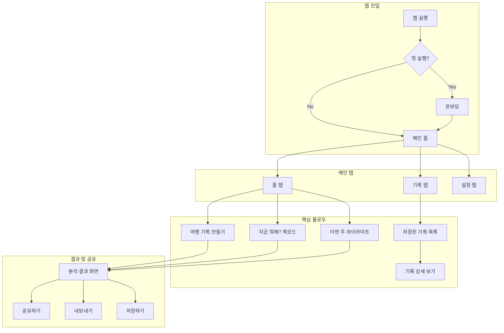

← [인덱스](index.md)

---

# 1. 앱 구조 및 화면 목록

## 1.1 전체 앱 구조

## 1.2 화면 목록 (Screen Inventory)

> 전체 화면 목록은 [인덱스](index.md)의 화면 매핑표 참조

| 화면 ID | 화면명 | 설명 | 접근 경로 |
|---------|--------|------|-----------|
| SCR-001 | 스플래시 | 앱 로딩 화면 | 앱 실행 시 |
| SCR-002 | 온보딩 1 | 서비스 소개 | 첫 실행 |
| SCR-003 | 온보딩 2 | 사진 권한 요청 | 첫 실행 |
| SCR-004 | 온보딩 3 | 위치 권한 요청 | 첫 실행 |
| SCR-005 | 홈 | 메인 홈 화면 | 탭바 (홈) |
| SCR-006 | 기록 목록 | 저장된 기록 목록 + 검색 | 탭바 (기록) |
| SCR-006a | 기록 상세 (전체화면) | 기록 상세 정보 + Wander Intelligence | 기록 목록 → 기록 선택 |
| SCR-007 | 설정 | 설정 메인 | 탭바 (설정) |
| SCR-008 | 사진 선택 | 커스텀 포토 피커 (날짜 필터, 드래그 선택) | 홈 → 기록 만들기 |
| SCR-009 | 분석 중 | 분석 로딩 화면 (Smart Analysis 단계 표시) | 사진 선택 완료 후 |
| SCR-010 | 분석 결과 | 결과 표시 + Wander Intelligence | 분석 완료 후 |
| SCR-011 | 지도 상세 | 전체 지도 보기 | 결과 화면에서 |
| SCR-012 | 타임라인 편집 | 타임라인 수정 | 결과 화면에서 |
| SCR-013 | AI 스토리 | AI 생성 스토리 | 결과 화면 (BYOK 연결 시) |
| SCR-014 | 공유 시트 | 공유 옵션 | 결과 화면에서 |
| SCR-015 | 내보내기 옵션 | 내보내기 포맷 선택 | 결과 화면에서 |
| SCR-016 | AI 설정 | AI 프로바이더/모델 선택 | 설정 → AI 설정 |
| SCR-017 | 공유 설정 | 출처 표기 등 공유 옵션 | 설정 → 공유 설정 |
| SCR-018 | 보안 설정 | PIN/생체인증 설정 | 설정 → 보안 |
| SCR-019 | 에러 화면 | 에러 발생 시 | 에러 발생 시 |
| SCR-020 | API Key 입력 | 프로바이더별 API Key 입력 + 모델 선택 | AI 설정 → 프로바이더 선택 |
| SCR-021 | 데이터 관리 | 저장 공간 및 데이터 관리 | 설정 → 데이터 관리 |
| SCR-022 | 돌아보기 | 기간별 사진 자동 수집/분석 | 홈 → 돌아보기 카드 |
| SCR-023 | 숨긴 기록 | 숨긴 기록 목록 (인증 필요) | 기록 탭 → 숨긴 기록 |
| SCR-024 | 인증 화면 | Face ID/Touch ID/PIN 입력 | 숨긴 기록 접근 시 |
| SCR-025 | 카테고리 관리 | 카테고리 숨기기/추가/삭제 | 설정 → 카테고리 관리 |
| SCR-026 | 사용자 장소 설정 | 집/회사/학교/사용자정의 위치 | 설정 → 장소 관리 |
| SCR-027 | 권한 설정 | 사진/위치 권한 상태 및 변경 | 설정 → 권한 설정 |
| SCR-028 | 앱 정보 | 버전, 라이선스, 문의 | 설정 → 앱 정보 |

> **참고**: 탭바는 3개 탭으로 구성 (홈, 기록, 설정). 프로필/로그인 없음 (서버리스 앱). 커스텀 탭바 사용.
