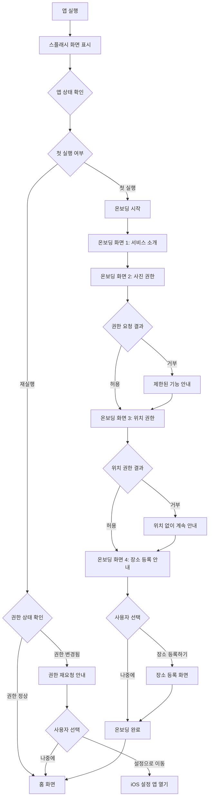
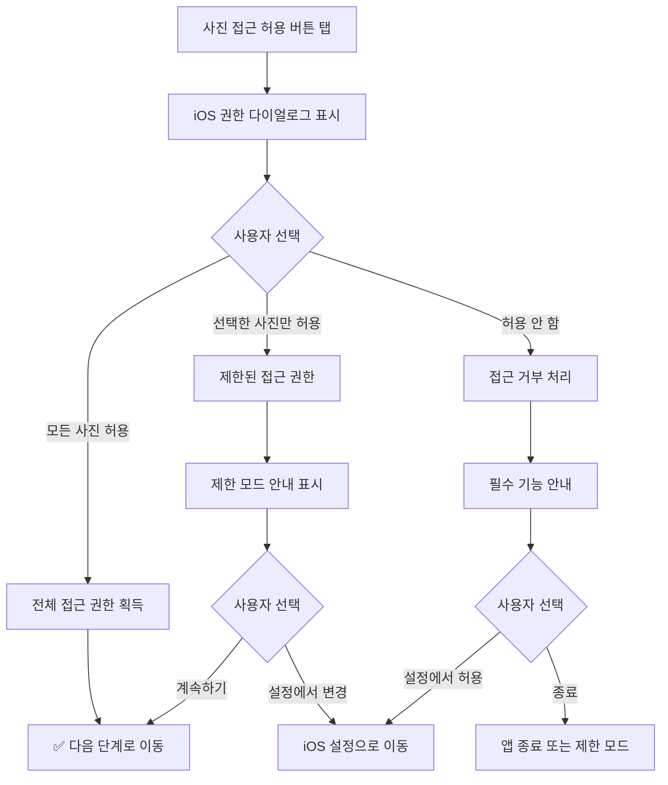
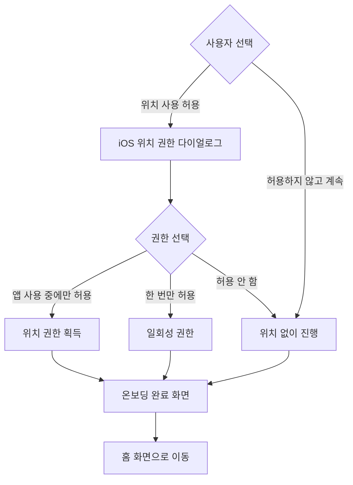

← [인덱스](index.md)

---

## 2. 앱 진입 및 온보딩

### 2.1 앱 실행 플로우

> **v3.1 변경사항**: 장소 등록 선택적 단계 추가 (Context Classification 지원)



### 2.2 온보딩 화면 상세

#### SCR-002: 온보딩 1 - 서비스 소개

**화면 구성:**
```
┌─────────────────────────────────┐
│                                 │
│      [일러스트레이션]            │
│      사진 → 지도 → 스토리        │
│                                 │
├─────────────────────────────────┤
│                                 │
│   사진 몇 장이면 충분해요         │
│                                 │
│   여행인지, 일상인지,            │
│   AI가 자동으로 파악하고         │
│   스토리로 만들어 드려요         │
│                                 │
├─────────────────────────────────┤
│                                 │
│   ● ○ ○                        │
│                                 │
│   [      다 음      ]           │
│                                 │
└─────────────────────────────────┘
```

**동작:**
- 좌우 스와이프로 페이지 이동 가능
- "다음" 버튼 탭 시 다음 온보딩 화면으로 이동
- 페이지 인디케이터로 현재 위치 표시

#### SCR-003: 온보딩 2 - 사진 권한 요청

**화면 구성:**
```
┌─────────────────────────────────┐
│                                 │
│      [사진 아이콘]              │
│                                 │
├─────────────────────────────────┤
│                                 │
│   사진에 접근할 수 있도록        │
│   허용해 주세요                 │
│                                 │
│   ┌─────────────────────────┐   │
│   │ • 사진의 촬영 시간과 위치   │   │
│   │   정보를 분석합니다        │   │
│   │ • 사진은 기기 내에서만     │   │
│   │   처리되며 서버로 전송     │   │
│   │   되지 않습니다           │   │
│   └─────────────────────────┘   │
│                                 │
├─────────────────────────────────┤
│                                 │
│   ○ ● ○                        │
│                                 │
│   [    사진 접근 허용    ]      │
│                                 │
└─────────────────────────────────┘
```

**권한 요청 시나리오:**



**제한 모드 안내 (사진 접근 거부 시):**
```
┌─────────────────────────────────┐
│                                 │
│     ⚠️ 사진 접근 필요           │
│                                 │
│   Wander는 사진의 메타데이터를   │
│   분석하여 동선을 파악합니다.    │
│                                 │
│   사진 접근 없이는 서비스를      │
│   이용할 수 없어요.             │
│                                 │
│   [  설정에서 허용하기  ]       │
│   [      나중에       ]        │
│                                 │
└─────────────────────────────────┘
```

#### SCR-004: 온보딩 3 - 위치 권한 요청

**화면 구성:**
```
┌─────────────────────────────────┐
│                                 │
│      [위치 아이콘]              │
│                                 │
├─────────────────────────────────┤
│                                 │
│   위치 정보 사용을 허용하면      │
│   더 정확한 분석이 가능해요      │
│                                 │
│   ┌─────────────────────────┐   │
│   │ • GPS 좌표를 주소로 변환   │   │
│   │ • 장소 이름 자동 인식     │   │
│   │ • 위치 정보는 기기에서만   │   │
│   │   처리됩니다             │   │
│   └─────────────────────────┘   │
│                                 │
│   💡 허용하지 않아도 기본 기능   │
│      사용이 가능합니다          │
│                                 │
├─────────────────────────────────┤
│                                 │
│   ○ ○ ●                        │
│                                 │
│   [    위치 사용 허용    ]      │
│   [   허용하지 않고 계속  ]     │
│                                 │
└─────────────────────────────────┘
```

**위치 권한 플로우:**



#### SCR-004-1: 온보딩 4 - 장소 등록 안내 (선택 사항)

> **v3.1 신규**: Context Classification 정확도 향상을 위한 선택적 장소 등록

**화면 구성:**
```
┌─────────────────────────────────┐
│                                 │
│      [집/회사 아이콘]           │
│                                 │
├─────────────────────────────────┤
│                                 │
│   일상과 여행을 더 정확하게      │
│   구분할 수 있어요              │
│                                 │
│   ┌─────────────────────────┐   │
│   │ 🏠 집, 🏢 회사/학교        │   │
│   │ 위치를 등록하면           │   │
│   │ AI가 일상/여행을 90% 이상 │   │
│   │ 정확하게 구분해요          │   │
│   │                           │   │
│   │ 💡 등록하지 않아도        │   │
│   │ 패턴을 학습해 점차 정확해져요 │   │
│   └─────────────────────────┘   │
│                                 │
├─────────────────────────────────┤
│                                 │
│   ○ ○ ○ ●                      │
│                                 │
│   [    장소 등록하기    ]       │
│   [   나중에 설정하기   ]       │
│                                 │
└─────────────────────────────────┘
```

**장소 등록 화면 (SCR-004-2):**
```
┌─────────────────────────────────┐
│  ◀        장소 등록       완료  │
├─────────────────────────────────┤
│                                 │
│  🏠 집                          │
│  ┌─────────────────────────────┐│
│  │ 🔍 주소 검색...              ││
│  └─────────────────────────────┘│
│  또는 [📍 현재 위치로 등록]      │
│                                 │
│  ─────────────────────────────  │
│                                 │
│  🏢 회사                         │
│  ┌─────────────────────────────┐│
│  │ 🔍 주소 검색...              ││
│  └─────────────────────────────┘│
│  또는 [📍 현재 위치로 등록]      │
│                                 │
│  ─────────────────────────────  │
│                                 │
│  🏫 학교                         │
│  ┌─────────────────────────────┐│
│  │ 🔍 주소 검색...              ││
│  └─────────────────────────────┘│
│  또는 [📍 현재 위치로 등록]      │
│                                 │
│  ─────────────────────────────  │
│                                 │
│  💡 최소 1곳 이상 등록하면       │
│     일상/여행 구분이 정확해져요  │
│                                 │
│  [모두 건너뛰기 →]               │
│                                 │
└─────────────────────────────────┘
```

**장소 등록 동작:**

| 항목 | 동작 |
|------|------|
| 주소 검색 | MapKit MKLocalSearch로 검색 |
| 현재 위치 등록 | CLLocationManager로 현재 좌표 획득 |
| 최소 등록 | 없음 (모두 건너뛰기 가능) |
| 저장 위치 | SwiftData UserPlace 모델 |
| **H3 인덱스 계산** | 좌표 저장 시 SwiftyH3로 H3 셀 인덱스 자동 계산 (내부, 사용자 비노출) |

**미등록 시 자동 학습 안내:**
```
┌─────────────────────────────────┐
│                                 │
│  ✓ 나중에 설정할게요            │
│                                 │
│  괜찮아요! Wander가 여러분의     │
│  일상 패턴을 자동으로 학습해요.  │
│                                 │
│  ┌─────────────────────────────┐│
│  │ 📊 자주 가는 곳을 발견하면   ││
│  │ 알려드릴게요                ││
│  └─────────────────────────────┘│
│                                 │
│  [      시작하기      ]         │
│                                 │
└─────────────────────────────────┘
```

---

### 2.3 온보딩 완료 후 저장 데이터

```swift
// UserDefaults 저장 항목
struct OnboardingState {
    var isOnboardingCompleted: Bool     // 온보딩 완료 여부
    var photoPermissionStatus: String   // "full" | "limited" | "denied"
    var locationPermissionStatus: String // "always" | "whenInUse" | "denied"
    var placesRegistered: Bool          // v3.1: 장소 등록 여부
    var onboardingCompletedDate: Date   // 완료 일시
}
```
