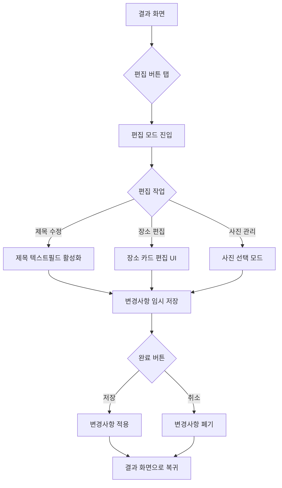
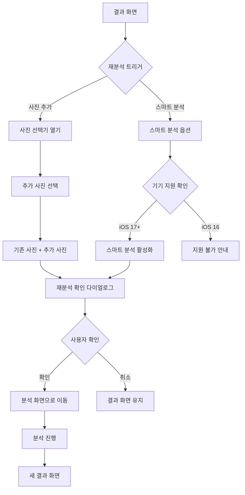
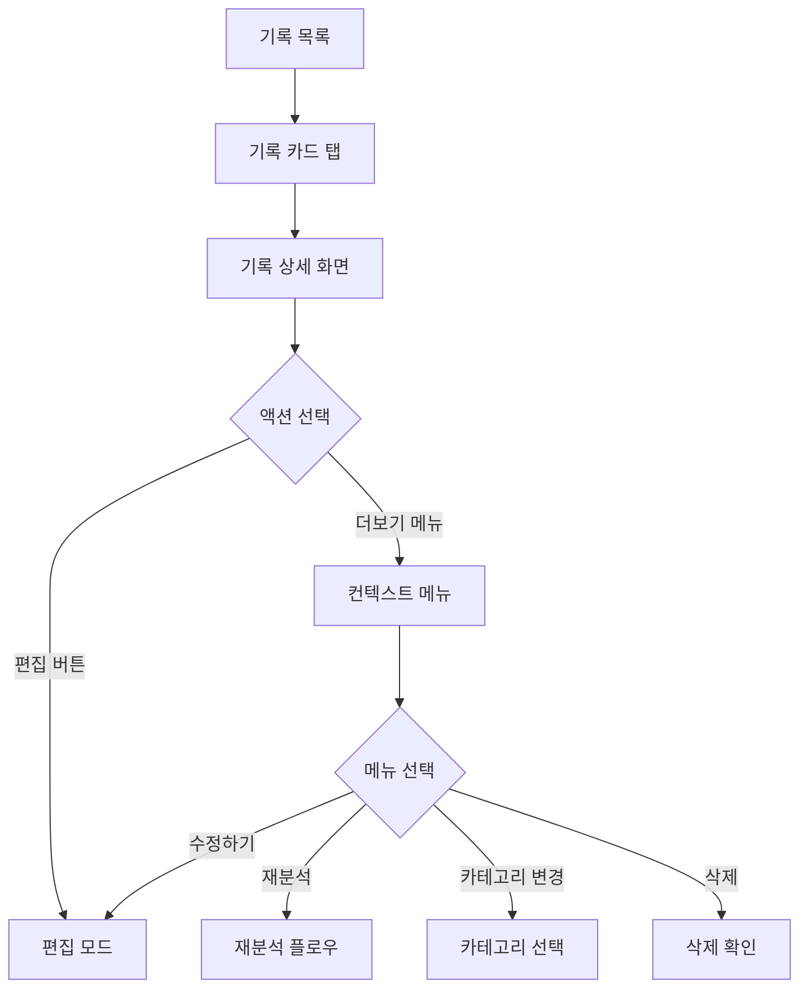
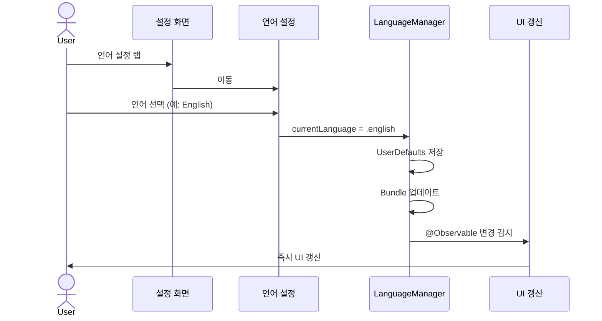

[← 인덱스](index.md)

---

## 부록 A: 화면 전환 매트릭스

| From \ To | 홈 | 기록목록 | 설정 | 사진선택 | 분석중 | 결과 | 공유시트 |
|-----------|-----|---------|------|---------|-------|------|---------|
| 스플래시 | ✓ | | | | | | |
| 온보딩 | ✓ | | | | | | |
| 홈 | - | ✓ | ✓ | ✓ | | | |
| 기록목록 | ✓ | - | ✓ | | | ✓ | |
| 설정 | ✓ | ✓ | - | | | | |
| 사진선택 | ✓ | | | - | ✓ | | |
| 분석중 | ✓ | | | | - | ✓ | |
| 결과 | ✓ | ✓ | | | | - | ✓ |
| 공유시트 | | | | | | ✓ | - |

---

## 부록 B: 에러 코드 정의

| 코드 | 카테고리 | 설명 | 사용자 메시지 |
|------|----------|------|--------------|
| E001 | 권한 | 사진 접근 권한 없음 | 사진 접근 권한이 필요합니다 |
| E002 | 권한 | 위치 권한 없음 | 위치 권한이 없어 GPS 분석이 제한됩니다 |
| E003 | 데이터 | GPS 정보 없음 | 선택한 사진에 위치 정보가 없습니다 |
| E004 | 데이터 | 메타데이터 손상 | 일부 사진의 정보를 읽을 수 없습니다 |
| E005 | 저장 | 저장 공간 부족 | 저장 공간이 부족합니다 |
| E006 | 저장 | 저장 실패 | 저장 중 문제가 발생했습니다 |
| E007 | 네트워크 | Geocoding 실패 | 주소 정보를 가져올 수 없습니다 |
| E008 | AI | API Key 오류 | API Key가 올바르지 않습니다 |
| E009 | AI | 요청 한도 초과 | API 요청 한도에 도달했습니다 |
| E010 | AI | 서버 오류 | AI 서비스에 일시적 문제가 있습니다 |
| E011 | AI | 타임아웃 | 응답 시간이 초과되었습니다 |
| E012 | 공유 | 공유 실패 | 공유 중 문제가 발생했습니다 |
| E013 | 일반 | 알 수 없는 오류 | 문제가 발생했습니다 |

---

## 부록 C: 결과 편집 및 재분석

### C.1 결과 화면 편집 기능

결과 화면(ResultView)에서 분석 결과를 수정할 수 있는 편집 기능을 제공합니다.

#### C.1.1 편집 가능 항목

| 항목 | 편집 방법 | 설명 |
|------|----------|------|
| 여행 제목 | 텍스트 입력 | 자동 생성된 제목 수정 |
| 장소 이름 | 텍스트 입력 | 역지오코딩 결과 수정 |
| 활동 라벨 | Picker 선택 | 추론된 활동 유형 변경 |
| 장소 순서 | 드래그 앤 드롭 | 타임라인 순서 재배열 |
| 사진 할당 | 선택 후 이동 | 다른 장소로 사진 이동 |
| 장소 삭제 | 스와이프/버튼 | 불필요한 장소 제거 |
| 장소 병합 | 두 장소 선택 | 인접 장소 하나로 합치기 |
| 메모 추가 | 텍스트 입력 | 장소별 메모 기록 |

#### C.1.2 편집 모드 플로우



#### C.1.3 편집 모드 UI

```
┌─────────────────────────────────┐
│  취소       편집 모드       완료 │
├─────────────────────────────────┤
│                                 │
│  📝 여행 제목                   │
│  ┌─────────────────────────────┐│
│  │ 제주도 3일 여행           ✏️││
│  └─────────────────────────────┘│
│                                 │
│  📅 Day 1 (1/15)               │
│                                 │
│  ┌─────────────────────────────┐│
│  │ ≡ 📍 제주공항          ✏️ 🗑️││
│  │   🕐 10:30 · ✈️ 도착        ││
│  │   활동: [✈️ 도착 ▾]         ││
│  │   ┌───┬───┬───┐            ││
│  │   │📷│📷│📷│  [+ 추가]    ││
│  │   └───┴───┴───┘            ││
│  │   메모: 탭하여 추가...      ││
│  └─────────────────────────────┘│
│                                 │
│  [+ 새 장소 추가]               │
│                                 │
└─────────────────────────────────┘
```

### C.2 재분석 기능

사진을 추가하거나 분석 옵션을 변경하여 다시 분석할 수 있습니다.

#### C.2.1 재분석 트리거

| 트리거 | 위치 | 설명 |
|--------|------|------|
| 사진 추가 | 결과 화면 | 기존 분석에 사진 추가 후 재분석 |
| 분석 설정 변경 | 설정 > 분석 설정 | 클러스터링 설정 변경 후 재분석 |
| 스마트 분석 활성화 | 결과 화면 | 기본 분석 → 스마트 분석 업그레이드 |

#### C.2.2 재분석 플로우



#### C.2.3 재분석 확인 다이얼로그

```
┌─────────────────────────────────┐
│                                 │
│           재분석 확인            │
│                                 │
│  기존 분석 결과가 새 결과로      │
│  대체됩니다. 계속하시겠습니까?   │
│                                 │
│  • 기존 사진: 25장              │
│  • 추가 사진: 10장              │
│  • 총 분석 대상: 35장           │
│                                 │
│  ┌─────────┐  ┌─────────────┐  │
│  │  취소   │  │  재분석하기  │  │
│  └─────────┘  └─────────────┘  │
│                                 │
└─────────────────────────────────┘
```

#### C.2.4 스마트 분석 업그레이드 UI

```
┌─────────────────────────────────┐
│                                 │
│      🤖 스마트 분석 사용 가능    │
│                                 │
│  Vision 프레임워크와 POI 검색으로│
│  더 정확한 분석이 가능합니다.    │
│                                 │
│  ✓ 장면 인식 (음식, 풍경 등)    │
│  ✓ 주변 POI 검색               │
│  ✓ 자동 제목 생성 개선         │
│                                 │
│  ┌─────────────────────────────┐│
│  │   🚀 스마트 분석으로 업그레이드││
│  └─────────────────────────────┘│
│                                 │
│  기본 분석 결과 유지하기         │
│                                 │
└─────────────────────────────────┘
```

### C.3 저장된 기록 편집

기록 목록에서 저장된 여행 기록을 편집할 수 있습니다.

#### C.3.1 편집 진입점



#### C.3.2 기록 상세 화면 더보기 메뉴

```
┌─────────────────────────────────┐
│  ✏️ 수정하기                    │
├─────────────────────────────────┤
│  🔄 사진 추가 후 재분석          │
├─────────────────────────────────┤
│  📁 카테고리 변경               │
├─────────────────────────────────┤
│  👁️ 숨기기                      │
├─────────────────────────────────┤
│  🗑️ 삭제                        │
└─────────────────────────────────┘
```

---

## 부록 D: 접근성 고려사항

### D.1 VoiceOver 지원

| 요소 | VoiceOver 레이블 |
|------|-----------------|
| 여행 기록 만들기 카드 | "여행 기록 만들기. 버튼. 여행 사진을 선택하면 자동으로 동선을 분석합니다" |
| 사진 썸네일 | "{촬영일시}, {장소명 또는 좌표}. 이미지. 선택하려면 두 번 탭하세요" |
| 지도 | "여행 동선 지도. {N}개 장소 표시됨. 확대하려면 두 번 탭하세요" |
| 타임라인 장소 카드 | "{장소명}, {시간}, {활동유형}. {N}장의 사진" |

### D.2 Dynamic Type 지원

- 모든 텍스트는 Dynamic Type 지원
- 최대 xxxLarge까지 대응
- 레이아웃 붕괴 방지를 위한 최소/최대 크기 설정

### D.3 색상 대비

- 모든 텍스트는 WCAG 2.1 AA 기준 충족 (4.5:1 이상)
- 중요 버튼은 3:1 이상 대비
- 다크모드 완전 지원

---

## 부록 E: 다국어 지원

### E.1 지원 언어

| 언어 코드 | 언어명 | 상태 |
|----------|--------|------|
| ko | 한국어 | 기본 언어 (소스) |
| en | 영어 | 완전 지원 |

### E.2 언어 설정 UI (SCR-027)

설정 > 언어에서 앱 언어를 변경할 수 있습니다.

```
┌─────────────────────────────────┐
│  ◀ 언어 설정                     │
├─────────────────────────────────┤
│                                 │
│  언어 선택                       │
│                                 │
│  ┌─────────────────────────────┐│
│  │ 🌐 시스템 설정        ✓     ││
│  │    기기 언어 설정을 따릅니다 ││
│  └─────────────────────────────┘│
│                                 │
│  ┌─────────────────────────────┐│
│  │ 🇰🇷 한국어                   ││
│  └─────────────────────────────┘│
│                                 │
│  ┌─────────────────────────────┐│
│  │ 🇺🇸 English                 ││
│  └─────────────────────────────┘│
│                                 │
│  ─────────────────────────────  │
│  앱 언어는 언제든지 변경할 수    │
│  있습니다.                       │
│                                 │
└─────────────────────────────────┘
```

### E.3 로컬라이즈 키 네이밍 컨벤션

```
{화면}.{영역}.{항목}
```

**주요 프리픽스:**
- `tab.*` - 탭바 항목
- `home.*` - 홈 화면
- `photoSelection.*` - 사진 선택
- `analysis.*` - 분석 화면
- `result.*` - 결과 화면
- `settings.*` - 설정 화면
- `records.*` - 기록 화면
- `common.*` - 공통 버튼/레이블
- `error.*` - 에러 메시지
- `activity.*` - 활동 유형
- `permission.*` - 권한 관련

### E.4 로컬라이즈 적용 화면

| 화면 | 로컬라이즈 적용 | 키 예시 |
|------|---------------|--------|
| 탭바 | 완료 | `tab.home`, `tab.records`, `tab.settings` |
| 홈 | 완료 | `home.greeting.line1`, `home.quickMode`, `home.recentRecords` |
| 사진 선택 | 완료 | `photoSelection.title`, `photoSelection.dragHint` |
| 분석 화면 | 완료 | `analysis.analyzing`, `analysis.photoCount` |
| 결과 화면 | 완료 | `result.travelRoute`, `result.saveRecord` |
| 기록 목록 | 완료 | `records.title`, `records.search`, `records.filter.all` |
| 설정 화면 | 완료 | `settings.title`, `settings.language` |

### E.5 LanguageManager 구조

```swift
@MainActor
@Observable
class LanguageManager {
    static let shared = LanguageManager()

    enum Language: String, CaseIterable {
        case system = "system"  // 시스템 설정 따르기
        case korean = "ko"
        case english = "en"
    }

    var currentLanguage: Language
    var effectiveLanguageCode: String  // 실제 적용되는 언어 코드

    func localizedString(_ key: String) -> String
}

// 사용 예시
extension String {
    @MainActor
    var localized: String {
        LanguageManager.shared.localizedString(self)
    }
}
```

### E.6 언어 변경 플로우



### E.7 주의사항

1. **포맷 문자열**: `%lld`, `%@` 등 플레이스홀더 위치가 언어마다 다를 수 있음
2. **텍스트 길이**: 영어가 한국어보다 길어질 수 있으므로 레이아웃 유연성 확보
3. **날짜/숫자 포맷**: `Locale`에 따라 자동 처리
4. **이미지 내 텍스트**: 로컬라이즈 불가, 아이콘 사용 권장

---

*문서 버전: v2.3*
*최종 수정: 2026년 2월 4일*
*변경사항 (v2.3): 다국어 지원 문서 추가 (지원 언어, 언어 설정 UI, 로컬라이즈 키 컨벤션)*
*이전 변경사항 (v2.2): 결과 편집 기능, 재분석 기능, 스마트 분석 업그레이드, 저장된 기록 편집 플로우 추가*
*이전 변경사항 (v2.1): 홈 FAB 도입, 돌아보기 기간선택, 이미지 내보내기, 숨긴 기록, 카테고리 관리, 사용자 장소 설정*
*다음 단계: 추가 언어 지원 (일본어, 중국어 등)*
