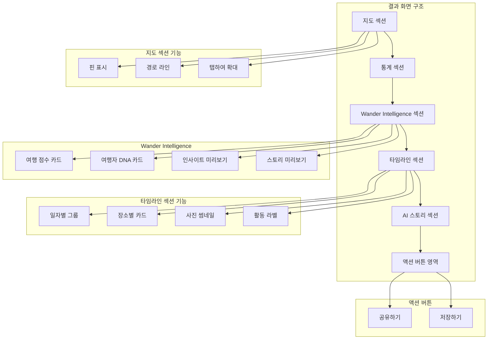
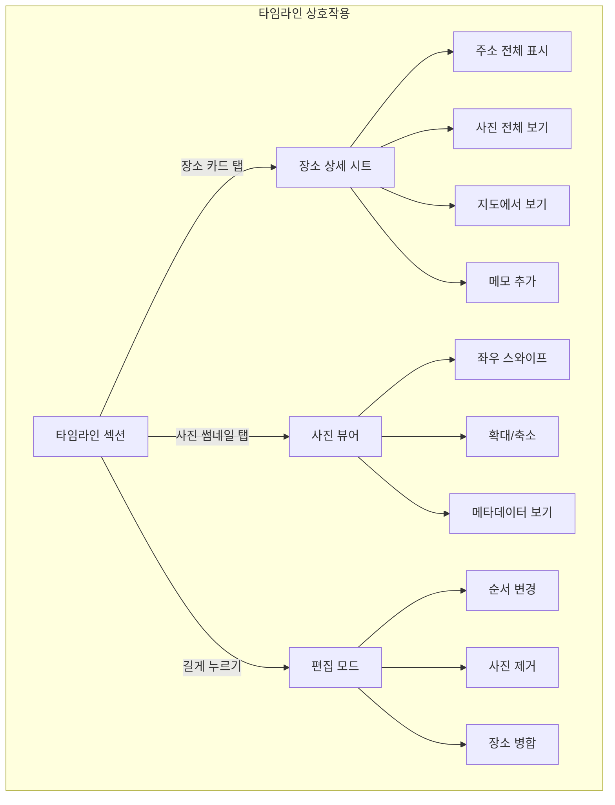
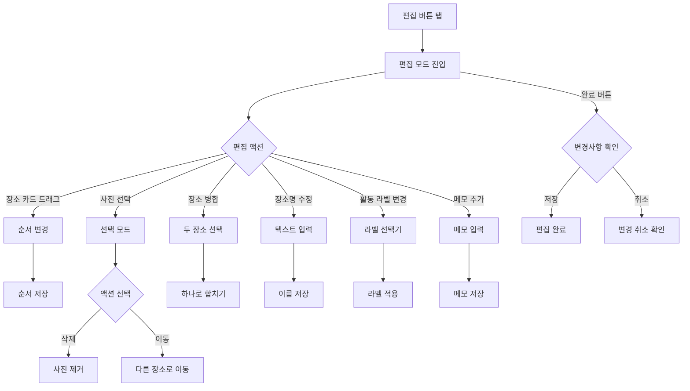

← [인덱스](../index.md)

---

## 7. 결과 화면 및 상세 보기

### 7.1 결과 화면 구조 (SCR-010)

> **v2.2 변경사항**: Wander Intelligence 섹션 추가 (여행 점수, 여행자 DNA, 인사이트, 스토리 미리보기)



### 7.2 결과 화면 레이아웃

```
┌─────────────────────────────────┐
│ 9:41                     📶 🔋  │
├─────────────────────────────────┤
│  ✕   제주도 3박4일       ···    │
│      2026.01.15 ~ 01.18        │
├─────────────────────────────────┤
│ ┌─────────────────────────────┐ │
│ │                             │ │
│ │    [지도 - 동선 표시]        │ │
│ │    📍━━📍━━📍━━📍          │ │
│ │                             │ │
│ │ 여행 동선         [전체보기] │ │
│ └─────────────────────────────┘ │
├─────────────────────────────────┤
│  ✨ 스마트 분석                 │
│  ┌────────┬────────┬────────┐  │
│  │ 🚗     │ 📍     │ 📸     │  │
│  │ 245km  │ 12곳   │ 50장   │  │
│  │ 이동   │ 방문   │ 사진   │  │
│  └────────┴────────┴────────┘  │
│  1월 15일 · 12곳               │
├─────────────────────────────────┤
│  ⭐ 여행 점수                   │
│ ┌─────────────────────────────┐ │
│ │  85      │ 전설적인 순간: 3개 │ │
│ │ Great    │ 획득한 배지: 5개   │ │
│ │          │                   │ │
│ │  🎨 예술가  🍽️ 미식가         │ │
│ └─────────────────────────────┘ │
├─────────────────────────────────┤
│  🧬 여행자 DNA                  │
│ ┌─────────────────────────────┐ │
│ │  🎨 예술적 탐험가             │ │
│ │  문화와 예술에 깊은 관심...   │ │
│ │                             │ │
│ │  탐험 ████████░░ 80          │ │
│ │  미식 ██████░░░░ 60          │ │
│ │  문화 █████████░ 90          │ │
│ │  휴식 ████░░░░░░ 40          │ │
│ └─────────────────────────────┘ │
├─────────────────────────────────┤
│  💡 여행 인사이트               │
│ ┌─────────────────────────────┐ │
│ │ 🌅 오후 시간대 활용 달인      │ │
│ │ 가장 활발하게 활동한 시간... │ │
│ └─────────────────────────────┘ │
│ ┌─────────────────────────────┐ │
│ │ 🍽️ 맛집 탐험가                │ │
│ │ 이번 여행에서 방문한 식당... │ │
│ └─────────────────────────────┘ │
├─────────────────────────────────┤
│  📖 여행 이야기                 │
│ ┌─────────────────────────────┐ │
│ │  제주의 푸른 바람            │ │
│ │  "바다와 하늘 사이에서..."   │ │
│ │                             │ │
│ │  새벽 비행기에 몸을 싣고...  │ │
│ │                             │ │
│ │  📚 3개의 챕터               │ │
│ └─────────────────────────────┘ │
├─────────────────────────────────┤
│  📅 타임라인                    │
│                                 │
│  📅 1월 15일 (월)               │
│ ┌─────────────────────────────┐ │
│ │ 📍 제주공항                  │ │
│ │ 🕐 10:30 · ✈️ 도착           │ │
│ │ ┌───┬───┬───┐              │ │
│ │ │📷│📷│📷│              │ │
│ │ └───┴───┴───┘              │ │
│ └─────────────────────────────┘ │
│           │                     │
│           ▼ 32km                │
│           │                     │
│ ┌─────────────────────────────┐ │
│ │ 📍 협재해수욕장              │ │
│ │ 🕐 13:00 · 🏖️ 해변           │ │
│ │ ┌───┬───┬───┬───┬───┐      │ │
│ │ │📷│📷│📷│📷│📷│      │ │
│ │ └───┴───┴───┴───┴───┘      │ │
│ └─────────────────────────────┘ │
│                                 │
│  • • • (스크롤)                 │
│                                 │
├─────────────────────────────────┤
│  🤖 AI 스토리                   │
│ ┌─────────────────────────────┐ │
│ │ AI 스토리 생성하기 >          │ │
│ └─────────────────────────────┘ │
├─────────────────────────────────┤
│ ┌──────────┬──────────────────┐ │
│ │  공유    │     저장하기     │ │
│ └──────────┴──────────────────┘ │
└─────────────────────────────────┘
```

> **v2.0 변경사항**: 탭바 3개 (홈, 기록, 설정), 프리미엄 다이아몬드 제거
> **v2.2 변경사항**: Wander Intelligence 섹션 추가 (여행 점수, DNA, 인사이트, 스토리)

### 7.3 타임라인 상호작용



### 7.4 지도 상세 화면 (SCR-011)

```
┌─────────────────────────────────┐
│ 9:41                     📶 🔋  │
├─────────────────────────────────┤
│  ✕         지도          ···   │
├─────────────────────────────────┤
│                                 │
│ ┌─────────────────────────────┐ │
│ │                             │ │
│ │                             │ │
│ │     [전체 화면 지도]         │ │
│ │                             │ │
│ │   📍1━━━📍2━━━📍3          │ │
│ │          ╲                  │ │
│ │           ━━━📍4━━━📍5     │ │
│ │                             │ │
│ │                             │ │
│ │                             │ │
│ └─────────────────────────────┘ │
│                                 │
├─────────────────────────────────┤
│  📍 터치하여 장소 정보 보기      │
│                                 │
│  [일자별 보기]  [전체 경로]      │
│                                 │
└─────────────────────────────────┘
```

**지도 핀 탭 시 말풍선:**
```
┌─────────────────────────┐
│ 📍 협재해수욕장          │
│ 🕐 13:00 ~ 15:30        │
│ 📷 8장                  │
│ [상세 보기]             │
└─────────────────────────┘
```

### 7.5 타임라인 편집 화면 (SCR-012)



**편집 모드 UI:**
```
┌─────────────────────────────────┐
│  취소      편집 모드       완료  │
├─────────────────────────────────┤
│                                 │
│  📅 Day 1 (1/15)               │
│                                 │
│ ┌─────────────────────────────┐ │
│ │ ≡  📍 제주공항         ✏️ 🗑️│ │
│ │    🕐 10:30 · ✈️ 도착       │ │
│ │    ┌───┬───┬───┐ [+추가]   │ │
│ │    │📷│📷│📷│           │ │
│ │    └───┴───┴───┘           │ │
│ └─────────────────────────────┘ │
│                                 │
│ ┌─────────────────────────────┐ │
│ │ ≡  📍 협재해수욕장     ✏️ 🗑️│ │
│ │    🕐 13:00 · 🏖️ 해변       │ │
│ │    활동: [🏖️해변▾]          │ │
│ │    메모: 탭하여 추가         │ │
│ └─────────────────────────────┘ │
│                                 │
│ [+ 새 장소 추가]                │
│                                 │
└─────────────────────────────────┘
```
