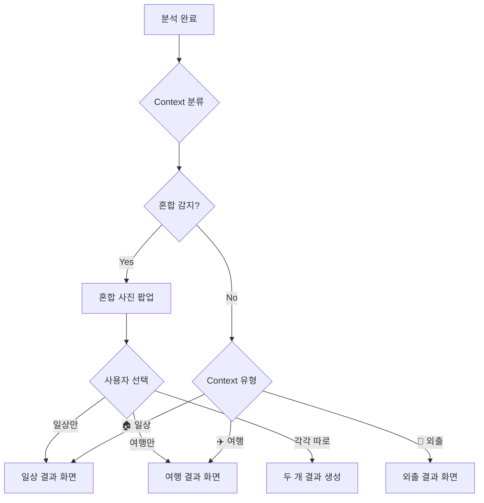
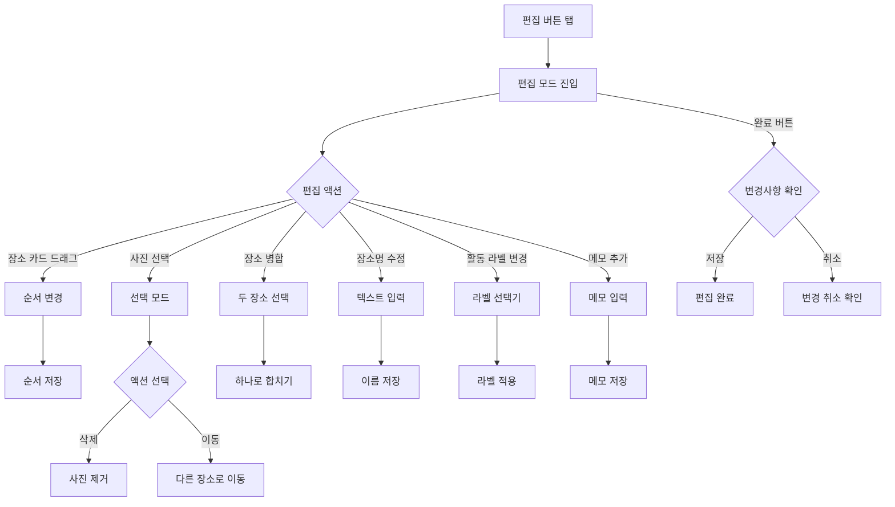
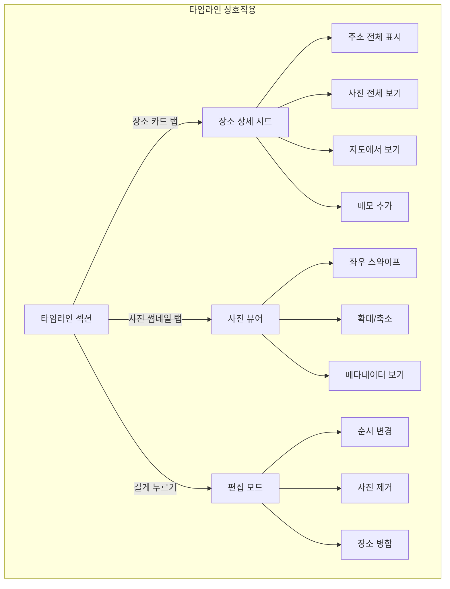

← [인덱스](../index.md)

---

## 7. 결과 화면 및 상세 보기

> **v3.2 변경사항**: Context Classification 도입, 일상/외출/여행 분기 UI, TravelDNA/점수/MomentScore 전면 제거, Wander Intelligence는 여행/혼합에서만 실행, AI 다듬기는 여행/혼합에서만 제공

### 7.1 Context Classification

분석 완료 후 자동으로 Context를 분류하여 맞춤 UI를 제공합니다.



#### Context 분류 기준

> **기술**: SwiftyH3 (Uber H3 헥사곤 그리드) 기반 오프라인 분류
> 경계 케이스만 CLGeocoder 온라인 확인

| Context | H3 조건 | 추가 조건 | 우선순위 |
|---------|---------|----------|---------|
| 🏠 **일상 Daily** | H3 res7 일치 (~5km² 동네) | 1일 이내 | 1 |
| 🚶 **외출 Outing** | H3 res5 일치 (~253km² 시/군) | 당일치기 | 2 |
| ✈️ **여행 Travel** | H3 res4 불일치 (~1,770km²) | 2일+ or 50km+ | 3 |
| 🔀 **혼합 Mixed** | 일상(res7 일치) + 여행(res4 불일치) 클러스터 공존 | 분리 제안 | - |

**H3 해상도 매핑:**

| H3 Resolution | 셀 크기 | 대응 행정구역 | Context |
|--------------|---------|-------------|---------|
| res 9 | ~0.11 km² | 건물 | 일상 |
| res 7 | ~5.16 km² | 동/읍/면 | 일상 |
| res 5 | ~253 km² | 시/군/구 | 외출 |
| res 4 | ~1,770 km² | 시/도 | 여행 기준 |

#### 장소 미등록 시 동작

| 상태 | 동작 |
|------|------|
| 장소 미등록 + 학습 데이터 없음 | Context 구분 없이 "분석 결과"로 표시 |
| 장소 미등록 + 패턴 감지됨 | 분석 후 장소 확인 요청 팝업 |
| 장소 등록됨 | 정확한 Context 분류 |

---

### 7.2 혼합 사진 감지 팝업 (신규)

일상과 여행 사진이 섞여 있을 때 표시되는 팝업입니다.

```
┌─────────────────────────────────────┐
│                                     │
│  📍 일상과 여행 사진이 섞여있어요    │
│                                     │
│  ┌─────────────────────────────┐   │
│  │ 🏠 일상 (서울 강남구)        │   │
│  │    3곳 · 8장                │   │
│  └─────────────────────────────┘   │
│                                     │
│  ┌─────────────────────────────┐   │
│  │ ✈️ 여행 (부산광역시)         │   │
│  │    5곳 · 32장               │   │
│  └─────────────────────────────┘   │
│                                     │
│  어떻게 분석할까요?                  │
│                                     │
│  ┌─────────────────────────────┐   │
│  │     🏠 일상만 분석           │   │
│  └─────────────────────────────┘   │
│  ┌─────────────────────────────┐   │
│  │     ✈️ 여행만 분석           │   │
│  └─────────────────────────────┘   │
│  ┌─────────────────────────────┐   │
│  │  ⭐ 각각 따로 분석 (추천)    │   │
│  └─────────────────────────────┘   │
│                                     │
│  [취소]                             │
│                                     │
└─────────────────────────────────────┘
```

**동작:**
- "각각 따로 분석" 선택 시: 두 개의 분석 결과가 생성됨
- 기록 탭에서 두 개의 별도 기록으로 표시

---

### 7.3 일상 결과 화면 (SCR-010a)

일상으로 분류된 사진의 심플한 결과 화면입니다.

```
┌─────────────────────────────────────┐
│ 9:41                         📶 🔋  │
├─────────────────────────────────────┤
│  ✕                            저장  │
├─────────────────────────────────────┤
│                                     │
│  ┌─────────────────────────────┐   │
│  │                             │   │
│  │   2월 7일 금요일             │   │
│  │                             │   │
│  │   🏢 → ☕ → 🍽️ → 🏠          │   │
│  │   회사  카페  저녁  집        │   │
│  │                             │   │
│  │   ─────────────────────     │   │
│  │                             │   │
│  │   📸 12장                   │   │
│  │                             │   │
│  └─────────────────────────────┘   │
│                                     │
│  ┌─────────────────────────────┐   │
│  │ ┌───┬───┬───┬───┬───┬───┐  │   │
│  │ │📷│📷│📷│📷│📷│📷│  │   │
│  │ └───┴───┴───┴───┴───┴───┘  │   │
│  │    (대표 사진 그리드)        │   │
│  └─────────────────────────────┘   │
│                                     │
│  ┌─────────────────────────────┐   │
│  │ #일상 #카페 #퇴근길 #저녁     │   │
│  └─────────────────────────────┘   │
│                                     │
│  ┌─────────────────────────────┐   │
│  │         저장하기             │   │
│  └─────────────────────────────┘   │
│                                     │
└─────────────────────────────────────┘
```

#### 일상 결과 구성 요소

| 포함 | 제외 |
|------|------|
| ✅ 날짜 | ❌ 지도 (동선) |
| ✅ 장소 흐름 (아이콘 + 이름) | ❌ 이동 거리/통계 |
| ✅ 사진 수 | ❌ 타임라인 |
| ✅ 대표 사진 그리드 | ❌ Wander Intelligence (전체) |
| ✅ 자동 생성 태그 | ❌ AI 다듬기 |

---

### 7.4 외출 결과 화면 (SCR-010b)

외출(당일치기)로 분류된 사진의 결과 화면입니다.

```
┌─────────────────────────────────────┐
│ 9:41                         📶 🔋  │
├─────────────────────────────────────┤
│  ✕      성수동 맛집 탐방       저장  │
├─────────────────────────────────────┤
│                                     │
│  ┌─────────────────────────────┐   │
│  │   [간단 지도]                │   │
│  │   📍 ─────────── 📍         │   │
│  └─────────────────────────────┘   │
│                                     │
│  2월 7일 · 성수동                   │
│                                     │
│  ┌────────┬────────┬────────┐      │
│  │ 📍     │ 🚗     │ 📸     │      │
│  │ 3곳    │ 5km    │ 25장   │      │
│  └────────┴────────┴────────┘      │
│                                     │
│  ━━━ 방문 장소 ━━━                  │
│                                     │
│  ┌─────────────────────────────┐   │
│  │ 🍽️ 성수 맛집                 │   │
│  │ 12:30                       │   │
│  │ ┌───┬───┬───┐              │   │
│  │ │📷│📷│📷│              │   │
│  │ └───┴───┴───┘              │   │
│  └─────────────────────────────┘   │
│                                     │
│  ┌─────────────────────────────┐   │
│  │ ☕ 카페 어니언                │   │
│  │ 14:00                       │   │
│  │ ┌───┬───┬───┬───┐          │   │
│  │ │📷│📷│📷│📷│          │   │
│  │ └───┴───┴───┴───┘          │   │
│  └─────────────────────────────┘   │
│                                     │
│  #맛집탐방 #성수동 #카페            │
│                                     │
│  ┌─────────────────────────────┐   │
│  │         저장하기             │   │
│  └─────────────────────────────┘   │
│                                     │
└─────────────────────────────────────┘
```

#### 외출 결과 구성 요소

| 포함 | 제외 |
|------|------|
| ✅ 간단 지도 (출발-도착) | ❌ 상세 타임라인 |
| ✅ 날짜, 지역명 | ❌ Wander Intelligence (전체) |
| ✅ 통계 (장소, 거리, 사진) | ❌ AI 다듬기 |
| ✅ 방문 장소 카드 + 사진 | |
| ✅ 자동 생성 태그 | |

---

### 7.5 여행 결과 화면 (SCR-010c)

여행으로 분류된 사진의 상세 결과 화면입니다.

> **v3.2 변경사항**: TravelDNA, TripScore, MomentScore 전면 제거. Wander Intelligence 섹션은 StoryPreviewCard + InsightsPreview만 유지. AI 다듬기는 여행/혼합에서만 제공.

```
┌─────────────────────────────────────┐
│ 9:41                         📶 🔋  │
├─────────────────────────────────────┤
│  ✕      부산 여행              저장  │
│         2월 5일 ~ 7일 (2박3일)      │
├─────────────────────────────────────┤
│                                     │
│  ┌─────────────────────────────┐   │
│  │   [지도 - 동선 표시]          │   │
│  │   📍━━📍━━📍━━📍            │   │
│  │                  [전체보기]  │   │
│  └─────────────────────────────┘   │
│                                     │
│  ┌────────┬────────┬────────┐      │
│  │ 📍     │ 🚗     │ 📸     │      │
│  │ 8곳    │ 45km   │ 120장  │      │
│  └────────┴────────┴────────┘      │
│                                     │
│  ━━━ 📅 타임라인 ━━━                │
│                                     │
│  📅 2월 5일 (수)                    │
│  ┌─────────────────────────────┐   │
│  │ 📍 부산역                    │   │
│  │ 🕐 14:00 · 🚄 도착           │   │
│  │ ┌───┬───┬───┐              │   │
│  │ │📷│📷│📷│              │   │
│  │ └───┴───┴───┘              │   │
│  └─────────────────────────────┘   │
│         │                           │
│         ▼ 12km                      │
│         │                           │
│  ┌─────────────────────────────┐   │
│  │ 📍 해운대                    │   │
│  │ 🕐 16:00 · 🏖️ 해변           │   │
│  │ ┌───┬───┬───┬───┬───┐      │   │
│  │ │📷│📷│📷│📷│📷│      │   │
│  │ └───┴───┴───┴───┴───┘      │   │
│  └─────────────────────────────┘   │
│                                     │
│  • • • (스크롤)                     │
│                                     │
│  ━━━ 💡 인사이트 ━━━ (있을 때만)    │
│  ┌─────────────────────────────┐   │
│  │ 🏖️ 해운대에서 가장 오래       │   │
│  │    머물렀어요 (2시간)         │   │
│  └─────────────────────────────┘   │
│  ┌─────────────────────────────┐   │
│  │ 🍽️ 맛집 3곳을 방문했어요      │   │
│  └─────────────────────────────┘   │
│                                     │
│  #부산여행 #해운대 #바다 #맛집      │
│                                     │
│  ┌─────────────────────────────┐   │
│  │    ✨ AI로 다듬기            │   │
│  └─────────────────────────────┘   │
│  ┌─────────────────────────────┐   │
│  │         저장하기             │   │
│  └─────────────────────────────┘   │
│                                     │
└─────────────────────────────────────┘
```

#### 여행 결과 구성 요소

| 포함 | 제거됨 (v3.2) |
|------|--------------|
| ✅ 지도 (동선 표시) | ❌ TravelDNA (근거 불명확) |
| ✅ 날짜 범위, 기간 | ❌ TripScore/여행 점수 (주관적 판단) |
| ✅ 통계 (장소, 거리, 사진) | ❌ MomentScore (기준 불명확) |
| ✅ 일자별 타임라인 | |
| ✅ 인사이트 (있을 때만 표시) | |
| ✅ 여행 이야기 (StoryPreviewCard) | |
| ✅ 자동 생성 태그 | |
| ✅ AI 다듬기 버튼 | |

> **Wander Intelligence 섹션 구성 (v3.2)**: TripScoreCard, TravelDNACard 완전 제거. InsightsPreview + StoryPreviewCard만 남음. `hasWanderIntelligence`는 travelStory + insights 존재 여부로만 판단.

---

### 7.6 장소 확인 요청 팝업 (신규)

패턴 학습 후 장소 확인을 요청하는 팝업입니다.

```
┌─────────────────────────────────────┐
│                                     │
│  💡 자주 가시는 곳을 발견했어요!     │
│                                     │
│  ┌─────────────────────────────┐   │
│  │  📍 서울 강남구 삼성동        │   │
│  │     야간 방문 80% · 5회 방문  │   │
│  │     🏠 집으로 추정            │   │
│  └─────────────────────────────┘   │
│                                     │
│  이곳이 어떤 곳인가요?              │
│                                     │
│  ┌────┐ ┌────┐ ┌────┐ ┌────┐      │
│  │ 🏠 │ │ 🏢 │ │ 🏫 │ │ ❌ │      │
│  │ 집 │ │회사│ │학교│ │아님│      │
│  └────┘ └────┘ └────┘ └────┘      │
│                                     │
│  [나중에]                           │
│                                     │
└─────────────────────────────────────┘
```

**동작:**
- 3회 이상 분석 후, 패턴이 감지되면 표시
- 사용자 확인 시 UserPlace에 자동 등록
- "나중에" 선택 시 다음 분석 때 다시 표시

---

### 7.7 지도 상세 화면 (SCR-011)

> 여행/외출 결과에서만 표시

```
┌─────────────────────────────────────┐
│ 9:41                         📶 🔋  │
├─────────────────────────────────────┤
│  ✕         지도          ···       │
├─────────────────────────────────────┤
│                                     │
│ ┌─────────────────────────────────┐ │
│ │                                 │ │
│ │                                 │ │
│ │     [전체 화면 지도]             │ │
│ │                                 │ │
│ │   📍1━━━📍2━━━📍3              │ │
│ │          ╲                      │ │
│ │           ━━━📍4━━━📍5         │ │
│ │                                 │ │
│ │                                 │ │
│ │                                 │ │
│ └─────────────────────────────────┘ │
│                                     │
├─────────────────────────────────────┤
│  📍 터치하여 장소 정보 보기          │
│                                     │
│  [일자별 보기]  [전체 경로]          │
│                                     │
└─────────────────────────────────────┘
```

**지도 핀 탭 시 말풍선:**
```
┌─────────────────────────┐
│ 📍 해운대               │
│ 🕐 16:00 ~ 18:30        │
│ 📷 15장                 │
│ [상세 보기]             │
└─────────────────────────┘
```

---

### 7.8 타임라인 편집 화면 (SCR-012)

> 여행 결과에서만 표시



**편집 모드 UI:**
```
┌─────────────────────────────────────┐
│  취소      편집 모드       완료      │
├─────────────────────────────────────┤
│                                     │
│  📅 Day 1 (2/5)                     │
│                                     │
│ ┌─────────────────────────────────┐ │
│ │ ≡  📍 부산역             ✏️ 🗑️  │ │
│ │    🕐 14:00 · 🚄 도착           │ │
│ │    ┌───┬───┬───┐ [+추가]       │ │
│ │    │📷│📷│📷│               │ │
│ │    └───┴───┴───┘               │ │
│ └─────────────────────────────────┘ │
│                                     │
│ ┌─────────────────────────────────┐ │
│ │ ≡  📍 해운대             ✏️ 🗑️  │ │
│ │    🕐 16:00 · 🏖️ 해변           │ │
│ │    활동: [🏖️해변▾]              │ │
│ │    메모: 탭하여 추가             │ │
│ └─────────────────────────────────┘ │
│                                     │
│ [+ 새 장소 추가]                    │
│                                     │
└─────────────────────────────────────┘
```

---

### 7.9 타임라인 상호작용



---

### 7.10 Context별 기능 비교표

> **v3.2 업데이트**: TravelDNA, TripScore, MomentScore 모든 Context에서 제거. StoryWeaving/InsightEngine은 여행/혼합에서만 유지. Wander Intelligence 연산 자체가 일상/외출에서는 스킵됨 (SmartAnalysisCoordinator).

| 기능 | 🏠 일상 | 🚶 외출 | ✈️ 여행 | 🔀 혼합 |
|------|---------|---------|---------|---------|
| 지도 | ❌ | ✅ 간단 | ✅ 상세 | ✅ 상세 |
| 이동거리/통계 | ❌ | ✅ | ✅ | ✅ |
| 타임라인 | ❌ | ❌ | ✅ | ✅ |
| 장소 카드 | 아이콘만 | ✅ | ✅ | ✅ |
| Wander Intelligence | ❌ (스킵) | ❌ (스킵) | ✅ | ✅ |
| ┗ StoryWeaving | ❌ | ❌ | ✅ | ✅ |
| ┗ InsightEngine | ❌ | ❌ | ✅ (없으면 숨김) | ✅ (없으면 숨김) |
| ┗ TravelDNA | ❌ (제거) | ❌ (제거) | ❌ (제거) | ❌ (제거) |
| ┗ TripScore | ❌ (제거) | ❌ (제거) | ❌ (제거) | ❌ (제거) |
| ┗ MomentScore | ❌ (제거) | ❌ (제거) | ❌ (제거) | ❌ (제거) |
| 태그 | ✅ | ✅ | ✅ | ✅ |
| AI 다듬기 | ❌ | ❌ | ✅ | ✅ |
| 편집 모드 | ❌ | ❌ | ✅ | ✅ |
| 공유 | ✅ 심플 | ✅ | ✅ 상세 | ✅ 상세 |

**지도 제목 Context별 표시:**

| Context | 지도 섹션 제목 |
|---------|--------------|
| 🏠 일상 | (지도 미표시) |
| 🚶 외출 | "외출 동선" |
| ✈️ 여행 | "여행 동선" |
| 🔀 혼합 | "여행 동선" |
