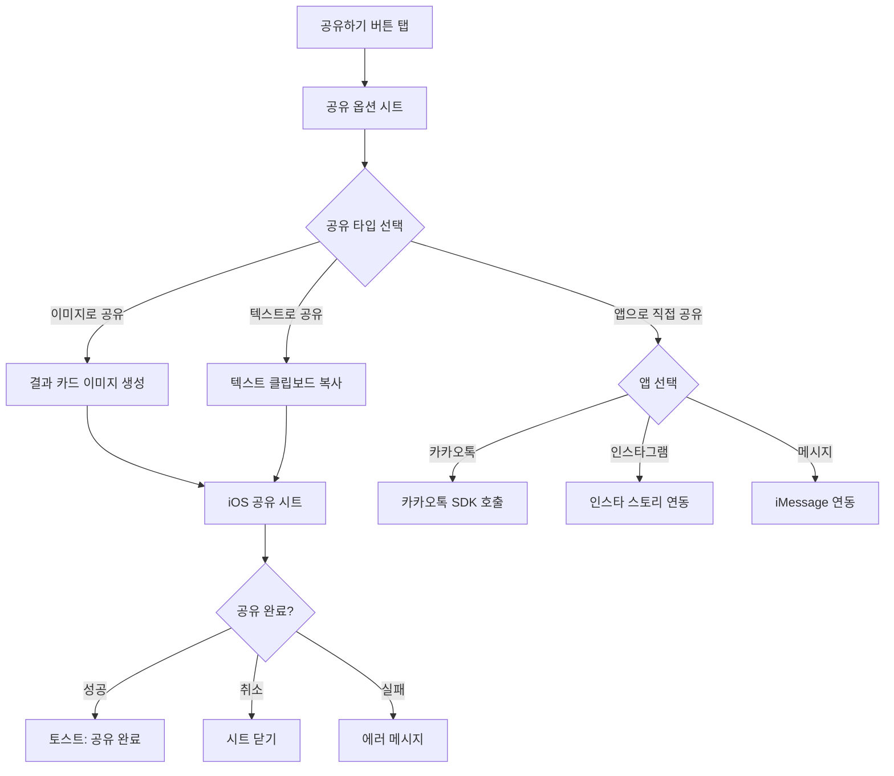
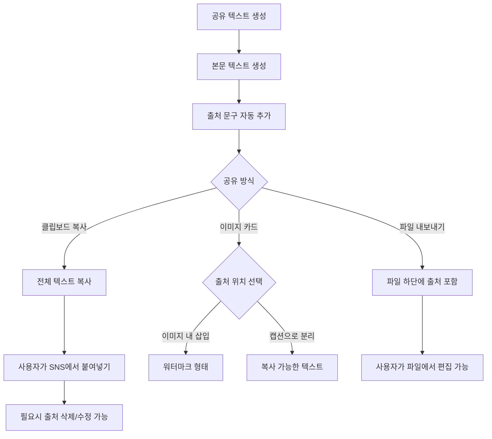
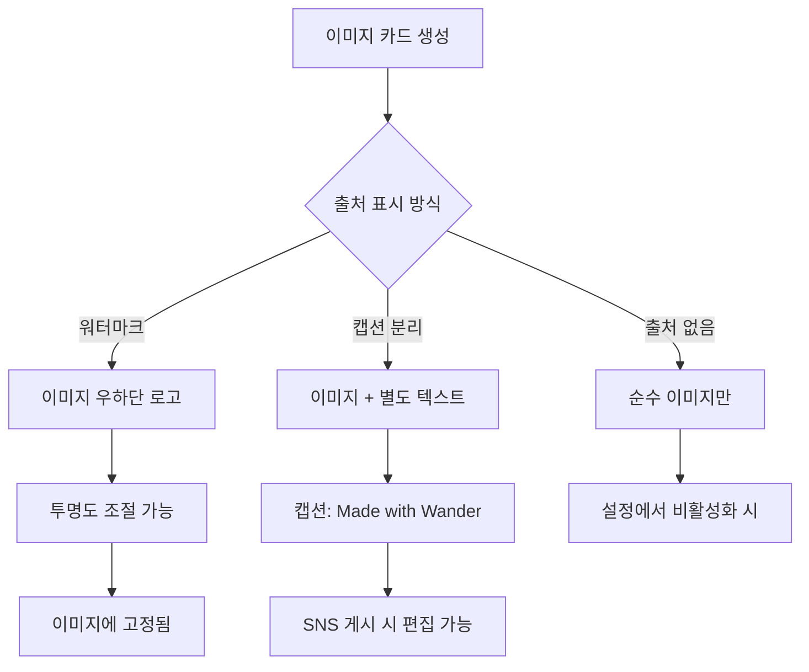
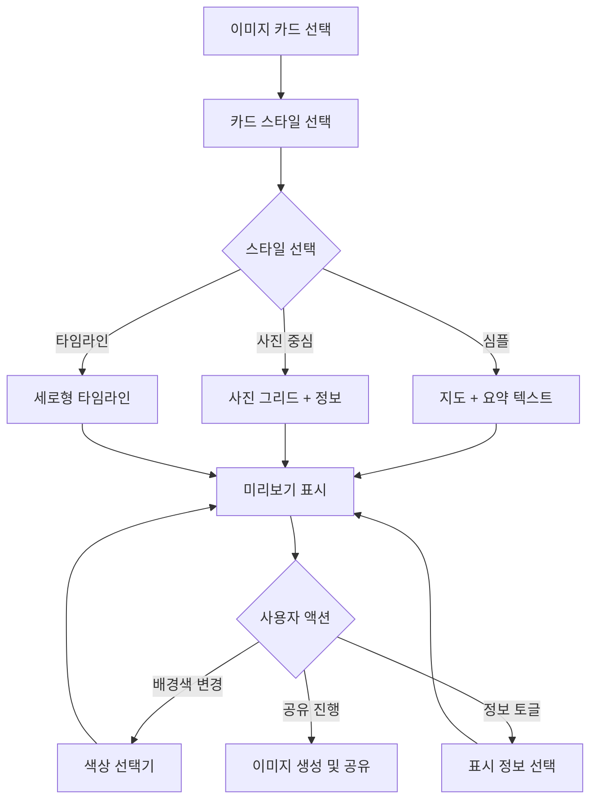
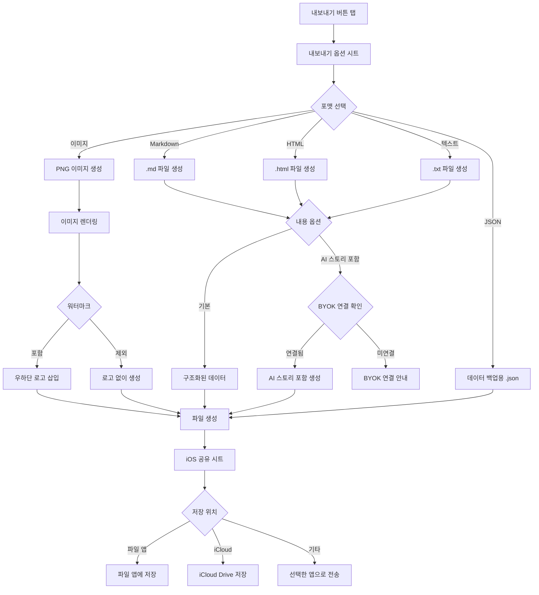

← [인덱스](../index.md)

---

## 8. 공유 및 내보내기

### 8.1 공유 플로우

> **v2.0 변경사항**: 프리미엄 체크 제거, 링크 공유는 서버리스로 인해 미지원



> **참고**: 서버리스 앱으로 웹 링크 공유는 미지원. 이미지/텍스트 공유만 가능.

### 8.2 공유 시트 (SCR-014)

```
┌─────────────────────────────────┐
│           공유하기              │
├─────────────────────────────────┤
│                                 │
│  공유 형식 선택                 │
│                                 │
│ ┌───────────────────────┐       │
│ │ 🖼️ 이미지 카드          │       │
│ │ SNS에 바로 올릴 수 있는  │       │
│ │ 예쁜 카드 이미지         │       │
│ └───────────────────────┘       │
│                                 │
│ ┌───────────────────────┐       │
│ │ 📝 텍스트만            │       │
│ │ 타임라인 텍스트 복사    │       │
│ └───────────────────────┘       │
│                                 │
├─────────────────────────────────┤
│  바로 공유                      │
│                                 │
│ ┌─────┬─────┬─────┬─────┐      │
│ │ 💬  │ 📸  │ 💬  │ ··· │      │
│ │카톡 │인스타│메시지│     │      │
│ └─────┴─────┴─────┴─────┘      │
│                                 │
│  [      기타 앱으로 공유     ]  │
│                                 │
└─────────────────────────────────┘
```

### 8.3 공유 텍스트 출처 표기

#### 8.3.1 출처 표기 정책

공유되는 모든 텍스트(이미지 카드, 텍스트 복사, 내보내기)에 앱 출처를 기본 포함합니다.
단, 사용자가 SNS 앱에서 자유롭게 편집/삭제할 수 있도록 **클립보드 복사 형태**로 제공합니다.



#### 8.3.2 출처 문구 형식

| 공유 유형 | 출처 문구 | 편집 가능 여부 |
|-----------|----------|---------------|
| 텍스트 공유 | `📍 Wander로 기록했어요` | ✅ SNS에서 삭제 가능 |
| 이미지 카드 (캡션) | `Made with Wander ✨` | ✅ 캡션에서 삭제 가능 |
| 이미지 카드 (워터마크) | 우하단 작은 로고 | ⚠️ 이미지 편집 필요 |
| Markdown 내보내기 | `> 📍 Wander로 기록한 여행` | ✅ 파일에서 삭제 가능 |
| 퀵모드 공유 | `via Wander` | ✅ SNS에서 삭제 가능 |

#### 8.3.3 출처 포함 텍스트 예시

**텍스트 공유 시:**
```
🏝️ 제주도 3박 4일 여행

📅 Day 1 (1/15)
📍 제주공항 → 협재해수욕장 → 애월카페거리

📅 Day 2 (1/16)
📍 한라산 등반 → 1100고지 → 서귀포

🚗 총 이동거리: 245km
📍 방문 장소: 12곳

─────────────────
📍 Wander로 기록했어요
```

**퀵모드 "지금 뭐해?" 공유 시:**
```
🎤 홍대 뮤직클럽에서 인디밴드 공연 보는 중!

📍 홍대입구역 근처 · 🕗 저녁 8시

via Wander
```

#### 8.3.4 출처 설정 옵션 (설정 화면)

```
┌─────────────────────────────────┐
│  ◀       공유 설정              │
├─────────────────────────────────┤
│                                 │
│  출처 표기                      │
│ ┌─────────────────────────────┐ │
│ │ 📍 공유 시 출처 포함    🔘  │ │
│ │                             │ │
│ │ 공유하는 텍스트 끝에 앱     │ │
│ │ 출처가 자동으로 추가됩니다.  │ │
│ │ SNS에서 자유롭게 편집/삭제  │ │
│ │ 할 수 있어요.              │ │
│ └─────────────────────────────┘ │
│                                 │
│  출처 문구 스타일               │
│ ┌─────────────────────────────┐ │
│ │ ● 📍 Wander로 기록했어요    │ │
│ │ ○ Made with Wander ✨       │ │
│ │ ○ via Wander               │ │
│ │ ○ #Wander                   │ │
│ └─────────────────────────────┘ │
│                                 │
│  💡 출처를 포함하면 더 많은     │
│     사람들이 Wander를 알게 돼요 │
│                                 │
└─────────────────────────────────┘
```

#### 8.3.5 이미지 카드 출처 옵션



**이미지 카드 옵션 UI 업데이트:**
```
┌─────────────────────────────────┐
│  ◀        카드 스타일     공유  │
├─────────────────────────────────┤
│                                 │
│  ┌─────────────────────────┐   │
│  │                         │   │
│  │    [카드 미리보기]       │   │
│  │                    🏷️   │   │
│  │    🗺️ + 📊         ↑   │   │
│  │              워터마크    │   │
│  └─────────────────────────┘   │
│                                 │
├─────────────────────────────────┤
│  스타일                         │
│  [심플✓] [사진중심] [타임라인]   │
│                                 │
├─────────────────────────────────┤
│  배경색                         │
│  ⚪ ⚫ 🔵 🟢 🟡 🟠 🔴         │
│                                 │
├─────────────────────────────────┤
│  표시 정보                      │
│  ☑️ 지도  ☑️ 날짜  ☑️ 통계      │
│  ☑️ 장소명  ☐ 정확한 주소       │
│                                 │
├─────────────────────────────────┤
│  출처 표기                      │
│  ● 워터마크 (이미지 내)         │
│  ○ 캡션으로 (편집 가능)         │
│  ○ 표시 안 함                   │
│                                 │
└─────────────────────────────────┘
```

#### 8.3.6 SNS별 출처 편집 안내

| SNS | 편집 방법 | 비고 |
|-----|----------|------|
| 카카오톡 | 전송 전 텍스트 직접 편집 | 복사된 텍스트 수정 |
| 인스타그램 스토리 | 텍스트 스티커로 추가됨 → 삭제 가능 | 별도 레이어 |
| 인스타그램 피드 | 캡션에서 편집 | 게시 전 수정 |
| 트위터/X | 트윗 작성 창에서 편집 | 복사된 텍스트 수정 |
| 메시지 | 전송 전 텍스트 편집 | iMessage/SMS |

### 8.4 공유 카드 이미지 옵션



**카드 스타일 선택 UI:**
```
┌─────────────────────────────────┐
│  ◀        카드 스타일     공유  │
├─────────────────────────────────┤
│                                 │
│  ┌─────────────────────────┐   │
│  │                         │   │
│  │    [카드 미리보기]       │   │
│  │                         │   │
│  │    🗺️ + 📊              │   │
│  │                         │   │
│  └─────────────────────────┘   │
│                                 │
├─────────────────────────────────┤
│  스타일                         │
│  [심플✓] [사진중심] [타임라인]   │
│                                 │
├─────────────────────────────────┤
│  배경색                         │
│  ⚪ ⚫ 🔵 🟢 🟡 🟠 🔴         │
│                                 │
├─────────────────────────────────┤
│  표시 정보                      │
│  ☑️ 지도  ☑️ 날짜  ☑️ 통계      │
│  ☑️ 장소명  ☐ 정확한 주소       │
│                                 │
└─────────────────────────────────┘
```

### 8.5 내보내기 플로우 (SCR-015)

> **v2.1 변경사항**: 이미지(PNG) 내보내기 추가, 워터마크 옵션
> **v2.0 변경사항**: 프리미엄 체크 제거, AI 스토리는 BYOK 연결 여부로 결정



#### 8.5.1 이미지 내보내기 사양

| 항목 | 값 |
|------|-----|
| 형식 | PNG |
| 해상도 | 1080 x 1920 (세로형) |
| 워터마크 | 우하단 Wander 로고 (선택적) |
| 내용 | 지도 + 타임라인 + 통계 요약 |

> **참고**: 프리미엄/크레딧 체크 없음. AI 스토리 포함은 BYOK 연결 여부로만 결정.

### 8.6 내보내기 옵션 시트

> **v2.1 변경사항**: 이미지(PNG) 형식 추가, 워터마크 옵션
> **v2.0 변경사항**: 프리미엄 표시 제거, AI 스토리는 BYOK 연결 시 사용 가능

```
┌─────────────────────────────────┐
│          내보내기               │
├─────────────────────────────────┤
│                                 │
│  파일 형식                      │
│                                 │
│ ┌─────────────────────────────┐ │
│ │ 🖼️ 이미지 (.png)        ⭐  │ │
│ │ SNS 공유에 최적화           │ │
│ └─────────────────────────────┘ │
│                                 │
│ ┌─────────────────────────────┐ │
│ │ 📝 Markdown (.md)           │ │
│ │ 블로그 포스팅에 적합         │ │
│ └─────────────────────────────┘ │
│                                 │
│ ┌─────────────────────────────┐ │
│ │ 🌐 HTML (.html)             │ │
│ │ 웹페이지 형식                │ │
│ └─────────────────────────────┘ │
│                                 │
│ ┌─────────────────────────────┐ │
│ │ 📄 텍스트 (.txt)            │ │
│ │ 순수 텍스트                  │ │
│ └─────────────────────────────┘ │
│                                 │
├─────────────────────────────────┤
│  이미지 옵션 (이미지 선택 시)   │
│                                 │
│  ☑️ Wander 로고 워터마크       │
│                                 │
├─────────────────────────────────┤
│  포함 내용 (문서 형식 선택 시)  │
│                                 │
│  ☑️ 타임라인                    │
│  ☑️ 통계 정보                   │
│  ☐ AI 스토리 (BYOK 연결 필요)  │
│  ☑️ 사진 파일명                 │
│                                 │
├─────────────────────────────────┤
│                                 │
│  [      내보내기 시작      ]    │
│                                 │
└─────────────────────────────────┘
```

> **참고**: AI 스토리는 BYOK 연결 시 무료로 사용 가능.

### 8.7 내보내기 결과물 예시

**Markdown 출력 (무료):**
```markdown
# 제주도 3박 4일 여행

**기간:** 2026.01.15 ~ 2026.01.18
**이동거리:** 245km
**방문장소:** 12곳

---

## Day 1 (2026.01.15)

### 📍 제주공항
- 시간: 10:30
- 유형: ✈️ 공항
- 사진: IMG_001.jpg, IMG_002.jpg

### 📍 협재해수욕장
- 시간: 13:00 ~ 15:30
- 유형: 🏖️ 해변
- 사진: IMG_003.jpg ~ IMG_010.jpg

...

---

> 📍 Wander로 기록한 여행
```

**Markdown 출력 (프리미엄 - AI 스토리 포함):**
```markdown
# 바다와 커피향이 함께한 제주 여행

비행기가 제주공항에 내리자마자 느껴지는 바다 냄새.
렌터카를 빌려 곧장 협재해수욕장으로 향했다...

---

## Day 1: 에메랄드빛 첫 만남

### 📍 제주공항
> 설렘을 안고 제주의 땅을 밟았다.
> 공항을 나서자 촉촉한 바다 공기가 반겼다.

...

---

> ✨ Made with Wander
```

---
