[← 인덱스](index.md)

---

## 10. 예외 케이스 및 에러 처리

### 10.1 예외 케이스 분류

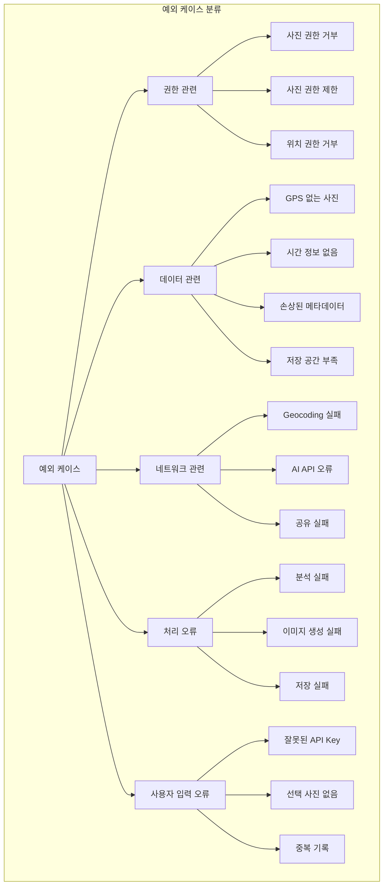

### 10.2 권한 관련 예외 처리

#### 10.2.1 사진 권한 완전 거부

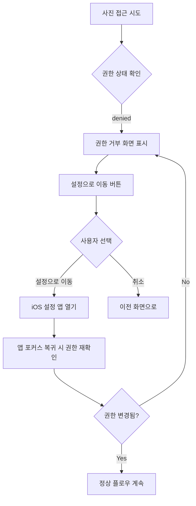

**권한 거부 화면 UI:**
```
┌─────────────────────────────────┐
│                                 │
│                                 │
│         📷 ❌                    │
│                                 │
│   사진 접근 권한이 필요해요      │
│                                 │
│   Wander는 사진의 메타데이터를  │
│   분석하여 여행 기록을          │
│   만들어 드립니다.              │
│                                 │
│   설정에서 사진 접근을          │
│   허용해 주세요.                │
│                                 │
│                                 │
│   [    설정으로 이동    ]       │
│   [       취소        ]        │
│                                 │
└─────────────────────────────────┘
```

#### 10.2.2 사진 권한 제한 (일부만 허용)

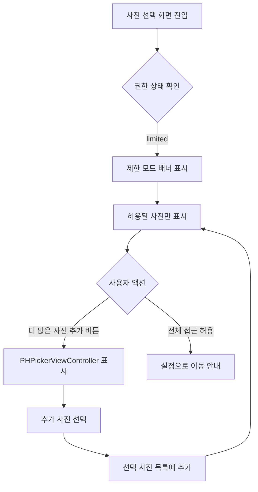

**제한 모드 배너:**
```
┌─────────────────────────────────┐
│ ⚠️ 일부 사진만 접근 가능합니다   │
│ [더 많은 사진 추가] [전체 허용]  │
└─────────────────────────────────┘
```

#### 10.2.3 위치 권한 거부

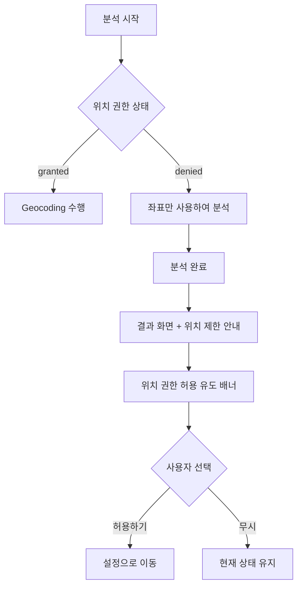

**위치 권한 없음 안내:**
```
┌─────────────────────────────────┐
│ ℹ️ GPS 좌표만 표시됩니다         │
│ 위치 권한을 허용하면 주소와      │
│ 장소명을 자동으로 표시합니다.    │
│ [    위치 권한 허용    ]        │
└─────────────────────────────────┘
```

### 10.3 데이터 관련 예외 처리

#### 10.3.1 GPS 없는 사진 처리

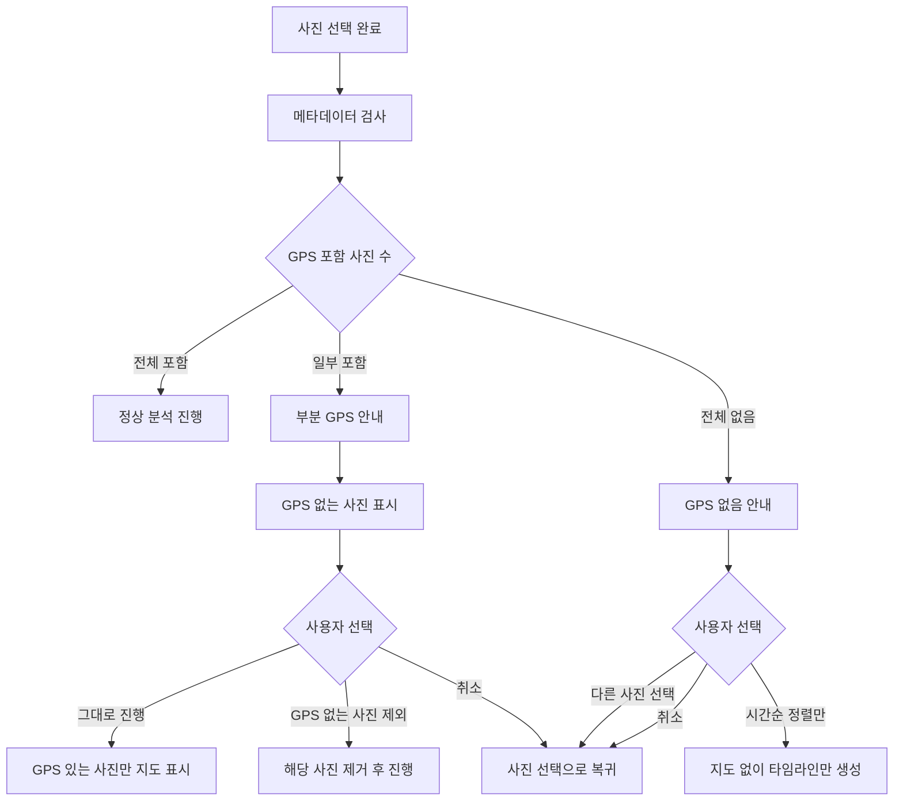

**GPS 없음 안내 다이얼로그:**
```
┌─────────────────────────────────┐
│                                 │
│   📍 위치 정보가 없어요         │
│                                 │
│   선택한 50장 중 32장에         │
│   GPS 정보가 없습니다.          │
│                                 │
│   ┌─────────────────────────┐  │
│   │ GPS 없음: 32장           │  │
│   │ ┌───┬───┬───┬───┐       │  │
│   │ │📷│📷│📷│...│       │  │
│   │ └───┴───┴───┴───┘       │  │
│   └─────────────────────────┘  │
│                                 │
│   [  GPS 있는 사진만 분석  ]    │
│   [   시간순 정렬만 진행   ]    │
│   [        취소          ]     │
│                                 │
└─────────────────────────────────┘
```

#### 10.3.2 시간 정보 없는 사진

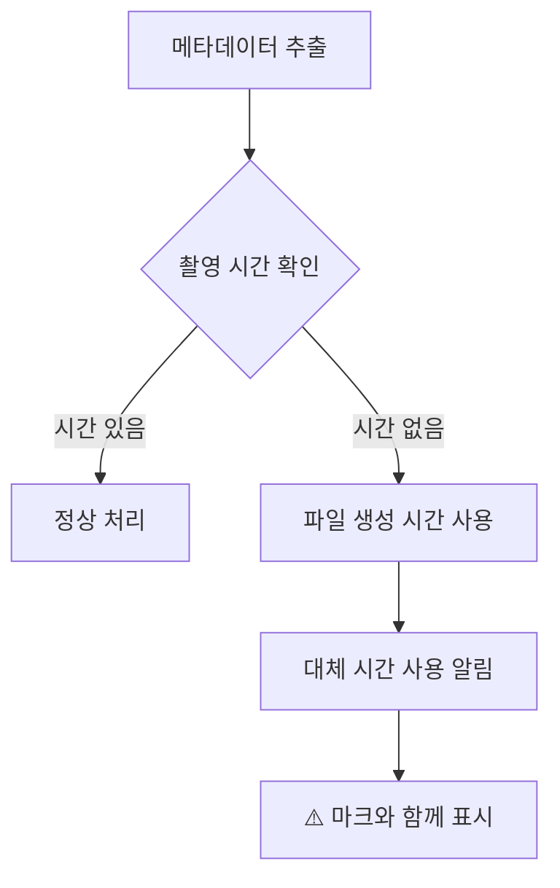

#### 10.3.3 저장 공간 부족

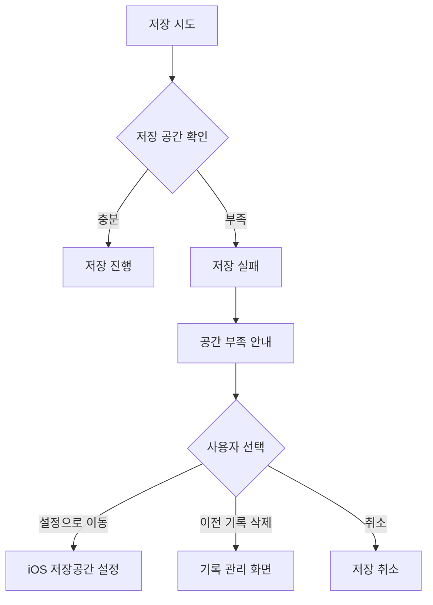

**저장 공간 부족 안내:**
```
┌─────────────────────────────────┐
│                                 │
│   💾 저장 공간이 부족해요        │
│                                 │
│   기록을 저장하려면 약 50MB의   │
│   여유 공간이 필요합니다.       │
│                                 │
│   현재 사용 가능: 12MB          │
│                                 │
│   [   저장공간 관리   ]         │
│   [ 이전 기록 삭제하기 ]        │
│   [       취소       ]         │
│                                 │
└─────────────────────────────────┘
```

### 10.4 네트워크 관련 예외 처리

#### 10.4.1 Geocoding 실패

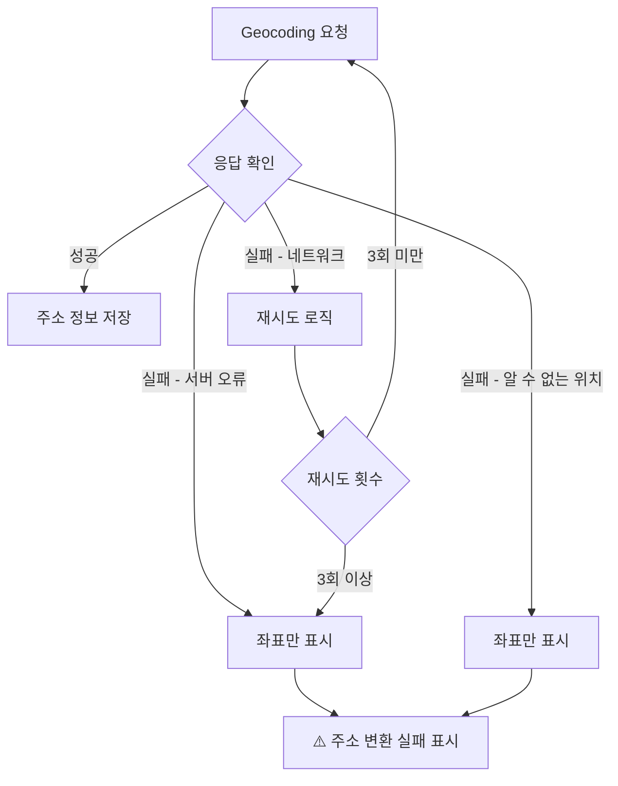

#### 10.4.2 AI API 오류

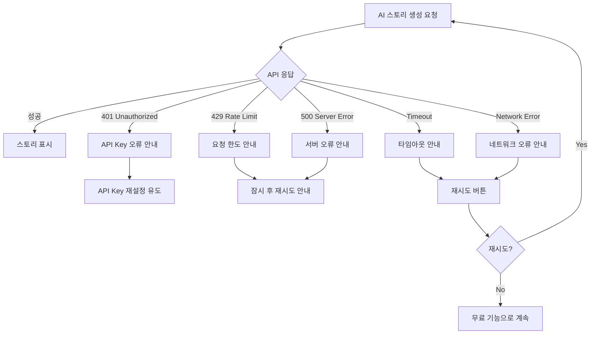

**AI API 오류 다이얼로그:**
```
┌─────────────────────────────────┐
│                                 │
│   🤖 AI 스토리 생성 실패        │
│                                 │
│   API 요청 한도에 도달했습니다.  │
│   잠시 후 다시 시도해주세요.     │
│                                 │
│   남은 크레딧: 45               │
│                                 │
│   [    나중에 다시 시도   ]     │
│   [ 무료 기능으로 계속하기 ]    │
│                                 │
└─────────────────────────────────┘
```

### 10.5 사용자 입력 오류

#### 10.5.1 잘못된 API Key 형식

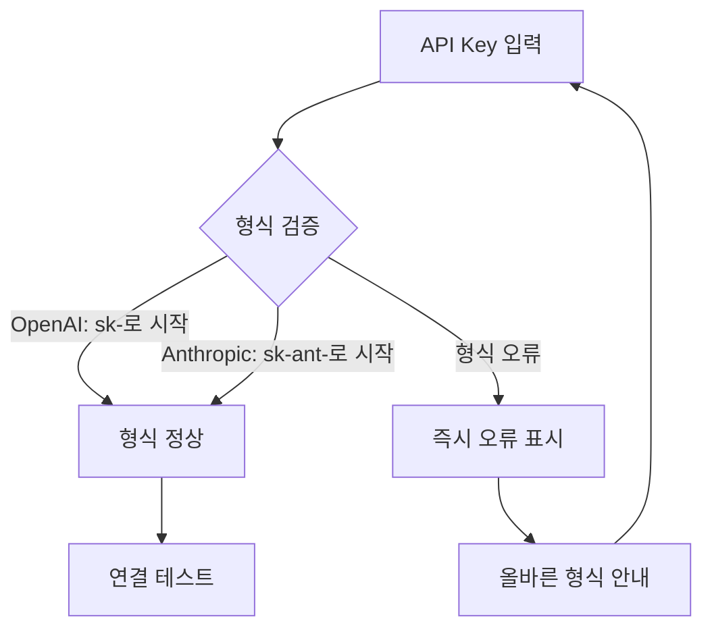

**형식 오류 인라인 표시:**
```
┌─────────────────────────────────┐
│ ┌─────────────────────────────┐ │
│ │ invalid-key-format          │ │
│ └─────────────────────────────┘ │
│ ⚠️ OpenAI API Key는 'sk-'로    │
│    시작해야 합니다              │
└─────────────────────────────────┘
```

#### 10.5.2 중복 기록 감지

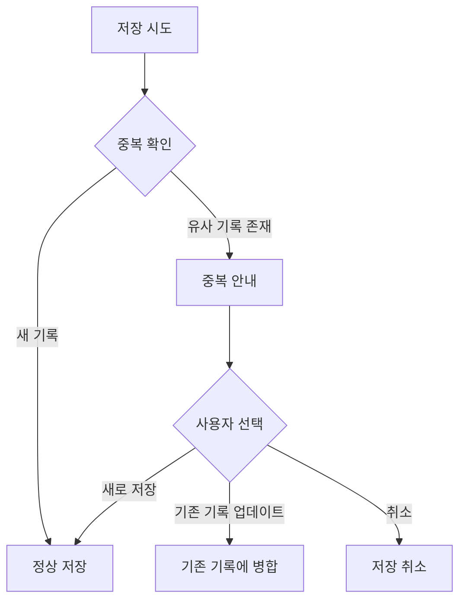

**중복 기록 안내:**
```
┌─────────────────────────────────┐
│                                 │
│   📋 비슷한 기록이 있어요       │
│                                 │
│   "제주도 3박4일" (1/15 ~ 1/18) │
│   과 겹치는 사진이 35장 있습니다 │
│                                 │
│   [   새로운 기록으로 저장  ]   │
│   [ 기존 기록에 사진 추가하기]   │
│   [         취소          ]    │
│                                 │
└─────────────────────────────────┘
```

### 10.6 에러 화면 템플릿 (SCR-019)

**일반 에러:**
```
┌─────────────────────────────────┐
│                                 │
│                                 │
│         [에러 아이콘]           │
│            ⚠️                   │
│                                 │
│   문제가 발생했어요              │
│                                 │
│   {에러 상세 메시지}            │
│                                 │
│                                 │
│   [      다시 시도      ]       │
│   [       홈으로       ]        │
│                                 │
│   문제가 계속되면               │
│   [문의하기]를 통해 알려주세요   │
│                                 │
└─────────────────────────────────┘
```

**복구 불가능한 에러:**
```
┌─────────────────────────────────┐
│                                 │
│                                 │
│         [심각 에러 아이콘]       │
│            ❌                   │
│                                 │
│   앱에 문제가 발생했어요         │
│                                 │
│   죄송합니다. 예기치 않은       │
│   오류가 발생했습니다.          │
│                                 │
│   [  오류 보고서 전송  ]        │
│   [    앱 재시작     ]         │
│                                 │
└─────────────────────────────────┘
```

---
