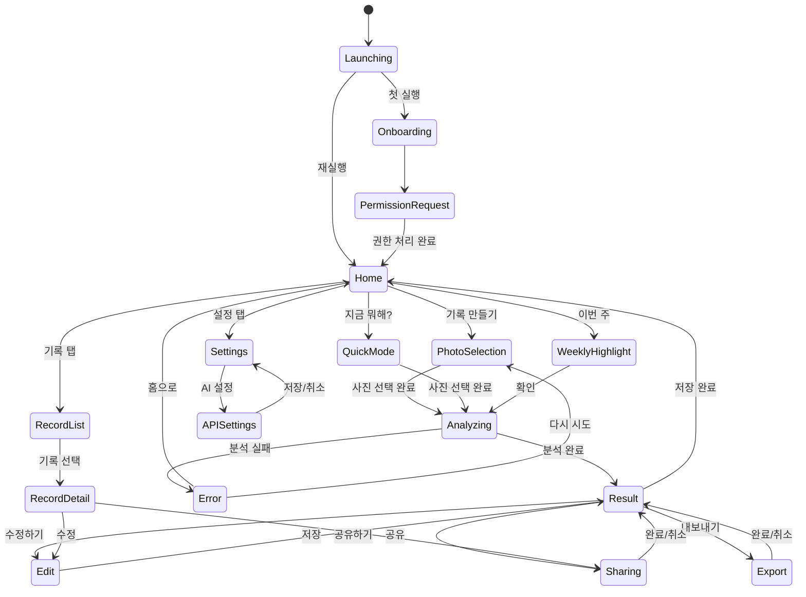
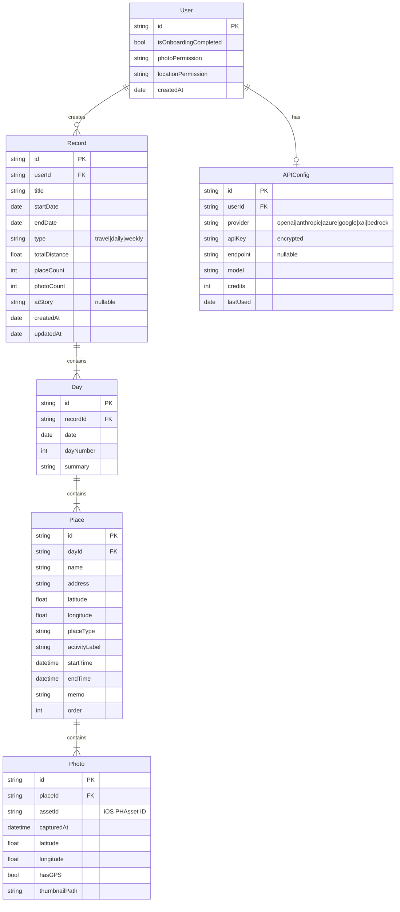
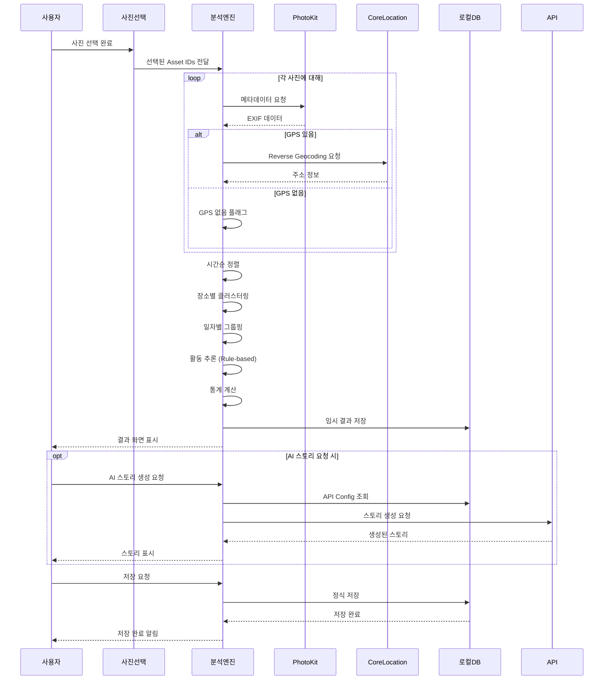
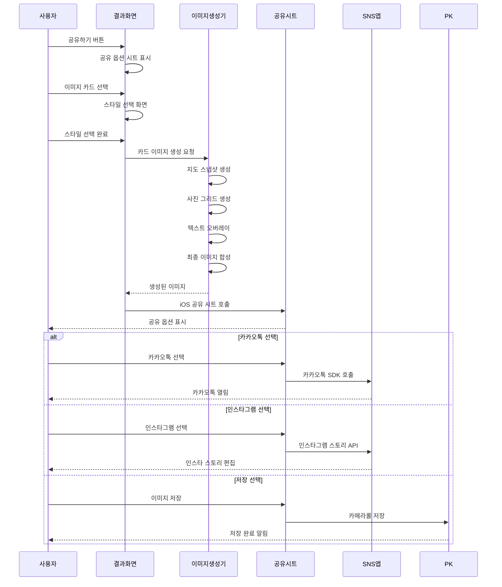

[← 인덱스](index.md)

---

## 11. 상태 관리 및 데이터 플로우

### 11.1 앱 상태 다이어그램

```mermaid
stateDiagram-v2
    [*] --> Launching
    Launching --> Onboarding: 첫 실행
    Launching --> Home: 재실행

    Onboarding --> PermissionRequest
    PermissionRequest --> Home: 권한 처리 완료

    Home --> PhotoSelection: 기록 만들기
    Home --> QuickMode: 지금 뭐해?
    Home --> WeeklyHighlight: 이번 주
    Home --> RecordList: 기록 탭
    Home --> Settings: 설정 탭

    PhotoSelection --> Analyzing: 사진 선택 완료
    QuickMode --> Analyzing: 사진 선택 완료
    WeeklyHighlight --> Analyzing: 확인

    Analyzing --> Result: 분석 완료
    Analyzing --> Error: 분석 실패

    Result --> Sharing: 공유하기
    Result --> Export: 내보내기
    Result --> Edit: 수정하기
    Result --> Home: 저장 완료

    Sharing --> Result: 완료/취소
    Export --> Result: 완료/취소
    Edit --> Result: 저장

    Error --> Home: 홈으로
    Error --> PhotoSelection: 다시 시도

    RecordList --> RecordDetail: 기록 선택
    RecordDetail --> Edit: 수정
    RecordDetail --> Sharing: 공유

    Settings --> APISettings: AI 설정
    APISettings --> Settings: 저장/취소
```

### 11.2 데이터 모델

```mermaid
erDiagram
    User ||--o{ Record : creates
    Record ||--|{ Day : contains
    Day ||--|{ Place : contains
    Place ||--|{ Photo : contains
    User ||--o| APIConfig : has

    User {
        string id PK
        bool isOnboardingCompleted
        string photoPermission
        string locationPermission
        date createdAt
    }

    Record {
        string id PK
        string userId FK
        string title
        date startDate
        date endDate
        string type "travel|daily|weekly"
        float totalDistance
        int placeCount
        int photoCount
        string aiStory "nullable"
        date createdAt
        date updatedAt
    }

    Day {
        string id PK
        string recordId FK
        date date
        int dayNumber
        string summary
    }

    Place {
        string id PK
        string dayId FK
        string name
        string address
        float latitude
        float longitude
        string placeType
        string activityLabel
        datetime startTime
        datetime endTime
        string memo
        int order
    }

    Photo {
        string id PK
        string placeId FK
        string assetId "iOS PHAsset ID"
        datetime capturedAt
        float latitude
        float longitude
        bool hasGPS
        string thumbnailPath
    }

    APIConfig {
        string id PK
        string userId FK
        string provider "openai|anthropic|azure|google|xai|bedrock"
        string apiKey "encrypted"
        string endpoint "nullable"
        string model
        int credits
        date lastUsed
    }
```

### 11.3 분석 프로세스 상세

```mermaid
sequenceDiagram
    participant U as 사용자
    participant PS as 사진선택
    participant A as 분석엔진
    participant PK as PhotoKit
    participant CL as CoreLocation
    participant DB as 로컬DB

    U->>PS: 사진 선택 완료
    PS->>A: 선택된 Asset IDs 전달

    loop 각 사진에 대해
        A->>PK: 메타데이터 요청
        PK-->>A: EXIF 데이터

        alt GPS 있음
            A->>CL: Reverse Geocoding 요청
            CL-->>A: 주소 정보
        else GPS 없음
            A->>A: GPS 없음 플래그
        end
    end

    A->>A: 시간순 정렬
    A->>A: 장소별 클러스터링
    A->>A: 일자별 그룹핑
    A->>A: 활동 추론 (Rule-based)
    A->>A: 통계 계산

    A->>DB: 임시 결과 저장
    A-->>U: 결과 화면 표시

    opt AI 스토리 요청 시
        U->>A: AI 스토리 생성 요청
        A->>DB: API Config 조회
        A->>API: 스토리 생성 요청
        API-->>A: 생성된 스토리
        A-->>U: 스토리 표시
    end

    U->>A: 저장 요청
    A->>DB: 정식 저장
    DB-->>A: 저장 완료
    A-->>U: 저장 완료 알림
```

### 11.4 공유 프로세스 상세

```mermaid
sequenceDiagram
    participant U as 사용자
    participant R as 결과화면
    participant IG as 이미지생성기
    participant SS as 공유시트
    participant SNS as SNS앱

    U->>R: 공유하기 버튼
    R->>R: 공유 옵션 시트 표시

    U->>R: 이미지 카드 선택
    R->>R: 스타일 선택 화면

    U->>R: 스타일 선택 완료
    R->>IG: 카드 이미지 생성 요청

    IG->>IG: 지도 스냅샷 생성
    IG->>IG: 사진 그리드 생성
    IG->>IG: 텍스트 오버레이
    IG->>IG: 최종 이미지 합성
    IG-->>R: 생성된 이미지

    R->>SS: iOS 공유 시트 호출
    SS-->>U: 공유 옵션 표시

    alt 카카오톡 선택
        U->>SS: 카카오톡 선택
        SS->>SNS: 카카오톡 SDK 호출
        SNS-->>U: 카카오톡 열림
    else 인스타그램 선택
        U->>SS: 인스타그램 선택
        SS->>SNS: 인스타그램 스토리 API
        SNS-->>U: 인스타 스토리 편집
    else 저장 선택
        U->>SS: 이미지 저장
        SS->>PK: 카메라롤 저장
        PK-->>U: 저장 완료 알림
    end
```

---
