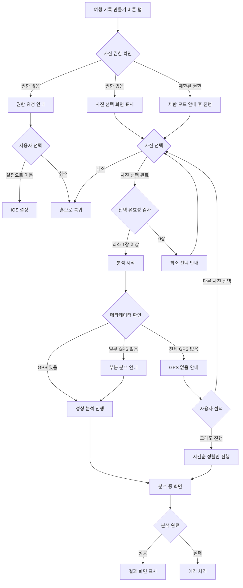
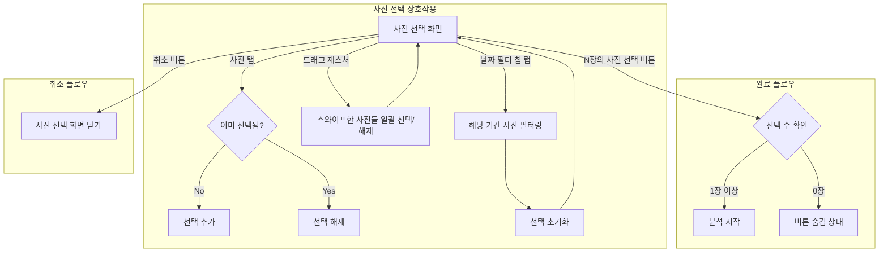
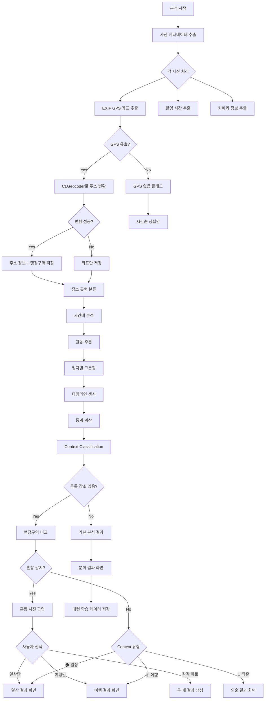

← [인덱스](../index.md)

---

## 4. 여행 기록 생성 플로우

### 4.1 전체 플로우 개요



### 4.2 사진 선택 화면 (SCR-008) - 커스텀 포토 피커

> **v2.2 변경사항**: 커스텀 포토 피커 도입 (PHPickerViewController 대체)
> - 날짜 필터 칩으로 빠른 필터링
> - 스와이프 드래그 선택 지원
> - 하단 선택 완료 버튼

**화면 레이아웃:**
```
┌─────────────────────────────────┐
│ 9:41                     📶 🔋  │
├─────────────────────────────────┤
│  취소       사진 선택            │
├─────────────────────────────────┤
│                                 │
│ [오늘][이번 주][이번 달][3개월][전체]
│                                 │
├─────────────────────────────────┤
│                                 │
│ ┌─────┬─────┬─────┬─────┐      │
│ │ ✓1  │  2  │  3  │ ✓4  │      │
│ │[📷] │[📷] │[📷] │[📷] │      │
│ ├─────┼─────┼─────┼─────┤      │
│ │ ✓5  │ ✓6  │  7  │  8  │      │
│ │[📷] │[📷] │[📷] │[📷] │      │
│ ├─────┼─────┼─────┼─────┤      │
│ │ ✓9  │✓10  │ 11  │ 12  │      │
│ │[📷] │[📷] │[📷] │[📷] │      │
│ └─────┴─────┴─────┴─────┘      │
│                                 │
│  • • • (스크롤)                 │
│                                 │
├─────────────────────────────────┤
│  ▼ 그라데이션 배경               │
│ ┌─────────────────────────────┐ │
│ │    10장의 사진 선택          │ │
│ └─────────────────────────────┘ │
│                                 │
└─────────────────────────────────┘
```

**날짜 필터 칩:**
| 필터 | 설명 |
|------|------|
| 오늘 | 오늘 촬영한 사진 |
| 이번 주 | 최근 7일간 촬영한 사진 |
| 이번 달 | 최근 30일간 촬영한 사진 (기본값) |
| 최근 3개월 | 최근 90일간 촬영한 사진 |
| 전체 | 모든 사진 |

### 4.3 사진 선택 상호작용

> **v2.2 변경사항**: 드래그 선택 기능 추가



### 4.3.1 드래그 선택 기능

> **v2.2 신규**: PhotoGridView에서 스와이프 드래그로 여러 사진 선택

**동작 방식:**
1. 첫 번째 사진 위에서 드래그 시작
2. 드래그하면서 지나가는 사진들 자동 선택/해제
3. 첫 번째 사진이 선택 상태였으면 → 지나가는 사진들 선택 해제
4. 첫 번째 사진이 미선택 상태였으면 → 지나가는 사진들 선택

**구현:**
```swift
// PhotoGridView에서 DragGesture 사용
.gesture(
    DragGesture(minimumDistance: 0)
        .onChanged { value in
            // 드래그 위치에 해당하는 사진 인덱스 계산
            // 드래그 시작 시 첫 사진의 선택 상태 기억
            // 지나가는 사진들에 반대 상태 적용
        }
)
```

### 4.4 기간 필터 동작

**필터 변경 시:**
1. 날짜 필터 칩 탭
2. PhotoAssetManager.fetchAssets(for: filter) 호출
3. 해당 기간 사진만 그리드에 표시
4. 기존 선택 초기화

**빈 상태:**
```
┌─────────────────────────────────┐
│                                 │
│      [빈 상태 아이콘]           │
│                                 │
│   선택한 기간에 사진이 없습니다   │
│   다른 기간을 선택해 보세요      │
│                                 │
└─────────────────────────────────┘
```

### 4.5 분석 중 화면 (SCR-009)

> **v3.2 변경사항**: 광고 영역 추가, Context Classification 단계 추가. 일상/외출 판별 시 Wander Intelligence 단계 스킵으로 분석 시간 단축.

```
┌─────────────────────────────────┐
│ 9:41                     📶 🔋  │
├─────────────────────────────────┤
│  취소                           │
├─────────────────────────────────┤
│                                 │
│       ┌─────────────────┐       │
│       │                 │       │
│       │  [로딩 아이콘]   │       │
│       │                 │       │
│       └─────────────────┘       │
│                                 │
│   사진을 분석하고 있어요...      │
│                                 │
│   ━━━━━━━━━━━━━━━━━━━━━━━━      │
│            60%                  │
│                                 │
│   📍 위치 정보 추출 중...        │
│                                 │
├─────────────────────────────────┤
│ ┌─────────────────────────────┐ │
│ │                             │ │
│ │       [광고 영역]            │ │
│ │       300 x 250             │ │
│ │       (Medium Rectangle)    │ │
│ │                             │ │
│ └─────────────────────────────┘ │
├─────────────────────────────────┤
│                                 │
│ 💡 Wander는 모든 처리를         │
│    기기 내에서 수행해요          │
│                                 │
└─────────────────────────────────┘
```

**분석 단계별 메시지:**
| 진행률 | 메시지 |
|--------|--------|
| 0-15% | 📸 사진 메타데이터 읽는 중... |
| 15-30% | 📍 위치 정보 추출 중... |
| 30-50% | 🗺️ 주소 정보 변환 중... |
| 50-70% | 📊 동선 분석 중... |
| 70-85% | 🏠 일상/여행 판별 중... |
| 85-100% | ✨ 결과 정리 중... |

**광고 정책:**
| 항목 | 내용 |
|------|------|
| 광고 유형 | 배너 광고 (Medium Rectangle, 300x250) |
| 표시 조건 | 분석 시작 시 로드 |
| 비표시 조건 | Premium 구독 사용자 |
| 광고 네트워크 | Google AdMob (예정) |

### 4.6 분석 처리 로직 (v3.2 업데이트)

> **v3.2 변경사항**: Context Classification 단계 추가, 혼합 사진 감지 분기, Context에 따른 Wander Intelligence 실행 분기
>
> **v3.2 Wander Intelligence 실행 조건:**
> - **일상(Daily)/외출(Outing)**: SmartAnalysisCoordinator에서 Wander Intelligence 연산 전체 스킵. StoryWeaving, InsightEngine, TravelDNA, TripScore, MomentScore 모두 실행하지 않음.
> - **여행(Travel)/혼합(Mixed)**: Wander Intelligence 실행. 단, TravelDNA/TripScore/MomentScore는 v3.2에서 전면 제거되어 StoryWeaving + InsightEngine만 실행됨.
> - `hasWanderIntelligence` 판정: travelStory + insights 존재 여부로만 판단 (DNA/점수 제외)



### 4.7 Context Classification 상세

#### 행정구역 비교 로직

```
사용자 등록 장소 (집/회사/학교)
    ↓
행정구역 추출: administrativeArea, locality, subLocality
    ↓
사진 클러스터의 행정구역과 비교
    ↓
┌─────────────────────────────────────────────────────┐
│  거리 레벨 (Distance Level)                          │
├─────────────────────────────────────────────────────┤
│  Level 0: 같은 동 (subLocality)     → 매우 가까움    │
│  Level 1: 같은 구 (locality)        → 가까움         │
│  Level 2: 같은 시/도 (adminArea)    → 같은 지역      │
│  Level 3: 다른 시/도                → 다른 지역      │
│  Level 4: 다른 시/도 + 50km+        → 여행 가능성    │
└─────────────────────────────────────────────────────┘
```

#### Context 결정 규칙

| Context | 조건 | 분석 범위 |
|---------|------|----------|
| 🏠 일상 | 모든 클러스터 Level 0~1 + 1일 이내 | 기본 분석만 (Intelligence 스킵) |
| 🚶 외출 | 대부분 Level 2 + 당일치기 | 기본 분석만 (Intelligence 스킵) |
| ✈️ 여행 | 대부분 Level 3~4 + (2일 이상 or 50km+) | 전체 분석 (Intelligence 포함) |
| 🔀 혼합 | Level 0~1 클러스터 + Level 3~4 클러스터 공존 | 전체 분석 (Intelligence 포함) |
