← [인덱스](../index.md)

---

## 4. 여행 기록 생성 플로우

### 4.1 전체 플로우 개요

```mermaid
flowchart TD
    A[여행 기록 만들기 버튼 탭] --> B{사진 권한 확인}

    B -->|권한 있음| C[사진 선택 화면 표시]
    B -->|권한 없음| D[권한 요청 안내]
    B -->|제한된 권한| E[제한 모드 안내 후 진행]

    D --> F{사용자 선택}
    F -->|설정으로 이동| G[iOS 설정]
    F -->|취소| H[홈으로 복귀]

    C --> I{사진 선택}
    E --> I

    I -->|사진 선택 완료| J{선택 유효성 검사}
    I -->|취소| H

    J -->|최소 1장 이상| K[분석 시작]
    J -->|0장| L[최소 선택 안내]
    L --> I

    K --> M{메타데이터 확인}

    M -->|GPS 있음| N[정상 분석 진행]
    M -->|일부 GPS 없음| O[부분 분석 안내]
    M -->|전체 GPS 없음| P[GPS 없음 안내]

    O --> N
    P --> Q{사용자 선택}
    Q -->|그래도 진행| R[시간순 정렬만 진행]
    Q -->|다른 사진 선택| I

    N --> S[분석 중 화면]
    R --> S

    S --> T{분석 완료}
    T -->|성공| U[결과 화면 표시]
    T -->|실패| V[에러 처리]
```



### 4.2 사진 선택 화면 (SCR-008) - 커스텀 포토 피커

> **v2.2 변경사항**: 커스텀 포토 피커 도입 (PHPickerViewController 대체)
> - 날짜 필터 칩으로 빠른 필터링
> - 스와이프 드래그 선택 지원
> - 하단 선택 완료 버튼

**화면 레이아웃:**
```
┌─────────────────────────────────┐
│ 9:41                     📶 🔋  │
├─────────────────────────────────┤
│  취소       사진 선택            │
├─────────────────────────────────┤
│                                 │
│ [오늘][이번 주][이번 달][3개월][전체]
│                                 │
├─────────────────────────────────┤
│                                 │
│ ┌─────┬─────┬─────┬─────┐      │
│ │ ✓1  │  2  │  3  │ ✓4  │      │
│ │[📷] │[📷] │[📷] │[📷] │      │
│ ├─────┼─────┼─────┼─────┤      │
│ │ ✓5  │ ✓6  │  7  │  8  │      │
│ │[📷] │[📷] │[📷] │[📷] │      │
│ ├─────┼─────┼─────┼─────┤      │
│ │ ✓9  │✓10  │ 11  │ 12  │      │
│ │[📷] │[📷] │[📷] │[📷] │      │
│ └─────┴─────┴─────┴─────┘      │
│                                 │
│  • • • (스크롤)                 │
│                                 │
├─────────────────────────────────┤
│  ▼ 그라데이션 배경               │
│ ┌─────────────────────────────┐ │
│ │    10장의 사진 선택          │ │
│ └─────────────────────────────┘ │
│                                 │
└─────────────────────────────────┘
```

**날짜 필터 칩:**
| 필터 | 설명 |
|------|------|
| 오늘 | 오늘 촬영한 사진 |
| 이번 주 | 최근 7일간 촬영한 사진 |
| 이번 달 | 최근 30일간 촬영한 사진 (기본값) |
| 최근 3개월 | 최근 90일간 촬영한 사진 |
| 전체 | 모든 사진 |

### 4.3 사진 선택 상호작용

> **v2.2 변경사항**: 드래그 선택 기능 추가

```mermaid
flowchart TD
    subgraph "사진 선택 상호작용"
        A[사진 선택 화면]

        A -->|사진 탭| B{이미 선택됨?}
        B -->|No| C[선택 추가]
        B -->|Yes| D[선택 해제]

        A -->|드래그 제스처| E[스와이프한 사진들 일괄 선택/해제]
        E --> A

        A -->|날짜 필터 칩 탭| F[해당 기간 사진 필터링]
        F --> G[선택 초기화]
        G --> A
    end

    subgraph "완료 플로우"
        A -->|N장의 사진 선택 버튼| H{선택 수 확인}
        H -->|1장 이상| I[분석 시작]
        H -->|0장| J[버튼 숨김 상태]
    end

    subgraph "취소 플로우"
        A -->|취소 버튼| K[사진 선택 화면 닫기]
    end
```



### 4.3.1 드래그 선택 기능

> **v2.2 신규**: PhotoGridView에서 스와이프 드래그로 여러 사진 선택

**동작 방식:**
1. 첫 번째 사진 위에서 드래그 시작
2. 드래그하면서 지나가는 사진들 자동 선택/해제
3. 첫 번째 사진이 선택 상태였으면 → 지나가는 사진들 선택 해제
4. 첫 번째 사진이 미선택 상태였으면 → 지나가는 사진들 선택

**구현:**
```swift
// PhotoGridView에서 DragGesture 사용
.gesture(
    DragGesture(minimumDistance: 0)
        .onChanged { value in
            // 드래그 위치에 해당하는 사진 인덱스 계산
            // 드래그 시작 시 첫 사진의 선택 상태 기억
            // 지나가는 사진들에 반대 상태 적용
        }
)
```

### 4.4 기간 필터 동작

**필터 변경 시:**
1. 날짜 필터 칩 탭
2. PhotoAssetManager.fetchAssets(for: filter) 호출
3. 해당 기간 사진만 그리드에 표시
4. 기존 선택 초기화

**빈 상태:**
```
┌─────────────────────────────────┐
│                                 │
│      [빈 상태 아이콘]           │
│                                 │
│   선택한 기간에 사진이 없습니다   │
│   다른 기간을 선택해 보세요      │
│                                 │
└─────────────────────────────────┘
```

### 4.5 분석 중 화면 (SCR-009)

```
┌─────────────────────────────────┐
│ 9:41                     📶 🔋  │
├─────────────────────────────────┤
│                                 │
│                                 │
│                                 │
│         [로딩 애니메이션]        │
│                                 │
│   사진을 분석하고 있어요...      │
│                                 │
│   ━━━━━━━━━━━━━━━━━━━━━━━━      │
│         60%                     │
│                                 │
│   📍 위치 정보 추출 중...        │
│                                 │
│                                 │
│                                 │
│                                 │
│                                 │
│                                 │
│   💡 Wander는 모든 처리를       │
│      기기 내에서 수행해요        │
│                                 │
└─────────────────────────────────┘
```

**분석 단계별 메시지:**
| 진행률 | 메시지 |
|--------|--------|
| 0-20% | 📸 사진 메타데이터 읽는 중... |
| 20-40% | 📍 위치 정보 추출 중... |
| 40-60% | 🗺️ 주소 정보 변환 중... |
| 60-80% | 📊 동선 분석 중... |
| 80-100% | ✨ 결과 정리 중... |

### 4.6 분석 처리 로직

```mermaid
flowchart TD
    A[분석 시작] --> B[사진 메타데이터 추출]

    B --> C{각 사진 처리}
    C --> D[EXIF GPS 좌표 추출]
    C --> E[촬영 시간 추출]
    C --> F[카메라 정보 추출]

    D --> G{GPS 유효?}
    G -->|Yes| H[CLGeocoder로 주소 변환]
    G -->|No| I[GPS 없음 플래그]

    H --> J{변환 성공?}
    J -->|Yes| K[주소 정보 저장]
    J -->|No| L[좌표만 저장]

    K --> M[장소 유형 분류]
    L --> M
    I --> N[시간순 정렬만]

    M --> O[시간대 분석]
    O --> P[활동 추론]

    P --> Q[일자별 그룹핑]
    Q --> R[타임라인 생성]

    R --> S[통계 계산]
    S --> T[결과 데이터 생성]

    T --> U[결과 화면 표시]
```


