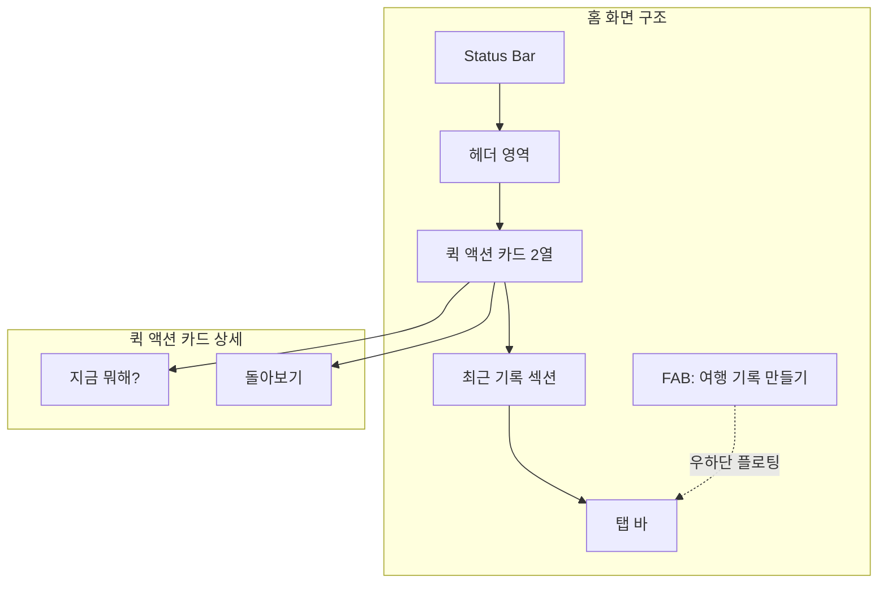
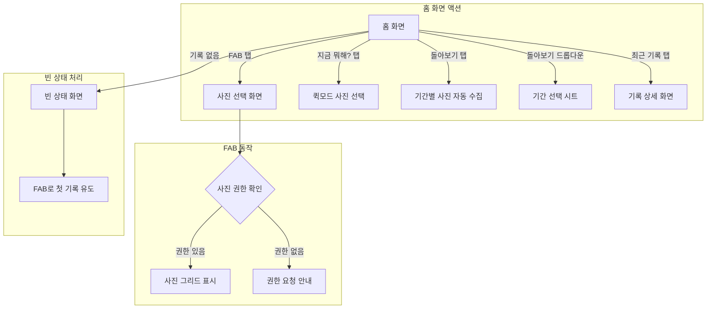

← [인덱스](../index.md)

---

## 3. 메인 화면 (홈)

### 3.1 홈 화면 구조

> **v2.1 변경사항**: "여행 기록 만들기"를 FAB로 분리, 퀵 액션 2개로 축소



### 3.2 홈 화면 레이아웃 (SCR-005)

> **v2.2 변경사항**: 햄버거 메뉴 제거, "Wander" 중앙 정렬 헤더
> **v2.1 변경사항**: FAB 도입 (여행 기록하기), 퀵액션 2열로 축소
> **v2.0 변경사항**: 프로필 아이콘 제거, 탭바 3개로 통일

```
┌─────────────────────────────────┐
│ 9:41                     📶 🔋  │
├─────────────────────────────────┤
│                                 │
│           Wander                │
│                                 │
├─────────────────────────────────┤
│                                 │
│  오늘 어떤 이야기를             │
│  만들어 볼까요?                 │
│                                 │
├─────────────────────────────────┤
│ ┌──────────────┐ ┌────────────┐ │
│ │ 💬 지금 뭐해?  │ │ 🔄 돌아보기 │ │
│ │              │ │            │ │
│ │ 사진 몇 장으로 │ │ 자동 하이   │ │
│ │ 바로 공유     │ │ 라이트 생성 │ │
│ └──────────────┘ └────────────┘ │
│                                 │
├─────────────────────────────────┤
│  최근 기록                      │
│                                 │
│ ┌─────────────────────────────┐ │
│ │ [썸네일] 🏝️ 제주도 3박4일    │ │
│ │          2026.01.20~01.23   │ │
│ │          📍 12곳 · 🚗 245km │ │
│ └─────────────────────────────┘ │
│                                 │
│ ┌─────────────────────────────┐ │
│ │ [썸네일] ☕ 성수동 카페 투어   │ │
│ │          2026.01.18         │ │
│ │          📍 4곳 방문         │ │
│ └─────────────────────────────┘ │
│                                 │
│                          ┌────┐ │
│                          │ ➕ │ │
│                          │    │ │
│                          └────┘ │
├─────────────────────────────────┤
│    🏠      📚      ⚙️           │
│    홈      기록    설정          │
└─────────────────────────────────┘

[FAB: 우하단 플로팅 액션 버튼]
- 아이콘: ➕
- 탭 시: 사진 선택 화면 (여행 기록 만들기)
- 색상: Primary (#87CEEB)
- 그림자: 8pt radius, 4pt y-offset
- 기록이 있을 때만 표시 (빈 상태에서는 빈 상태 뷰 내 버튼 사용)
```

### 3.2.1 돌아보기

> **v2.2 변경사항**: 홈 화면에서 바로 시트로 열림 (드롭다운 제거)

**동작:**
- 돌아보기 카드 탭 → LookbackView 시트 표시
- 시트 내에서 기간 선택 후 분석 진행

**기간 옵션 (LookbackView 내 선택):**
| 옵션 | 설명 |
|------|------|
| 이번 주 | 최근 7일간 촬영한 사진 |
| 지난 주 | 7~14일 전 촬영한 사진 |
| 이번 달 | 최근 30일간 촬영한 사진 |
| 올해 | 올해 촬영한 사진 |

**빈 상태 처리:**
- 선택한 기간에 사진이 없으면: "선택한 기간에 촬영한 사진이 없어요"
- 다른 기간 제안: "다른 기간을 선택해 보세요" 버튼 표시

### 3.3 홈 화면 상호작용



### 3.4 빈 상태 (Empty State) 화면

**최근 기록이 없을 때:**
```
┌─────────────────────────────────┐
│                                 │
│  최근 기록                      │
│                                 │
│      ┌─────────────────┐       │
│      │                 │       │
│      │   📷  →  📍     │       │
│      │                 │       │
│      └─────────────────┘       │
│                                 │
│   아직 기록이 없어요            │
│   첫 번째 여행을 기록해 보세요   │
│                                 │
│   [  여행 기록 만들기  ]        │
│                                 │
└─────────────────────────────────┘
```
