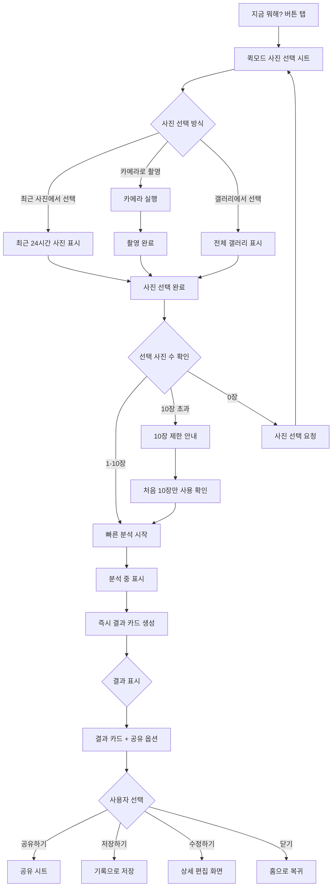
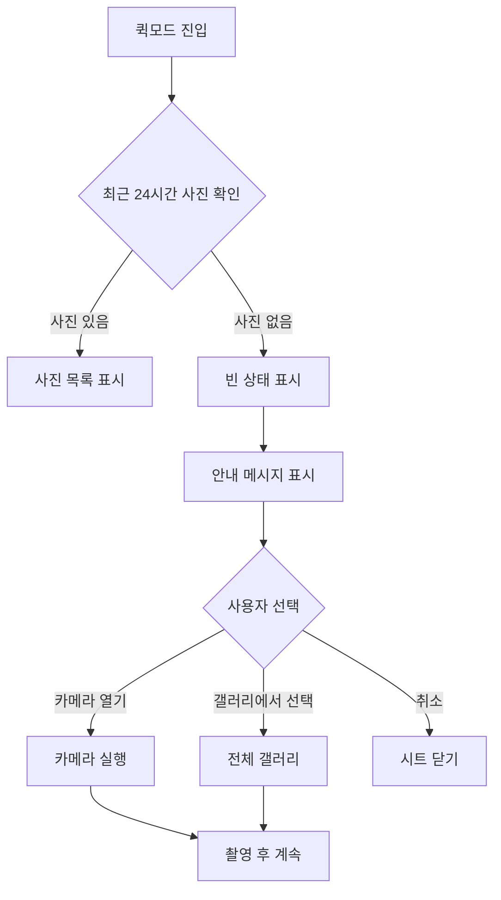

← [인덱스](../index.md)

---

## 5. "지금 뭐해?" 퀵 모드

### 5.1 퀵 모드 플로우



### 5.2 퀵모드 사진 선택 시트

```
┌─────────────────────────────────┐
│       지금 뭐해?         ✕      │
├─────────────────────────────────┤
│                                 │
│  방금 찍은 사진을 공유해 보세요  │
│                                 │
├─────────────────────────────────┤
│  최근 사진 (24시간)             │
│ ┌─────┬─────┬─────┬─────┐      │
│ │ ✓1  │  2  │  3  │  4  │      │
│ │[📷] │[📷] │[📷] │[📷] │      │
│ ├─────┼─────┼─────┼─────┤      │
│ │ ✓5  │  6  │  7  │  8  │      │
│ │[📷] │[📷] │[📷] │[📷] │      │
│ └─────┴─────┴─────┴─────┘      │
│                                 │
├─────────────────────────────────┤
│  [📷 카메라 열기]               │
│  [🖼️ 갤러리에서 더 선택]         │
├─────────────────────────────────┤
│                                 │
│  [     완료 (2장 선택)    ]     │
│                                 │
└─────────────────────────────────┘
```

### 5.3 퀵모드 결과 카드

```
┌─────────────────────────────────┐
│       지금 뭐해?         ✕      │
├─────────────────────────────────┤
│ ┌─────────────────────────────┐ │
│ │  [사진 슬라이드/그리드]      │ │
│ │                             │ │
│ │       📷  📷  📷            │ │
│ │                             │ │
│ └─────────────────────────────┘ │
├─────────────────────────────────┤
│                                 │
│  🎤 홍대 뮤직클럽에서           │
│     인디밴드 공연 보는 중!      │
│                                 │
│  📍 홍대입구역 근처             │
│  🕗 저녁 8시                    │
│                                 │
├─────────────────────────────────┤
│                                 │
│  [✏️ 문구 수정]                 │
│                                 │
│ ┌──────────────┬──────────────┐ │
│ │   카카오톡    │  인스타그램   │ │
│ ├──────────────┼──────────────┤ │
│ │   메시지     │    저장      │ │
│ └──────────────┴──────────────┘ │
│                                 │
│  [      이미지로 저장      ]    │
│                                 │
└─────────────────────────────────┘
```

### 5.4 24시간 내 사진이 없는 경우



**빈 상태 UI:**
```
┌─────────────────────────────────┐
│       지금 뭐해?         ✕      │
├─────────────────────────────────┤
│                                 │
│      [빈 상태 일러스트]         │
│                                 │
│   최근 24시간 내 촬영한         │
│   사진이 없어요                 │
│                                 │
│   [📷 지금 촬영하기]            │
│   [🖼️ 갤러리에서 선택]          │
│                                 │
└─────────────────────────────────┘
```
