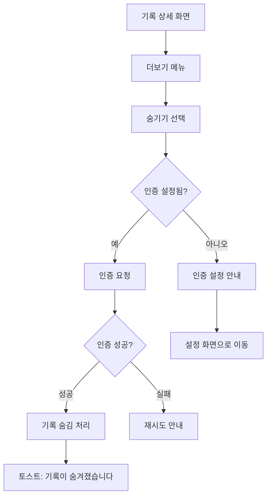
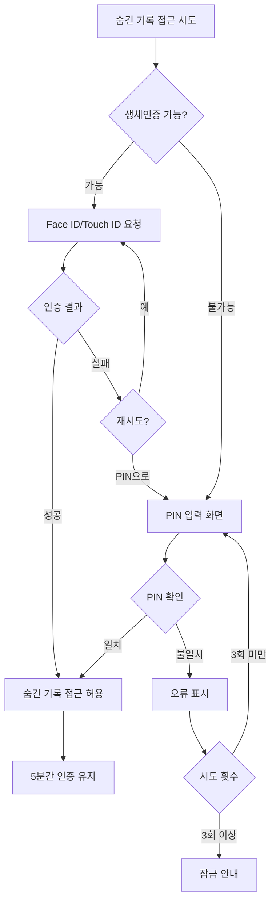

← [인덱스](../index.md)

---

### 9.11 숨긴 기록 화면 (SCR-023)

> **v2.1 신규**: 숨긴 기록 접근 (인증 필요)

**기록 탭 내 진입점:**
```
┌─────────────────────────────────┐
│          기록                    │
├─────────────────────────────────┤
│  [전체] [여행] [일상] [주간] ... │
│                                 │
│  ... 일반 기록 목록 ...          │
│                                 │
├─────────────────────────────────┤
│ ┌─────────────────────────────┐ │
│ │ 🔒 숨긴 기록 (3)         >  │ │
│ └─────────────────────────────┘ │
│                                 │
├─────────────────────────────────┤
│    🏠      📚      ⚙️           │
│    홈      기록    설정          │
└─────────────────────────────────┘
```

**숨긴 기록 목록 (인증 후):**
```
┌─────────────────────────────────┐
│  ◀       숨긴 기록               │
├─────────────────────────────────┤
│                                 │
│  🔓 인증됨 · 5분 후 자동 잠금    │
│                                 │
│ ┌─────────────────────────────┐ │
│ │ 🏝️ 비밀 여행               │ │
│ │ 2026.01.10 ~ 01.12         │ │
│ │ 📍 5곳 방문                  │ │
│ │                    [숨김해제]│ │
│ └─────────────────────────────┘ │
│                                 │
│ ┌─────────────────────────────┐ │
│ │ 🎁 깜짝 계획                │ │
│ │ 2026.01.05                  │ │
│ │ 📍 3곳 방문                  │ │
│ │                    [숨김해제]│ │
│ └─────────────────────────────┘ │
│                                 │
└─────────────────────────────────┘
```

**기록 숨기기 플로우:**


### 9.12 인증 화면 (SCR-024)

> **v2.1 신규**: Face ID/Touch ID 또는 PIN 입력

**생체 인증 화면:**
```
┌─────────────────────────────────┐
│                                 │
│                                 │
│                                 │
│         ┌─────────┐             │
│         │  😐     │             │
│         │ Face ID │             │
│         └─────────┘             │
│                                 │
│    숨긴 기록에 접근하려면        │
│    인증이 필요합니다            │
│                                 │
│                                 │
│    [    PIN으로 인증    ]       │
│                                 │
│    [      취소      ]           │
│                                 │
└─────────────────────────────────┘
```

**PIN 입력 화면:**
```
┌─────────────────────────────────┐
│                                 │
│    PIN 입력                     │
│                                 │
│    ● ● ○ ○                     │
│                                 │
│  ┌─────┬─────┬─────┐           │
│  │  1  │  2  │  3  │           │
│  ├─────┼─────┼─────┤           │
│  │  4  │  5  │  6  │           │
│  ├─────┼─────┼─────┤           │
│  │  7  │  8  │  9  │           │
│  ├─────┼─────┼─────┤           │
│  │     │  0  │  ⌫  │           │
│  └─────┴─────┴─────┘           │
│                                 │
│    [Face ID로 인증]             │
│                                 │
└─────────────────────────────────┘
```

**인증 플로우:**

