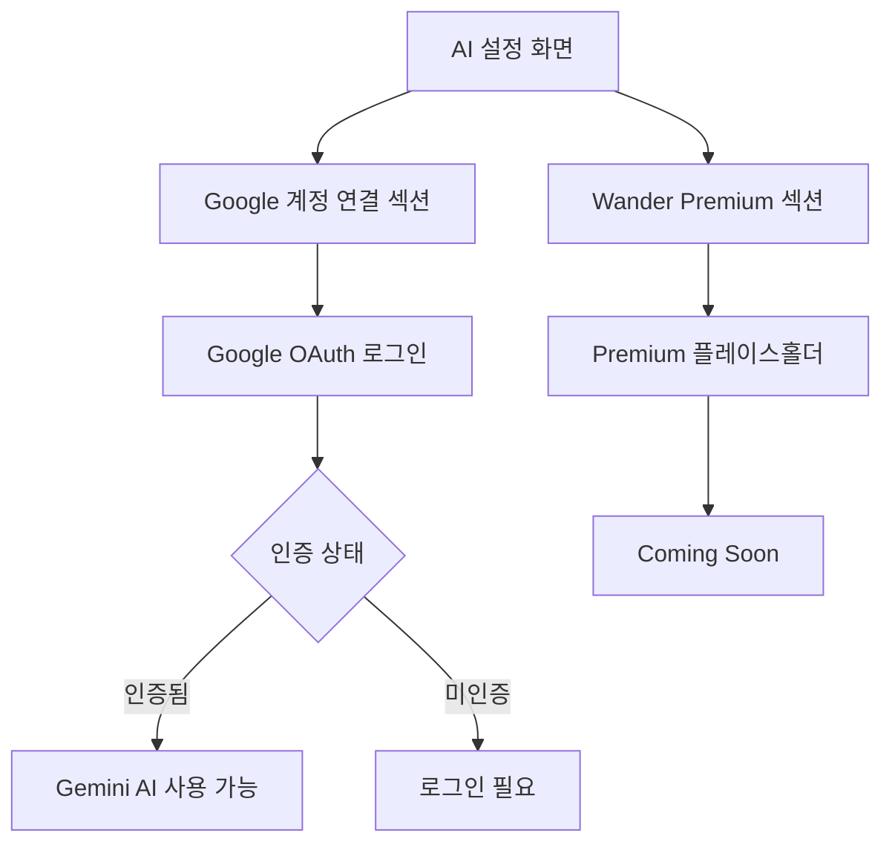
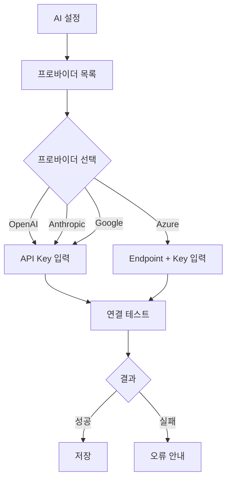

← [인덱스](../index.md)

---

# AI 설정 (SCR-016)

> **v3.0 변경사항**: API Key 입력 UI 제거, Google OAuth + Wander Premium 구조로 전환
> **v3.0 변경사항**: 개인정보 안내 문구 수정 (멀티모달 사진 전송 반영)

## AI 설정 화면 구조



## AI 설정 화면 레이아웃

```
┌─────────────────────────────────┐
│  ◀          AI 설정              │
├─────────────────────────────────┤
│                                 │
│  Google 계정 연결                │
│ ┌─────────────────────────────┐ │
│ │  Google Gemini            > │ │
│ │  Google 계정으로 로그인      │ │
│ │                    연결됨 ✅ │ │
│ └─────────────────────────────┘ │
│  Google 계정으로 로그인하면      │
│  Gemini AI를 바로 사용할 수 있습니다.│
│                                 │
│  프리미엄                       │
│ ┌─────────────────────────────┐ │
│ │  👑 Wander Premium          │ │
│ │  더 강력한 AI 기능을 준비 중  │ │
│ │                             │ │
│ │  ✨ AI 다듬기 무제한          │ │
│ │     횟수 제한 없이 스토리를 다듬기│ │
│ │                             │ │
│ │  🧠 고급 AI 모델             │ │
│ │     더 정교한 분석과 스토리 생성│ │
│ │                             │ │
│ │  🎧 우선 지원                │ │
│ │     빠른 문의 응답 및 기능 제안│ │
│ │                             │ │
│ │      [ Coming Soon ]        │ │
│ └─────────────────────────────┘ │
│                                 │
└─────────────────────────────────┘
```

## Google Gemini 설정 화면

```
┌─────────────────────────────────┐
│  ◀       Google Gemini           │
├─────────────────────────────────┤
│                                 │
│  계정 연결                      │
│ ┌─────────────────────────────┐ │
│ │ 🔵 Google 계정으로 로그인     │ │
│ └─────────────────────────────┘ │
│  Google 계정으로 로그인하면      │
│  별도의 API Key 없이 Gemini AI를│
│  사용할 수 있습니다.            │
│                                 │
│  (인증 후)                      │
│  연결됨                         │
│ ┌─────────────────────────────┐ │
│ │ ✅ user@gmail.com            │ │
│ ├─────────────────────────────┤ │
│ │ 연결 테스트               > │ │
│ ├─────────────────────────────┤ │
│ │ 🔴 로그아웃                  │ │
│ └─────────────────────────────┘ │
│  로그아웃하면 Google Gemini를    │
│  사용할 수 없습니다.            │
│                                 │
│  개인정보                       │
│ ┌─────────────────────────────┐ │
│ │ 🛡️ 개인정보 처리 안내        │ │
│ │ AI 다듬기 시 텍스트 정보와    │ │
│ │ 대표 사진이 Google에 전송됩니다.│ │
│ │ 전송된 데이터는 분석 후       │ │
│ │ 저장되지 않습니다.           │ │
│ └─────────────────────────────┘ │
│                                 │
└─────────────────────────────────┘
```

## Premium 기능 (예정)

| 기능 | 설명 | 상태 |
|------|------|------|
| AI 다듬기 무제한 | 횟수 제한 없이 스토리 다듬기 | Coming Soon |
| 고급 AI 모델 | 더 정교한 분석과 스토리 생성 | Coming Soon |
| 우선 지원 | 빠른 문의 응답 및 기능 제안 | Coming Soon |

## 레거시: API Key 입력 (SCR-020)

> ⚠️ **레거시**: API Key 직접 입력 UI는 v3.0에서 제거되었습니다.
> Google OAuth가 유일한 AI 연동 방식이며, 향후 Premium 구독 모델로 전환 예정입니다.
> `APIKeyInputView` 코드는 아직 잔류하나 UI에서 접근 불가합니다.

### 이전 API Key 설정 플로우 (참고용)



### API Key 오류 케이스 (참고용)

| 오류 코드 | 상황 | 사용자 메시지 |
|-----------|------|--------------|
| 401 | 잘못된 API Key | API Key가 올바르지 않습니다. |
| 403 | 권한 없음 | 해당 모델에 접근할 수 없습니다. |
| 429 | 요청 한도 초과 | API 요청 한도에 도달했습니다. |
| 500 | 서버 오류 | AI 서비스에 일시적인 문제가 있습니다. |
| Timeout | 응답 없음 | 연결 시간이 초과되었습니다. |
