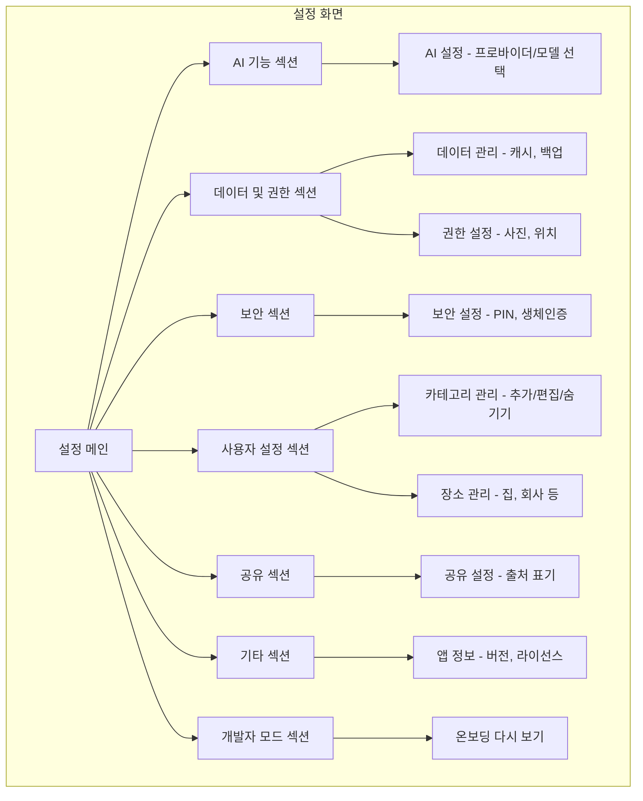

← [인덱스](../index.md)

---

## 9. 설정 화면

### 9.1 설정 화면 구조 (SCR-007)

> **v2.2 변경사항**: 섹션 구조 개편 - 보안, 사용자 설정, 공유 섹션 분리
> **v2.0 변경사항**: 계정/프로필/프리미엄 섹션 제거 (서버리스 앱), 크레딧 제거, BYOK만 지원



> **참고**: 계정/프로필/로그인 관련 섹션 없음. 프리미엄/크레딧 관련 UI 없음.

### 9.2 설정 화면 레이아웃

> **v2.2 변경사항**: 섹션 구조 개편 (6개 섹션 + 개발자 모드)

```
┌─────────────────────────────────┐
│ 9:41                     📶 🔋  │
├─────────────────────────────────┤
│             설정                │
├─────────────────────────────────┤
│                                 │
│  AI 기능                        │
│ ┌─────────────────────────────┐ │
│ │ ✨ AI 설정               >  │ │
│ │    API 키 관리, 프로바이더 선택│ │
│ └─────────────────────────────┘ │
│                                 │
│  데이터 및 권한                  │
│ ┌─────────────────────────────┐ │
│ │ 💾 데이터 관리           >  │ │
│ │    저장 공간, 캐시 삭제       │ │
│ ├─────────────────────────────┤ │
│ │ 🛡️ 권한 설정            >  │ │
│ │    사진, 위치 접근 권한       │ │
│ └─────────────────────────────┘ │
│                                 │
│  보안                           │
│ ┌─────────────────────────────┐ │
│ │ 🔐 보안                  >  │ │
│ │    PIN, 생체인증 설정        │ │
│ └─────────────────────────────┘ │
│                                 │
│  사용자 설정                     │
│ ┌─────────────────────────────┐ │
│ │ 📁 카테고리 관리         >  │ │
│ │    카테고리 추가, 편집, 숨기기 │ │
│ ├─────────────────────────────┤ │
│ │ 📍 장소 관리             >  │ │
│ │    집, 회사 등 자주 가는 장소 │ │
│ └─────────────────────────────┘ │
│                                 │
│  공유                           │
│ ┌─────────────────────────────┐ │
│ │ ↗️ 공유 설정             >  │ │
│ │    기본 공유 옵션            │ │
│ └─────────────────────────────┘ │
│                                 │
│  기타                           │
│ ┌─────────────────────────────┐ │
│ │ ℹ️ 앱 정보              >  │ │
│ │    버전, 라이선스            │ │
│ └─────────────────────────────┘ │
│                                 │
│  개발자 모드                     │
│ ┌─────────────────────────────┐ │
│ │ ↺ 온보딩 다시 보기           │ │
│ └─────────────────────────────┘ │
│                                 │
├─────────────────────────────────┤
│    🏠      📚      ⚙️           │
│    홈      기록    설정          │
└─────────────────────────────────┘
```

> **참고**: 탭바는 3개 (홈, 기록, 설정). 프로필/로그인/프리미엄 없음. List 스타일은 `.insetGrouped`
