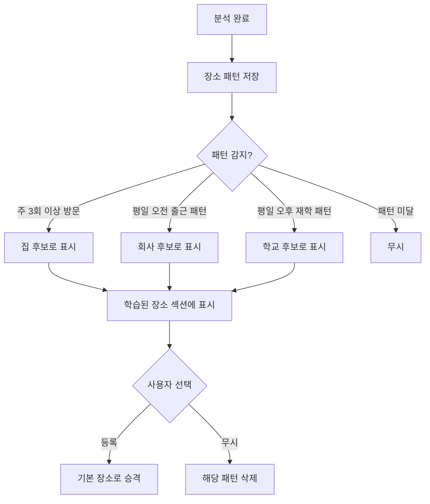
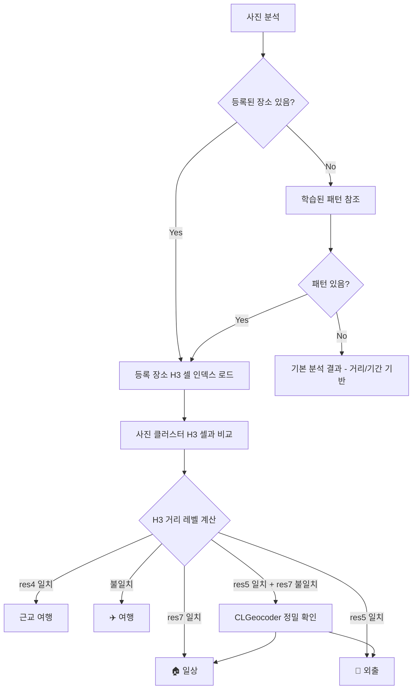

← [인덱스](../index.md)

---

### 9.13 카테고리 관리 화면 (SCR-025)

> **v2.1 신규**: 기본 카테고리 숨기기 + 사용자 정의 카테고리 추가

```
┌─────────────────────────────────┐
│  ◀      카테고리 관리            │
├─────────────────────────────────┤
│                                 │
│  기본 카테고리                   │
│ ┌─────────────────────────────┐ │
│ │ 🗺️ 여행              [표시] │ │
│ ├─────────────────────────────┤ │
│ │ ☀️ 일상              [표시] │ │
│ ├─────────────────────────────┤ │
│ │ 📅 주간              [숨김] │ │
│ ├─────────────────────────────┤ │
│ │ 💼 출장              [표시] │ │
│ └─────────────────────────────┘ │
│                                 │
│  내 카테고리                     │
│ ┌─────────────────────────────┐ │
│ │ 🎂 가족 모임           [✏️] │ │
│ ├─────────────────────────────┤ │
│ │ 🏃 운동               [✏️] │ │
│ └─────────────────────────────┘ │
│                                 │
│  [  ➕ 새 카테고리 추가  ]      │
│                                 │
└─────────────────────────────────┘
```

**카테고리 추가/편집 시트:**
```
┌─────────────────────────────────┐
│        새 카테고리 추가          │
├─────────────────────────────────┤
│                                 │
│  이름                           │
│ ┌─────────────────────────────┐ │
│ │ 데이트                       │ │
│ └─────────────────────────────┘ │
│                                 │
│  아이콘                         │
│ ┌─────┬─────┬─────┬─────┬────┐ │
│ │ 🎂 │ 🏃 │ 💑 │ 🎮 │ ...│ │
│ └─────┴─────┴─────┴─────┴────┘ │
│                                 │
│  색상                           │
│ ┌─────┬─────┬─────┬─────┬────┐ │
│ │ 🔴 │ 🟠 │ 🟡 │ 🟢 │ ...│ │
│ └─────┴─────┴─────┴─────┴────┘ │
│                                 │
├─────────────────────────────────┤
│  [취소]          [저장]         │
└─────────────────────────────────┘
```

**규칙:**
- 기본 카테고리: 숨기기만 가능 (삭제/수정 불가)
- 사용자 카테고리: 추가/수정/삭제 가능
- 사용자 카테고리 최대 10개

### 9.14 사용자 장소 설정 화면 (SCR-026)

> **v3.1 변경사항**: 회사/학교 분리, 학습된 장소 섹션 추가 (Context Classification 지원)

```
┌─────────────────────────────────┐
│  ◀       내 장소                 │
├─────────────────────────────────┤
│                                 │
│  💡 자주 가는 장소를 등록하면    │
│     일상/여행 구분이 정확해져요  │
│                                 │
│  기본 장소                       │
│ ┌─────────────────────────────┐ │
│ │ 🏠 집                        │ │
│ │ 서울시 강남구 테헤란로 123    │ │
│ │                        [✏️] │ │
│ ├─────────────────────────────┤ │
│ │ 🏢 회사                      │ │
│ │ 서울시 강남구 역삼동 456     │ │
│ │                        [✏️] │ │
│ ├─────────────────────────────┤ │
│ │ 🏫 학교                      │ │
│ │ 등록되지 않음                │ │
│ │                        [➕] │ │
│ └─────────────────────────────┘ │
│                                 │
│  학습된 장소                     │
│ ┌─────────────────────────────┐ │
│ │ 📊 Wander가 발견한 패턴      │ │
│ │ ─────────────────────────── │ │
│ │ 📍 서울시 서초구 반포동      │ │
│ │ 주 3회 이상 방문             │ │
│ │ [🏠 집으로 등록] [무시]       │ │
│ ├─────────────────────────────┤ │
│ │ 📍 서울시 강남구 역삼동      │ │
│ │ 평일 오전 9시경 자주 방문     │ │
│ │ [🏢 회사로 등록] [무시]       │ │
│ └─────────────────────────────┘ │
│                                 │
│  내 장소                         │
│ ┌─────────────────────────────┐ │
│ │ 🏋️ 헬스장                    │ │
│ │ 서울시 서초구 반포대로 45     │ │
│ │                        [✏️] │ │
│ ├─────────────────────────────┤ │
│ │ ☕ 단골 카페                  │ │
│ │ 서울시 마포구 연남동 123-4   │ │
│ │                        [✏️] │ │
│ └─────────────────────────────┘ │
│                                 │
│  [  ➕ 새 장소 추가  ]          │
│       (최대 5개)                │
│                                 │
└─────────────────────────────────┘
```

#### 학습된 장소 동작

> **v3.1 신규**: 자동 패턴 학습 후 사용자 확인



**패턴 감지 조건 (HoWDe 비율 기반):**

| 장소 유형 | 감지 조건 | 알고리즘 |
|-----------|----------|----------|
| 🏠 집 | 28일 윈도우 내 야간(20:00~05:00) 방문 비율 > 30% | HoWDe ΔT_H=28 |
| 🏢 회사 | 42일 윈도우 내 평일 주간(09:00~18:00) 방문 비율 > 25% | HoWDe ΔT_W=42 |
| 🏫 학교 | 42일 윈도우 내 평일 주간 비율 > 25% (회사 미등록 시) | HoWDe ΔT_W=42 |

**학습 데이터 모델 (HoWDe 비율 기반 + H3 ID):**

> HoWDe 알고리즘 (MIT, 97% 집 정확도, 88% 회사 정확도) 기반
> 절대 방문 횟수가 아닌 슬라이딩 윈도우 내 방문 비율로 판단

```swift
@Model class LearnedPlace {
    // H3 셀 ID (장소 고유 식별자)
    var h3CellRes9: String           // ~0.11 km² (건물 수준)
    var h3CellRes7: String           // ~5.16 km² (동네)
    var h3CellRes5: String           // ~253 km² (시/군)
    var h3CellRes4: String           // ~1,770 km² (시/도)

    // 표시용
    var latitude: Double
    var longitude: Double
    var displayName: String?         // CLGeocoder 캐시

    // HoWDe 비율 패턴
    var visitLogJSON: String?        // 방문 날짜 배열 (90일 제한)
    var nightVisitProportion: Double // 야간 방문 비율 (0.0~1.0)
    var weekdayDaytimeProportion: Double // 평일 주간 비율

    // 추천 상태
    var suggestedType: String?       // "home" | "work" | "school"
    var confidence: Double           // 0.0~1.0
    var isConfirmed: Bool
    var isIgnored: Bool
}
```

**HoWDe 추천 기준:**

| 장소 유형 | 윈도우 | 비율 임계값 | 최소 데이터 |
|-----------|--------|-----------|------------|
| 🏠 집 | 28일 | nightVisitProportion > 0.3 | 7일 이상 |
| 🏢 회사 | 42일 | weekdayDaytimeProportion > 0.25 | 14일 이상 |
| 🏫 학교 | 42일 | weekdayDaytimeProportion > 0.25 (회사 미등록 시) | 14일 이상 |

#### 학습 패턴 확인 팝업

> 새로운 패턴이 감지되면 홈 화면 진입 시 팝업 표시

```
┌─────────────────────────────────┐
│                                 │
│  📊 새로운 패턴을 발견했어요!    │
│                                 │
│  ┌─────────────────────────────┐│
│  │ 📍 서울시 강남구 역삼동       ││
│  │                             ││
│  │ 평일 오전 9시경 자주 방문하는 ││
│  │ 것 같아요. 회사인가요?        ││
│  └─────────────────────────────┘│
│                                 │
│  [🏢 네, 회사예요]               │
│  [🏫 아니요, 학교예요]           │
│  [❌ 아니요, 무시할게요]         │
│                                 │
└─────────────────────────────────┘
```

**장소 추가/편집 화면:**
```
┌─────────────────────────────────┐
│  ◀       장소 등록               │
├─────────────────────────────────┤
│                                 │
│  이름                           │
│ ┌─────────────────────────────┐ │
│ │ 헬스장                       │ │
│ └─────────────────────────────┘ │
│                                 │
│  아이콘                         │
│ ┌─────┬─────┬─────┬─────┬────┐ │
│ │ 🏋️ │ 🏠 │ 🏢 │ ☕ │ ...│ │
│ └─────┴─────┴─────┴─────┴────┘ │
│                                 │
│  위치                           │
│ ┌─────────────────────────────┐ │
│ │ 🔍 주소 검색                 │ │
│ └─────────────────────────────┘ │
│                                 │
│ ┌─────────────────────────────┐ │
│ │                             │ │
│ │       [ 🗺️ 지도 ]           │ │
│ │         📍                  │ │
│ │                             │ │
│ └─────────────────────────────┘ │
│                                 │
│ [  📍 현재 위치 사용  ]         │
│                                 │
├─────────────────────────────────┤
│  [삭제]          [저장]         │
└─────────────────────────────────┘
```

**분석 시 활용:**

| 용도 | 설명 |
|------|------|
| 장소 라벨링 | 등록된 장소 반경 100m 이내 → 해당 장소명으로 자동 라벨링 |
| 활동 추론 | "집" 근처 사진 → "귀가", "출발" / "회사" 근처 → "출근", "퇴근" |
| **Context 분류** | 등록 장소의 H3 헥사곤 셀 비교로 일상/외출/여행 자동 판별 (오프라인) |

**Context Classification 연동:**

> **v3.2 기술 스택**: SwiftyH3 (Apache 2.0) + NSHipster DBSCAN (MIT)
> H3 헥사곤 그리드로 오프라인 즉시 분류, CLGeocoder는 경계 케이스 정밀 확인용



**H3 거리 레벨 정의:**

> Uber H3 헥사곤 그리드 해상도별 셀 크기 기반, 오프라인 순수 수학 연산

| Level | H3 Resolution | 셀 크기 | 판정 |
|-------|--------------|---------|------|
| 0 | res 9 일치 | ~0.11 km² | 같은 건물 → 일상 |
| 1 | res 7 일치 | ~5.16 km² | 같은 동네 → 일상 |
| 2 | res 5 일치 | ~253 km² | 같은 시/군 → 외출 |
| 3 | res 4 일치 | ~1,770 km² | 같은 시/도 → 근교 여행 |
| 4 | 불일치 | - | 다른 시/도 → 여행 |

**H3 하이브리드 접근법:**
```
1차: H3 해상도 비교 (오프라인, 즉시)
  → 같은 H3 셀(res 7) = 일상 (확정)
  → 다른 H3 셀(res 4) = 여행 (확정)

2차: 경계 케이스만 CLGeocoder (온라인)
  → 같은 res 5, 다른 res 7 = 행정 경계 정밀 확인
```

---
