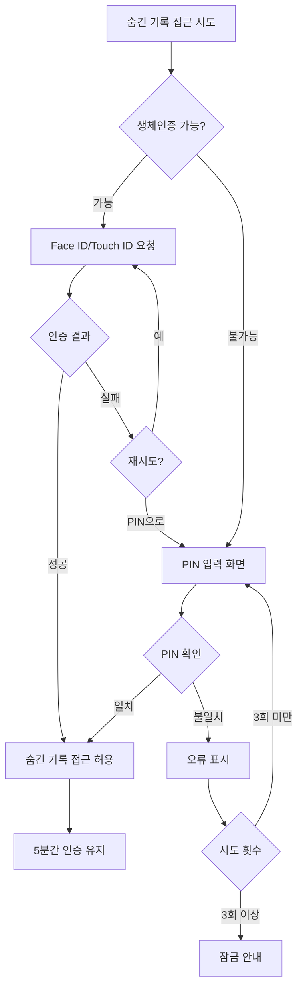

← [인덱스](../index.md)

---

### 9.12 인증 화면 (SCR-024)

> **v2.1 신규**: Face ID/Touch ID 또는 PIN 입력

**생체 인증 화면:**
```
┌─────────────────────────────────┐
│                                 │
│                                 │
│                                 │
│         ┌─────────┐             │
│         │  😐     │             │
│         │ Face ID │             │
│         └─────────┘             │
│                                 │
│    숨긴 기록에 접근하려면        │
│    인증이 필요합니다            │
│                                 │
│                                 │
│    [    PIN으로 인증    ]       │
│                                 │
│    [      취소      ]           │
│                                 │
└─────────────────────────────────┘
```

**PIN 입력 화면:**
```
┌─────────────────────────────────┐
│                                 │
│    PIN 입력                     │
│                                 │
│    ● ● ○ ○                     │
│                                 │
│  ┌─────┬─────┬─────┐           │
│  │  1  │  2  │  3  │           │
│  ├─────┼─────┼─────┤           │
│  │  4  │  5  │  6  │           │
│  ├─────┼─────┼─────┤           │
│  │  7  │  8  │  9  │           │
│  ├─────┼─────┼─────┤           │
│  │     │  0  │  ⌫  │           │
│  └─────┴─────┴─────┘           │
│                                 │
│    [Face ID로 인증]             │
│                                 │
└─────────────────────────────────┘
```

**인증 플로우:**

