# Wander UI 시나리오 명세서

## 문서 정보
- **버전**: v2.3
- **작성일**: 2026년 2월 4일
- **기반 문서**: wander_planning_report.md v2.0, todo.md
- **목적**: 개발자가 구현 시 참고할 수 있는 상세 UI 시나리오 및 예외 케이스 정의
- **주요 변경 (v2.3)**:
  - 다국어 지원 추가 (한국어, 영어)
  - 언어 설정 화면 (SCR-027) 추가
  - LanguageManager 구조 및 로컬라이즈 키 컨벤션 문서화
- **이전 변경 (v2.2)**: 결과 편집, 재분석 기능, Wander Intelligence, 커스텀 포토 피커
- **이전 변경 (v2.1)**: FAB 도입, 돌아보기, 기록 숨기기, 카테고리 관리, 사용자 장소
- **이전 변경 (v2.0)**: 서버리스 전환, 프리미엄/로그인 제거, BYOK 기본 기능화, 탭바 3개로 통일

---

## 목차

1. [앱 구조 및 화면 목록](#1-앱-구조-및-화면-목록)
2. [앱 진입 및 온보딩](#2-앱-진입-및-온보딩)
3. [메인 화면 (홈)](#3-메인-화면-홈)
4. [여행 기록 생성 플로우](#4-여행-기록-생성-플로우)
5. ["지금 뭐해?" 퀵 모드](#5-지금-뭐해-퀵-모드)
6. [일상 기록 플로우](#6-일상-기록-플로우)
7. [결과 화면 및 상세 보기](#7-결과-화면-및-상세-보기)
8. [공유 및 내보내기](#8-공유-및-내보내기)
9. [설정 화면](#9-설정-화면)
   - 9.9 돌아보기 (SCR-022)
   - 9.10 기록 탭 (SCR-006)
   - 9.11 숨긴 기록 (SCR-023)
   - 9.12 인증 화면 (SCR-024)
   - 9.13 카테고리 관리 (SCR-025)
   - 9.14 사용자 장소 설정 (SCR-026)
10. [예외 케이스 및 에러 처리](#10-예외-케이스-및-에러-처리)
11. [상태 관리 및 데이터 플로우](#11-상태-관리-및-데이터-플로우)

---

## 1. 앱 구조 및 화면 목록

### 1.1 전체 앱 구조

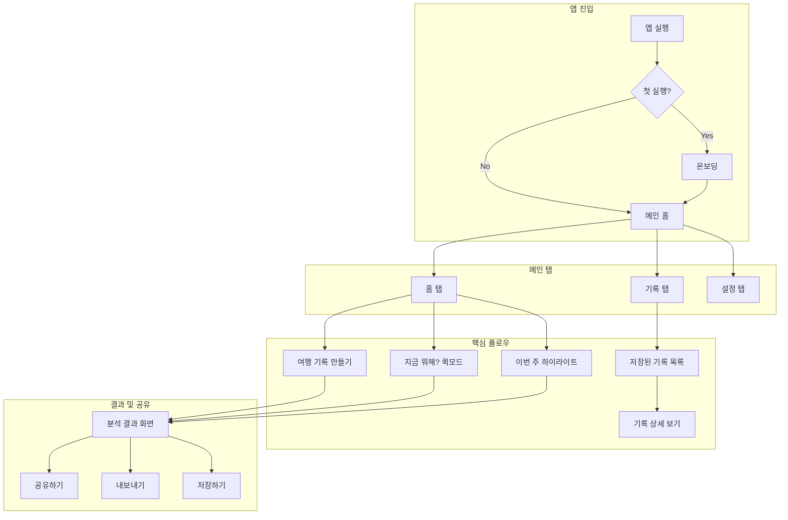
```mermaid
graph TB
    subgraph "앱 진입"
        A[앱 실행] --> B{첫 실행?}
        B -->|Yes| C[온보딩]
        B -->|No| D[메인 홈]
        C --> D
    end

    subgraph "메인 탭"
        D --> E[홈 탭]
        D --> F[기록 탭]
        D --> G[설정 탭]
    end

    subgraph "핵심 플로우"
        E --> H[여행 기록 만들기]
        E --> I[지금 뭐해? 퀵모드]
        E --> J[이번 주 하이라이트]
        F --> K[저장된 기록 목록]
        K --> L[기록 상세 보기]
    end

    subgraph "결과 및 공유"
        H --> M[분석 결과 화면]
        I --> M
        J --> M
        M --> N[공유하기]
        M --> O[내보내기]
        M --> P[저장하기]
    end
```

### 1.2 화면 목록 (Screen Inventory)

> **v2.2 업데이트**: 기록 상세 화면 분리, 보안 설정 추가

| 화면 ID | 화면명 | 설명 | 접근 경로 |
|---------|--------|------|-----------|
| SCR-001 | 스플래시 | 앱 로딩 화면 | 앱 실행 시 |
| SCR-002 | 온보딩 1 | 서비스 소개 | 첫 실행 |
| SCR-003 | 온보딩 2 | 사진 권한 요청 | 첫 실행 |
| SCR-004 | 온보딩 3 | 위치 권한 요청 | 첫 실행 |
| SCR-005 | 홈 | 메인 홈 화면 | 탭바 (홈) |
| SCR-006 | 기록 목록 | 저장된 기록 목록 + 검색 | 탭바 (기록) |
| SCR-006a | 기록 상세 (전체화면) | 기록 상세 정보 + Wander Intelligence | 기록 목록 → 기록 선택 |
| SCR-007 | 설정 | 설정 메인 | 탭바 (설정) |
| SCR-008 | 사진 선택 | 커스텀 포토 피커 (날짜 필터, 드래그 선택) | 홈 → 기록 만들기 |
| SCR-009 | 분석 중 | 분석 로딩 화면 (Smart Analysis 단계 표시) | 사진 선택 완료 후 |
| SCR-010 | 분석 결과 | 결과 표시 + Wander Intelligence | 분석 완료 후 |
| SCR-011 | 지도 상세 | 전체 지도 보기 | 결과 화면에서 |
| SCR-012 | 타임라인 편집 | 타임라인 수정 | 결과 화면에서 |
| SCR-013 | AI 스토리 | AI 생성 스토리 | 결과 화면 (BYOK 연결 시) |
| SCR-014 | 공유 시트 | 공유 옵션 | 결과 화면에서 |
| SCR-015 | 내보내기 옵션 | 내보내기 포맷 선택 | 결과 화면에서 |
| SCR-016 | AI 설정 | AI 프로바이더/모델 선택 | 설정 → AI 설정 |
| SCR-017 | 공유 설정 | 출처 표기 등 공유 옵션 | 설정 → 공유 설정 |
| SCR-018 | 보안 설정 | PIN/생체인증 설정 | 설정 → 보안 |
| SCR-019 | 에러 화면 | 에러 발생 시 | 에러 발생 시 |
| SCR-020 | API Key 입력 | 프로바이더별 API Key 입력 + 모델 선택 | AI 설정 → 프로바이더 선택 |
| SCR-021 | 데이터 관리 | 저장 공간 및 데이터 관리 | 설정 → 데이터 관리 |
| SCR-022 | 돌아보기 | 기간별 사진 자동 수집/분석 | 홈 → 돌아보기 카드 |
| SCR-023 | 숨긴 기록 | 숨긴 기록 목록 (인증 필요) | 기록 탭 → 숨긴 기록 |
| SCR-024 | 인증 화면 | Face ID/Touch ID/PIN 입력 | 숨긴 기록 접근 시 |
| SCR-025 | 카테고리 관리 | 카테고리 숨기기/추가/삭제 | 설정 → 카테고리 관리 |
| SCR-026 | 사용자 장소 설정 | 집/회사/학교/사용자정의 위치 | 설정 → 장소 관리 |
| SCR-027 | 권한 설정 | 사진/위치 권한 상태 및 변경 | 설정 → 권한 설정 |
| SCR-028 | 앱 정보 | 버전, 라이선스, 문의 | 설정 → 앱 정보 |

> **참고**: 탭바는 3개 탭으로 구성 (홈, 기록, 설정). 프로필/로그인 없음 (서버리스 앱). 커스텀 탭바 사용 (SwiftUI TabView(.page) 스타일).

---

## 2. 앱 진입 및 온보딩

### 2.1 앱 실행 플로우

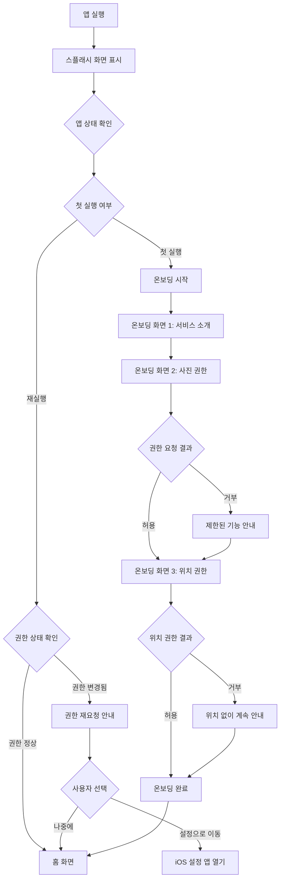
```mermaid
flowchart TD
    A[앱 실행] --> B[스플래시 화면 표시]
    B --> C{앱 상태 확인}

    C --> D{첫 실행 여부}
    D -->|첫 실행| E[온보딩 시작]
    D -->|재실행| F{권한 상태 확인}

    F -->|권한 정상| G[홈 화면]
    F -->|권한 변경됨| H[권한 재요청 안내]
    H --> I{사용자 선택}
    I -->|설정으로 이동| J[iOS 설정 앱 열기]
    I -->|나중에| G

    E --> K[온보딩 화면 1: 서비스 소개]
    K --> L[온보딩 화면 2: 사진 권한]
    L --> M{권한 요청 결과}
    M -->|허용| N[온보딩 화면 3: 위치 권한]
    M -->|거부| O[제한된 기능 안내]
    O --> N

    N --> P{위치 권한 결과}
    P -->|허용| Q[온보딩 완료]
    P -->|거부| R[위치 없이 계속 안내]
    R --> Q

    Q --> G
```

### 2.2 온보딩 화면 상세

#### SCR-002: 온보딩 1 - 서비스 소개

**화면 구성:**
```
┌─────────────────────────────────┐
│                                 │
│      [일러스트레이션]            │
│      사진 → 지도 → 스토리        │
│                                 │
├─────────────────────────────────┤
│                                 │
│   사진 몇 장이면 충분해요         │
│                                 │
│   여행인지, 일상인지,            │
│   AI가 자동으로 파악하고         │
│   스토리로 만들어 드려요         │
│                                 │
├─────────────────────────────────┤
│                                 │
│   ● ○ ○                        │
│                                 │
│   [      다 음      ]           │
│                                 │
└─────────────────────────────────┘
```

**동작:**
- 좌우 스와이프로 페이지 이동 가능
- "다음" 버튼 탭 시 다음 온보딩 화면으로 이동
- 페이지 인디케이터로 현재 위치 표시

#### SCR-003: 온보딩 2 - 사진 권한 요청

**화면 구성:**
```
┌─────────────────────────────────┐
│                                 │
│      [사진 아이콘]              │
│                                 │
├─────────────────────────────────┤
│                                 │
│   사진에 접근할 수 있도록        │
│   허용해 주세요                 │
│                                 │
│   ┌─────────────────────────┐   │
│   │ • 사진의 촬영 시간과 위치   │   │
│   │   정보를 분석합니다        │   │
│   │ • 사진은 기기 내에서만     │   │
│   │   처리되며 서버로 전송     │   │
│   │   되지 않습니다           │   │
│   └─────────────────────────┘   │
│                                 │
├─────────────────────────────────┤
│                                 │
│   ○ ● ○                        │
│                                 │
│   [    사진 접근 허용    ]      │
│                                 │
└─────────────────────────────────┘
```

**권한 요청 시나리오:**

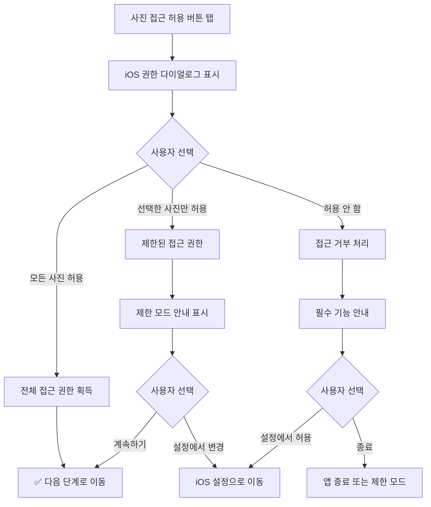
```mermaid
flowchart TD
    A[사진 접근 허용 버튼 탭] --> B[iOS 권한 다이얼로그 표시]

    B --> C{사용자 선택}

    C -->|모든 사진 허용| D[전체 접근 권한 획득]
    D --> E[✅ 다음 단계로 이동]

    C -->|선택한 사진만 허용| F[제한된 접근 권한]
    F --> G[제한 모드 안내 표시]
    G --> H{사용자 선택}
    H -->|계속하기| E
    H -->|설정에서 변경| I[iOS 설정으로 이동]

    C -->|허용 안 함| J[접근 거부 처리]
    J --> K[필수 기능 안내]
    K --> L{사용자 선택}
    L -->|설정에서 허용| I
    L -->|종료| M[앱 종료 또는 제한 모드]
```

**제한 모드 안내 (사진 접근 거부 시):**
```
┌─────────────────────────────────┐
│                                 │
│     ⚠️ 사진 접근 필요           │
│                                 │
│   Wander는 사진의 메타데이터를   │
│   분석하여 동선을 파악합니다.    │
│                                 │
│   사진 접근 없이는 서비스를      │
│   이용할 수 없어요.             │
│                                 │
│   [  설정에서 허용하기  ]       │
│   [      나중에       ]        │
│                                 │
└─────────────────────────────────┘
```

#### SCR-004: 온보딩 3 - 위치 권한 요청

**화면 구성:**
```
┌─────────────────────────────────┐
│                                 │
│      [위치 아이콘]              │
│                                 │
├─────────────────────────────────┤
│                                 │
│   위치 정보 사용을 허용하면      │
│   더 정확한 분석이 가능해요      │
│                                 │
│   ┌─────────────────────────┐   │
│   │ • GPS 좌표를 주소로 변환   │   │
│   │ • 장소 이름 자동 인식     │   │
│   │ • 위치 정보는 기기에서만   │   │
│   │   처리됩니다             │   │
│   └─────────────────────────┘   │
│                                 │
│   💡 허용하지 않아도 기본 기능   │
│      사용이 가능합니다          │
│                                 │
├─────────────────────────────────┤
│                                 │
│   ○ ○ ●                        │
│                                 │
│   [    위치 사용 허용    ]      │
│   [   허용하지 않고 계속  ]     │
│                                 │
└─────────────────────────────────┘
```

**위치 권한 플로우:**

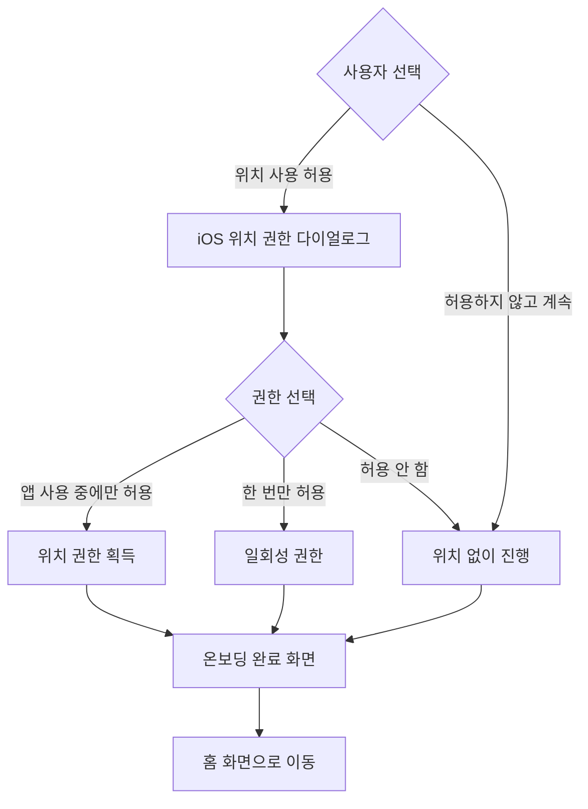
```mermaid
flowchart TD
    A{사용자 선택}

    A -->|위치 사용 허용| B[iOS 위치 권한 다이얼로그]
    A -->|허용하지 않고 계속| C[위치 없이 진행]

    B --> D{권한 선택}
    D -->|앱 사용 중에만 허용| E[위치 권한 획득]
    D -->|한 번만 허용| F[일회성 권한]
    D -->|허용 안 함| C

    E --> G[온보딩 완료 화면]
    F --> G
    C --> G

    G --> H[홈 화면으로 이동]
```

### 2.3 온보딩 완료 후 저장 데이터

```swift
// UserDefaults 저장 항목
struct OnboardingState {
    var isOnboardingCompleted: Bool     // 온보딩 완료 여부
    var photoPermissionStatus: String   // "full" | "limited" | "denied"
    var locationPermissionStatus: String // "always" | "whenInUse" | "denied"
    var onboardingCompletedDate: Date   // 완료 일시
}
```

---

## 3. 메인 화면 (홈)

### 3.1 홈 화면 구조

> **v2.1 변경사항**: "여행 기록 만들기"를 FAB로 분리, 퀵 액션 2개로 축소

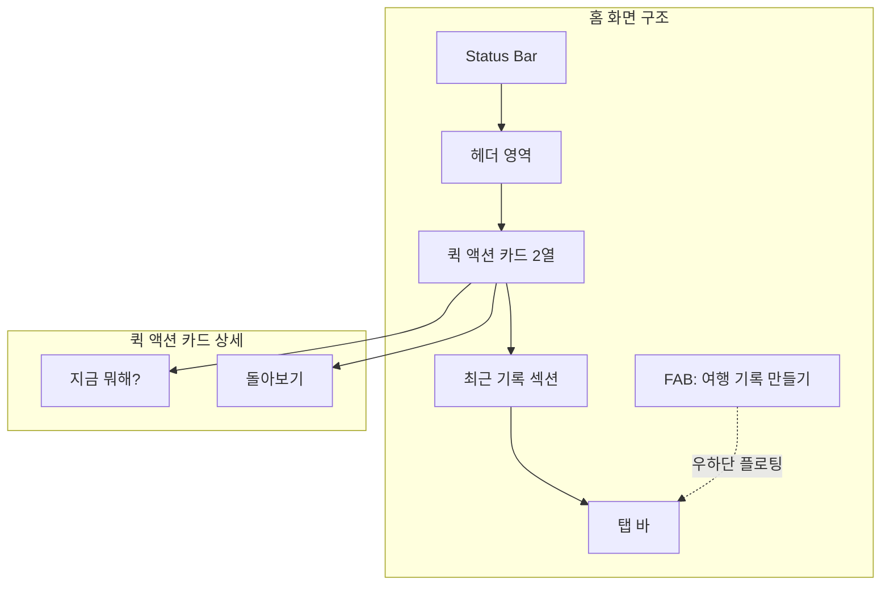
```mermaid
graph TB
    subgraph "홈 화면 구조"
        A[Status Bar]
        B[헤더 영역]
        C[퀵 액션 카드 2열]
        D[최근 기록 섹션]
        E[탭 바]
        F[FAB: 여행 기록 만들기]
    end

    A --> B
    B --> C
    C --> D
    D --> E
    F -.->|우하단 플로팅| E

    subgraph "퀵 액션 카드 상세"
        C --> G[지금 뭐해?]
        C --> H[돌아보기]
    end
```

### 3.2 홈 화면 레이아웃 (SCR-005)

> **v2.2 변경사항**: 햄버거 메뉴 제거, "Wander" 중앙 정렬 헤더
> **v2.1 변경사항**: FAB 도입 (여행 기록하기), 퀵액션 2열로 축소
> **v2.0 변경사항**: 프로필 아이콘 제거, 탭바 3개로 통일

```
┌─────────────────────────────────┐
│ 9:41                     📶 🔋  │
├─────────────────────────────────┤
│                                 │
│           Wander                │
│                                 │
├─────────────────────────────────┤
│                                 │
│  오늘 어떤 이야기를             │
│  만들어 볼까요?                 │
│                                 │
├─────────────────────────────────┤
│ ┌──────────────┐ ┌────────────┐ │
│ │ 💬 지금 뭐해?  │ │ 🔄 돌아보기 │ │
│ │              │ │            │ │
│ │ 사진 몇 장으로 │ │ 자동 하이   │ │
│ │ 바로 공유     │ │ 라이트 생성 │ │
│ └──────────────┘ └────────────┘ │
│                                 │
├─────────────────────────────────┤
│  최근 기록                      │
│                                 │
│ ┌─────────────────────────────┐ │
│ │ [썸네일] 🏝️ 제주도 3박4일    │ │
│ │          2026.01.20~01.23   │ │
│ │          📍 12곳 · 🚗 245km │ │
│ └─────────────────────────────┘ │
│                                 │
│ ┌─────────────────────────────┐ │
│ │ [썸네일] ☕ 성수동 카페 투어   │ │
│ │          2026.01.18         │ │
│ │          📍 4곳 방문         │ │
│ └─────────────────────────────┘ │
│                                 │
│                          ┌────┐ │
│                          │ ➕ │ │
│                          │    │ │
│                          └────┘ │
├─────────────────────────────────┤
│    🏠      📚      ⚙️           │
│    홈      기록    설정          │
└─────────────────────────────────┘

[FAB: 우하단 플로팅 액션 버튼]
- 아이콘: ➕
- 탭 시: 사진 선택 화면 (여행 기록 만들기)
- 색상: Primary (#87CEEB)
- 그림자: 8pt radius, 4pt y-offset
- 기록이 있을 때만 표시 (빈 상태에서는 빈 상태 뷰 내 버튼 사용)
```

### 3.2.1 돌아보기

> **v2.2 변경사항**: 홈 화면에서 바로 시트로 열림 (드롭다운 제거)

**동작:**
- 돌아보기 카드 탭 → LookbackView 시트 표시
- 시트 내에서 기간 선택 후 분석 진행

**기간 옵션 (LookbackView 내 선택):**
| 옵션 | 설명 |
|------|------|
| 이번 주 | 최근 7일간 촬영한 사진 |
| 지난 주 | 7~14일 전 촬영한 사진 |
| 이번 달 | 최근 30일간 촬영한 사진 |
| 올해 | 올해 촬영한 사진 |

**빈 상태 처리:**
- 선택한 기간에 사진이 없으면: "선택한 기간에 촬영한 사진이 없어요"
- 다른 기간 제안: "다른 기간을 선택해 보세요" 버튼 표시

### 3.3 홈 화면 상호작용

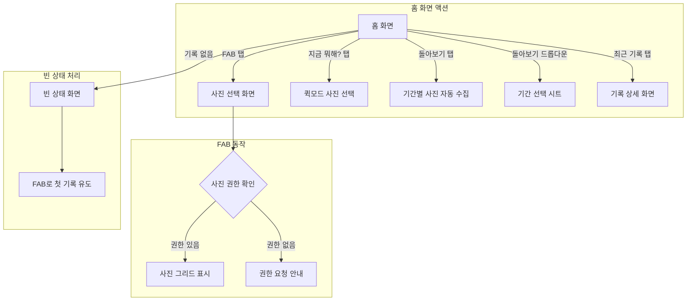
```mermaid
flowchart TD
    subgraph "홈 화면 액션"
        A[홈 화면]

        A -->|FAB 탭| B[사진 선택 화면]
        A -->|지금 뭐해? 탭| C[퀵모드 사진 선택]
        A -->|돌아보기 탭| D[기간별 사진 자동 수집]
        A -->|돌아보기 드롭다운| D1[기간 선택 시트]
        A -->|최근 기록 탭| E[기록 상세 화면]
    end

    subgraph "FAB 동작"
        B --> B1{사진 권한 확인}
        B1 -->|권한 있음| B2[사진 그리드 표시]
        B1 -->|권한 없음| B3[권한 요청 안내]
    end

    subgraph "빈 상태 처리"
        A -->|기록 없음| G[빈 상태 화면]
        G --> H[FAB로 첫 기록 유도]
    end
```

### 3.4 빈 상태 (Empty State) 화면

**최근 기록이 없을 때:**
```
┌─────────────────────────────────┐
│                                 │
│  최근 기록                      │
│                                 │
│      ┌─────────────────┐       │
│      │                 │       │
│      │   📷  →  📍     │       │
│      │                 │       │
│      └─────────────────┘       │
│                                 │
│   아직 기록이 없어요            │
│   첫 번째 여행을 기록해 보세요   │
│                                 │
│   [  여행 기록 만들기  ]        │
│                                 │
└─────────────────────────────────┘
```

---

## 4. 여행 기록 생성 플로우

### 4.1 전체 플로우 개요

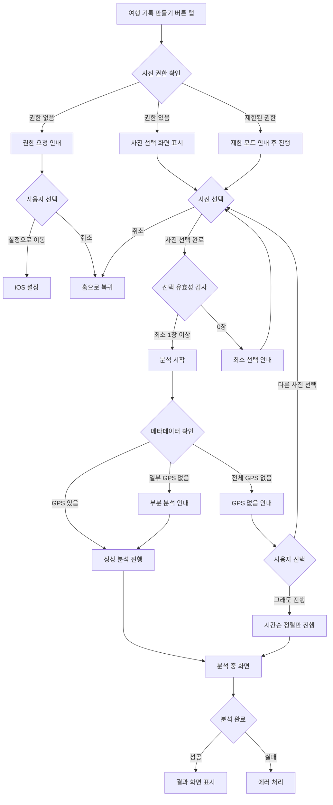
```mermaid
flowchart TD
    A[여행 기록 만들기 버튼 탭] --> B{사진 권한 확인}

    B -->|권한 있음| C[사진 선택 화면 표시]
    B -->|권한 없음| D[권한 요청 안내]
    B -->|제한된 권한| E[제한 모드 안내 후 진행]

    D --> F{사용자 선택}
    F -->|설정으로 이동| G[iOS 설정]
    F -->|취소| H[홈으로 복귀]

    C --> I{사진 선택}
    E --> I

    I -->|사진 선택 완료| J{선택 유효성 검사}
    I -->|취소| H

    J -->|최소 1장 이상| K[분석 시작]
    J -->|0장| L[최소 선택 안내]
    L --> I

    K --> M{메타데이터 확인}

    M -->|GPS 있음| N[정상 분석 진행]
    M -->|일부 GPS 없음| O[부분 분석 안내]
    M -->|전체 GPS 없음| P[GPS 없음 안내]

    O --> N
    P --> Q{사용자 선택}
    Q -->|그래도 진행| R[시간순 정렬만 진행]
    Q -->|다른 사진 선택| I

    N --> S[분석 중 화면]
    R --> S

    S --> T{분석 완료}
    T -->|성공| U[결과 화면 표시]
    T -->|실패| V[에러 처리]
```

### 4.2 사진 선택 화면 (SCR-008) - 커스텀 포토 피커

> **v2.2 변경사항**: 커스텀 포토 피커 도입 (PHPickerViewController 대체)
> - 날짜 필터 칩으로 빠른 필터링
> - 스와이프 드래그 선택 지원
> - 하단 선택 완료 버튼

**화면 레이아웃:**
```
┌─────────────────────────────────┐
│ 9:41                     📶 🔋  │
├─────────────────────────────────┤
│  취소       사진 선택            │
├─────────────────────────────────┤
│                                 │
│ [오늘][이번 주][이번 달][3개월][전체]
│                                 │
├─────────────────────────────────┤
│                                 │
│ ┌─────┬─────┬─────┬─────┐      │
│ │ ✓1  │  2  │  3  │ ✓4  │      │
│ │[📷] │[📷] │[📷] │[📷] │      │
│ ├─────┼─────┼─────┼─────┤      │
│ │ ✓5  │ ✓6  │  7  │  8  │      │
│ │[📷] │[📷] │[📷] │[📷] │      │
│ ├─────┼─────┼─────┼─────┤      │
│ │ ✓9  │✓10  │ 11  │ 12  │      │
│ │[📷] │[📷] │[📷] │[📷] │      │
│ └─────┴─────┴─────┴─────┘      │
│                                 │
│  • • • (스크롤)                 │
│                                 │
├─────────────────────────────────┤
│  ▼ 그라데이션 배경               │
│ ┌─────────────────────────────┐ │
│ │    10장의 사진 선택          │ │
│ └─────────────────────────────┘ │
│                                 │
└─────────────────────────────────┘
```

**날짜 필터 칩:**
| 필터 | 설명 |
|------|------|
| 오늘 | 오늘 촬영한 사진 |
| 이번 주 | 최근 7일간 촬영한 사진 |
| 이번 달 | 최근 30일간 촬영한 사진 (기본값) |
| 최근 3개월 | 최근 90일간 촬영한 사진 |
| 전체 | 모든 사진 |

### 4.3 사진 선택 상호작용

> **v2.2 변경사항**: 드래그 선택 기능 추가

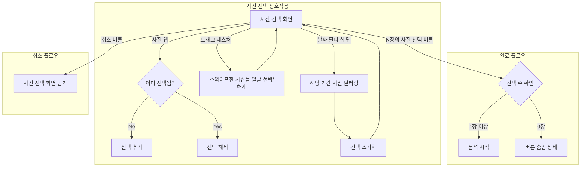
```mermaid
flowchart TD
    subgraph "사진 선택 상호작용"
        A[사진 선택 화면]

        A -->|사진 탭| B{이미 선택됨?}
        B -->|No| C[선택 추가]
        B -->|Yes| D[선택 해제]

        A -->|드래그 제스처| E[스와이프한 사진들 일괄 선택/해제]
        E --> A

        A -->|날짜 필터 칩 탭| F[해당 기간 사진 필터링]
        F --> G[선택 초기화]
        G --> A
    end

    subgraph "완료 플로우"
        A -->|N장의 사진 선택 버튼| H{선택 수 확인}
        H -->|1장 이상| I[분석 시작]
        H -->|0장| J[버튼 숨김 상태]
    end

    subgraph "취소 플로우"
        A -->|취소 버튼| K[사진 선택 화면 닫기]
    end
```

### 4.3.1 드래그 선택 기능

> **v2.2 신규**: PhotoGridView에서 스와이프 드래그로 여러 사진 선택

**동작 방식:**
1. 첫 번째 사진 위에서 드래그 시작
2. 드래그하면서 지나가는 사진들 자동 선택/해제
3. 첫 번째 사진이 선택 상태였으면 → 지나가는 사진들 선택 해제
4. 첫 번째 사진이 미선택 상태였으면 → 지나가는 사진들 선택

**구현:**
```swift
// PhotoGridView에서 DragGesture 사용
.gesture(
    DragGesture(minimumDistance: 0)
        .onChanged { value in
            // 드래그 위치에 해당하는 사진 인덱스 계산
            // 드래그 시작 시 첫 사진의 선택 상태 기억
            // 지나가는 사진들에 반대 상태 적용
        }
)
```

### 4.4 기간 필터 동작

**필터 변경 시:**
1. 날짜 필터 칩 탭
2. PhotoAssetManager.fetchAssets(for: filter) 호출
3. 해당 기간 사진만 그리드에 표시
4. 기존 선택 초기화

**빈 상태:**
```
┌─────────────────────────────────┐
│                                 │
│      [빈 상태 아이콘]           │
│                                 │
│   선택한 기간에 사진이 없습니다   │
│   다른 기간을 선택해 보세요      │
│                                 │
└─────────────────────────────────┘
```

### 4.5 분석 중 화면 (SCR-009)

```
┌─────────────────────────────────┐
│ 9:41                     📶 🔋  │
├─────────────────────────────────┤
│                                 │
│                                 │
│                                 │
│         [로딩 애니메이션]        │
│                                 │
│   사진을 분석하고 있어요...      │
│                                 │
│   ━━━━━━━━━━━━━━━━━━━━━━━━      │
│         60%                     │
│                                 │
│   📍 위치 정보 추출 중...        │
│                                 │
│                                 │
│                                 │
│                                 │
│                                 │
│                                 │
│   💡 Wander는 모든 처리를       │
│      기기 내에서 수행해요        │
│                                 │
└─────────────────────────────────┘
```

**분석 단계별 메시지:**
| 진행률 | 메시지 |
|--------|--------|
| 0-20% | 📸 사진 메타데이터 읽는 중... |
| 20-40% | 📍 위치 정보 추출 중... |
| 40-60% | 🗺️ 주소 정보 변환 중... |
| 60-80% | 📊 동선 분석 중... |
| 80-100% | ✨ 결과 정리 중... |

### 4.6 분석 처리 로직

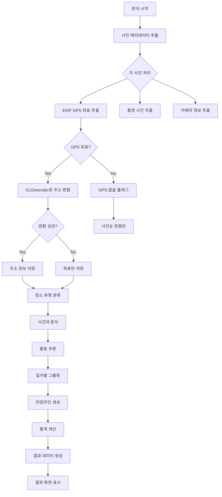
```mermaid
flowchart TD
    A[분석 시작] --> B[사진 메타데이터 추출]

    B --> C{각 사진 처리}
    C --> D[EXIF GPS 좌표 추출]
    C --> E[촬영 시간 추출]
    C --> F[카메라 정보 추출]

    D --> G{GPS 유효?}
    G -->|Yes| H[CLGeocoder로 주소 변환]
    G -->|No| I[GPS 없음 플래그]

    H --> J{변환 성공?}
    J -->|Yes| K[주소 정보 저장]
    J -->|No| L[좌표만 저장]

    K --> M[장소 유형 분류]
    L --> M
    I --> N[시간순 정렬만]

    M --> O[시간대 분석]
    O --> P[활동 추론]

    P --> Q[일자별 그룹핑]
    Q --> R[타임라인 생성]

    R --> S[통계 계산]
    S --> T[결과 데이터 생성]

    T --> U[결과 화면 표시]
```

---

## 5. "지금 뭐해?" 퀵 모드

### 5.1 퀵 모드 플로우

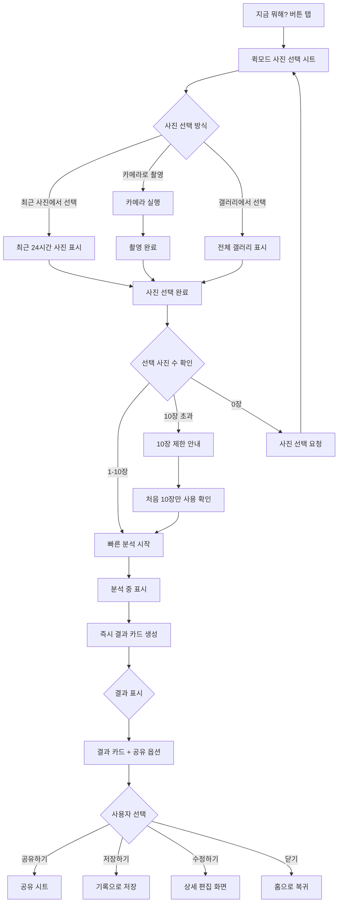
```mermaid
flowchart TD
    A[지금 뭐해? 버튼 탭] --> B[퀵모드 사진 선택 시트]

    B --> C{사진 선택 방식}
    C -->|최근 사진에서 선택| D[최근 24시간 사진 표시]
    C -->|카메라로 촬영| E[카메라 실행]
    C -->|갤러리에서 선택| F[전체 갤러리 표시]

    D --> G[사진 선택 완료]
    E --> H[촬영 완료]
    F --> G
    H --> G

    G --> I{선택 사진 수 확인}
    I -->|1-10장| J[빠른 분석 시작]
    I -->|10장 초과| K[10장 제한 안내]
    I -->|0장| L[사진 선택 요청]
    K --> M[처음 10장만 사용 확인]
    M --> J
    L --> B

    J --> N[분석 중 표시]
    N --> O[즉시 결과 카드 생성]

    O --> P{결과 표시}
    P --> Q[결과 카드 + 공유 옵션]
    Q --> R{사용자 선택}

    R -->|공유하기| S[공유 시트]
    R -->|저장하기| T[기록으로 저장]
    R -->|수정하기| U[상세 편집 화면]
    R -->|닫기| V[홈으로 복귀]
```

### 5.2 퀵모드 사진 선택 시트

```
┌─────────────────────────────────┐
│       지금 뭐해?         ✕      │
├─────────────────────────────────┤
│                                 │
│  방금 찍은 사진을 공유해 보세요  │
│                                 │
├─────────────────────────────────┤
│  최근 사진 (24시간)             │
│ ┌─────┬─────┬─────┬─────┐      │
│ │ ✓1  │  2  │  3  │  4  │      │
│ │[📷] │[📷] │[📷] │[📷] │      │
│ ├─────┼─────┼─────┼─────┤      │
│ │ ✓5  │  6  │  7  │  8  │      │
│ │[📷] │[📷] │[📷] │[📷] │      │
│ └─────┴─────┴─────┴─────┘      │
│                                 │
├─────────────────────────────────┤
│  [📷 카메라 열기]               │
│  [🖼️ 갤러리에서 더 선택]         │
├─────────────────────────────────┤
│                                 │
│  [     완료 (2장 선택)    ]     │
│                                 │
└─────────────────────────────────┘
```

### 5.3 퀵모드 결과 카드

```
┌─────────────────────────────────┐
│       지금 뭐해?         ✕      │
├─────────────────────────────────┤
│ ┌─────────────────────────────┐ │
│ │  [사진 슬라이드/그리드]      │ │
│ │                             │ │
│ │       📷  📷  📷            │ │
│ │                             │ │
│ └─────────────────────────────┘ │
├─────────────────────────────────┤
│                                 │
│  🎤 홍대 뮤직클럽에서           │
│     인디밴드 공연 보는 중!      │
│                                 │
│  📍 홍대입구역 근처             │
│  🕗 저녁 8시                    │
│                                 │
├─────────────────────────────────┤
│                                 │
│  [✏️ 문구 수정]                 │
│                                 │
│ ┌──────────────┬──────────────┐ │
│ │   카카오톡    │  인스타그램   │ │
│ ├──────────────┼──────────────┤ │
│ │   메시지     │    저장      │ │
│ └──────────────┴──────────────┘ │
│                                 │
│  [      이미지로 저장      ]    │
│                                 │
└─────────────────────────────────┘
```

### 5.4 24시간 내 사진이 없는 경우

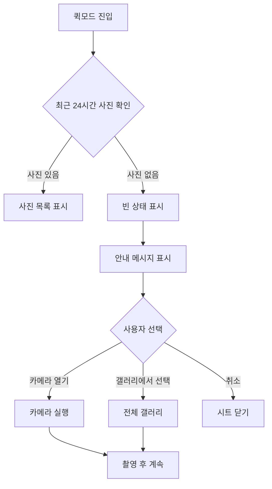
```mermaid
flowchart TD
    A[퀵모드 진입] --> B{최근 24시간 사진 확인}

    B -->|사진 있음| C[사진 목록 표시]
    B -->|사진 없음| D[빈 상태 표시]

    D --> E[안내 메시지 표시]
    E --> F{사용자 선택}

    F -->|카메라 열기| G[카메라 실행]
    F -->|갤러리에서 선택| H[전체 갤러리]
    F -->|취소| I[시트 닫기]

    G --> J[촬영 후 계속]
    H --> J
```

**빈 상태 UI:**
```
┌─────────────────────────────────┐
│       지금 뭐해?         ✕      │
├─────────────────────────────────┤
│                                 │
│      [빈 상태 일러스트]         │
│                                 │
│   최근 24시간 내 촬영한         │
│   사진이 없어요                 │
│                                 │
│   [📷 지금 촬영하기]            │
│   [🖼️ 갤러리에서 선택]          │
│                                 │
└─────────────────────────────────┘
```

---

## 6. 일상 기록 플로우

### 6.1 이번 주 하이라이트 플로우

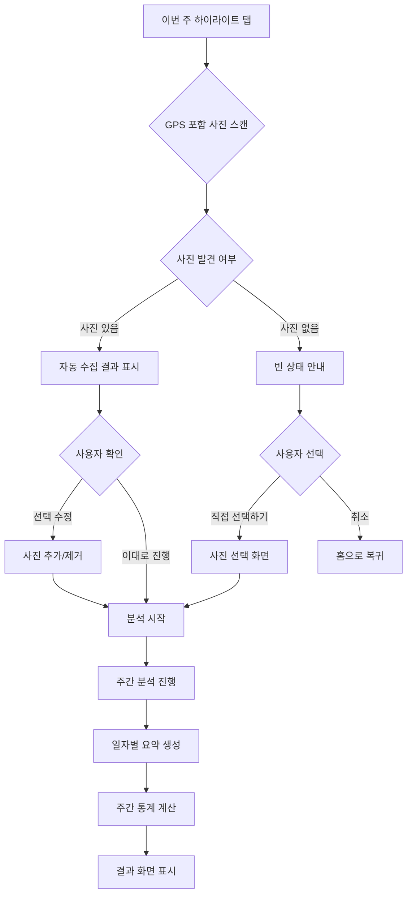
```mermaid
flowchart TD
    A[이번 주 하이라이트 탭] --> B{GPS 포함 사진 스캔}

    B --> C{사진 발견 여부}
    C -->|사진 있음| D[자동 수집 결과 표시]
    C -->|사진 없음| E[빈 상태 안내]

    E --> F{사용자 선택}
    F -->|직접 선택하기| G[사진 선택 화면]
    F -->|취소| H[홈으로 복귀]

    D --> I{사용자 확인}
    I -->|선택 수정| J[사진 추가/제거]
    I -->|이대로 진행| K[분석 시작]

    G --> K
    J --> K

    K --> L[주간 분석 진행]
    L --> M[일자별 요약 생성]
    M --> N[주간 통계 계산]
    N --> O[결과 화면 표시]
```

### 6.2 주간 사진 자동 수집 화면

```
┌─────────────────────────────────┐
│ 9:41                     📶 🔋  │
├─────────────────────────────────┤
│  ✕   이번 주 하이라이트   완료   │
├─────────────────────────────────┤
│                                 │
│  📅 1/20 (월) ~ 1/26 (일)       │
│                                 │
│  GPS가 있는 사진 23장을         │
│  자동으로 찾았어요               │
│                                 │
├─────────────────────────────────┤
│  월요일 (4장)                   │
│ ┌───┬───┬───┬───┐              │
│ │ ✓ │ ✓ │ ✓ │ ✓ │              │
│ └───┴───┴───┴───┘              │
│                                 │
│  화요일 (2장)                   │
│ ┌───┬───┐                      │
│ │ ✓ │ ✓ │                      │
│ └───┴───┘                      │
│                                 │
│  수요일 (사진 없음)             │
│                                 │
│  목요일 (8장)                   │
│ ┌───┬───┬───┬───┬───┬───┬───┬───┐│
│ │ ✓ │ ✓ │ ✓ │ ✓ │ ✓ │ ✓ │ ✓ │ ✓ ││
│ └───┴───┴───┴───┴───┴───┴───┴───┘│
│                                 │
│  • • • (스크롤)                 │
│                                 │
├─────────────────────────────────┤
│  [  갤러리에서 더 추가  ]       │
└─────────────────────────────────┘
```

### 6.3 주간 결과 화면

```
┌─────────────────────────────────┐
│ 9:41                     📶 🔋  │
├─────────────────────────────────┤
│  ✕    이번 주 요약        공유  │
├─────────────────────────────────┤
│                                 │
│   📅 1/20 ~ 1/26 주간 하이라이트 │
│                                 │
├─────────────────────────────────┤
│  [미니 지도 - 이번 주 동선]      │
│                                 │
├─────────────────────────────────┤
│                                 │
│  📅 월: 회사 → 퇴근 후 한강 러닝 │
│  📅 화: 평일 루틴               │
│  📅 수: GPS 기록 없음           │
│  📅 목: 성수동 팝업스토어 방문   │
│  📅 금: 압구정 와인바 친구 모임  │
│  📅 토: 북한산 등산              │
│  📅 일: 집 근처 카페 독서        │
│                                 │
├─────────────────────────────────┤
│  이번 주 통계                   │
│                                 │
│  🏃 총 이동거리: 47km           │
│  📍 방문한 장소: 12곳           │
│  💡 키워드: #운동 #친구 #자연    │
│                                 │
├─────────────────────────────────┤
│                                 │
│  [🤖 AI 스토리 생성하기]        │
│  [    저장하기    ]             │
│                                 │
└─────────────────────────────────┘
```

---

## 7. 결과 화면 및 상세 보기

### 7.1 결과 화면 구조 (SCR-010)

> **v2.2 변경사항**: Wander Intelligence 섹션 추가 (여행 점수, 여행자 DNA, 인사이트, 스토리 미리보기)

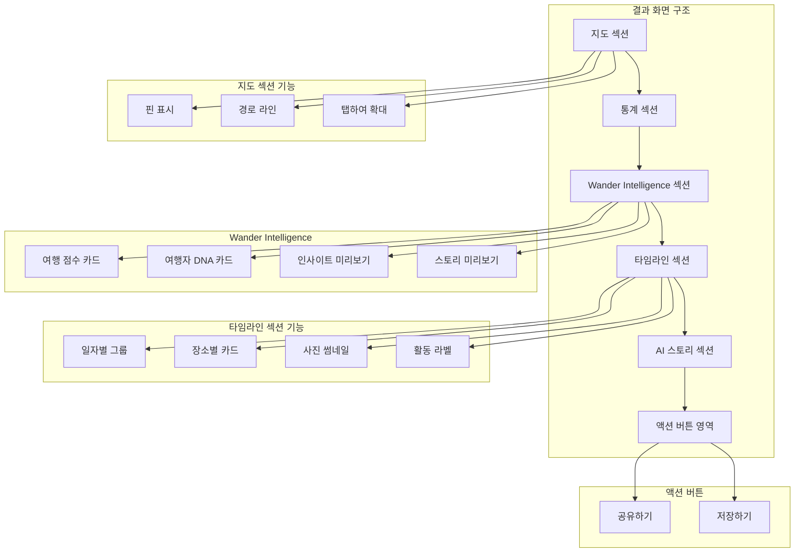
```mermaid
graph TB
    subgraph "결과 화면 구조"
        A[지도 섹션]
        B[통계 섹션]
        C[Wander Intelligence 섹션]
        D[타임라인 섹션]
        E[AI 스토리 섹션]
        F[액션 버튼 영역]
    end

    A --> B
    B --> C
    C --> D
    D --> E
    E --> F

    subgraph "지도 섹션 기능"
        A --> A1[핀 표시]
        A --> A2[경로 라인]
        A --> A3[탭하여 확대]
    end

    subgraph "Wander Intelligence"
        C --> C1[여행 점수 카드]
        C --> C2[여행자 DNA 카드]
        C --> C3[인사이트 미리보기]
        C --> C4[스토리 미리보기]
    end

    subgraph "타임라인 섹션 기능"
        D --> D1[일자별 그룹]
        D --> D2[장소별 카드]
        D --> D3[사진 썸네일]
        D --> D4[활동 라벨]
    end

    subgraph "액션 버튼"
        F --> F1[공유하기]
        F --> F2[저장하기]
    end
```

### 7.2 결과 화면 레이아웃

```
┌─────────────────────────────────┐
│ 9:41                     📶 🔋  │
├─────────────────────────────────┤
│  ✕   제주도 3박4일       ···    │
│      2026.01.15 ~ 01.18        │
├─────────────────────────────────┤
│ ┌─────────────────────────────┐ │
│ │                             │ │
│ │    [지도 - 동선 표시]        │ │
│ │    📍━━📍━━📍━━📍          │ │
│ │                             │ │
│ │ 여행 동선         [전체보기] │ │
│ └─────────────────────────────┘ │
├─────────────────────────────────┤
│  ✨ 스마트 분석                 │
│  ┌────────┬────────┬────────┐  │
│  │ 🚗     │ 📍     │ 📸     │  │
│  │ 245km  │ 12곳   │ 50장   │  │
│  │ 이동   │ 방문   │ 사진   │  │
│  └────────┴────────┴────────┘  │
│  1월 15일 · 12곳               │
├─────────────────────────────────┤
│  ⭐ 여행 점수                   │
│ ┌─────────────────────────────┐ │
│ │  85      │ 전설적인 순간: 3개 │ │
│ │ Great    │ 획득한 배지: 5개   │ │
│ │          │                   │ │
│ │  🎨 예술가  🍽️ 미식가         │ │
│ └─────────────────────────────┘ │
├─────────────────────────────────┤
│  🧬 여행자 DNA                  │
│ ┌─────────────────────────────┐ │
│ │  🎨 예술적 탐험가             │ │
│ │  문화와 예술에 깊은 관심...   │ │
│ │                             │ │
│ │  탐험 ████████░░ 80          │ │
│ │  미식 ██████░░░░ 60          │ │
│ │  문화 █████████░ 90          │ │
│ │  휴식 ████░░░░░░ 40          │ │
│ └─────────────────────────────┘ │
├─────────────────────────────────┤
│  💡 여행 인사이트               │
│ ┌─────────────────────────────┐ │
│ │ 🌅 오후 시간대 활용 달인      │ │
│ │ 가장 활발하게 활동한 시간... │ │
│ └─────────────────────────────┘ │
│ ┌─────────────────────────────┐ │
│ │ 🍽️ 맛집 탐험가                │ │
│ │ 이번 여행에서 방문한 식당... │ │
│ └─────────────────────────────┘ │
├─────────────────────────────────┤
│  📖 여행 이야기                 │
│ ┌─────────────────────────────┐ │
│ │  제주의 푸른 바람            │ │
│ │  "바다와 하늘 사이에서..."   │ │
│ │                             │ │
│ │  새벽 비행기에 몸을 싣고...  │ │
│ │                             │ │
│ │  📚 3개의 챕터               │ │
│ └─────────────────────────────┘ │
├─────────────────────────────────┤
│  📅 타임라인                    │
│                                 │
│  📅 1월 15일 (월)               │
│ ┌─────────────────────────────┐ │
│ │ 📍 제주공항                  │ │
│ │ 🕐 10:30 · ✈️ 도착           │ │
│ │ ┌───┬───┬───┐              │ │
│ │ │📷│📷│📷│              │ │
│ │ └───┴───┴───┘              │ │
│ └─────────────────────────────┘ │
│           │                     │
│           ▼ 32km                │
│           │                     │
│ ┌─────────────────────────────┐ │
│ │ 📍 협재해수욕장              │ │
│ │ 🕐 13:00 · 🏖️ 해변           │ │
│ │ ┌───┬───┬───┬───┬───┐      │ │
│ │ │📷│📷│📷│📷│📷│      │ │
│ │ └───┴───┴───┴───┴───┘      │ │
│ └─────────────────────────────┘ │
│                                 │
│  • • • (스크롤)                 │
│                                 │
├─────────────────────────────────┤
│  🤖 AI 스토리                   │
│ ┌─────────────────────────────┐ │
│ │ AI 스토리 생성하기 >          │ │
│ └─────────────────────────────┘ │
├─────────────────────────────────┤
│ ┌──────────┬──────────────────┐ │
│ │  공유    │     저장하기     │ │
│ └──────────┴──────────────────┘ │
└─────────────────────────────────┘
```

> **v2.0 변경사항**: 탭바 3개 (홈, 기록, 설정), 프리미엄 다이아몬드 제거
> **v2.2 변경사항**: Wander Intelligence 섹션 추가 (여행 점수, DNA, 인사이트, 스토리)

### 7.3 타임라인 상호작용

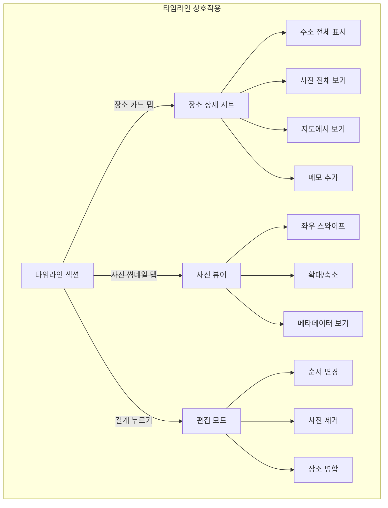
```mermaid
flowchart TD
    subgraph "타임라인 상호작용"
        A[타임라인 섹션]

        A -->|장소 카드 탭| B[장소 상세 시트]
        B --> B1[주소 전체 표시]
        B --> B2[사진 전체 보기]
        B --> B3[지도에서 보기]
        B --> B4[메모 추가]

        A -->|사진 썸네일 탭| C[사진 뷰어]
        C --> C1[좌우 스와이프]
        C --> C2[확대/축소]
        C --> C3[메타데이터 보기]

        A -->|길게 누르기| D[편집 모드]
        D --> D1[순서 변경]
        D --> D2[사진 제거]
        D --> D3[장소 병합]
    end
```

### 7.4 지도 상세 화면 (SCR-011)

```
┌─────────────────────────────────┐
│ 9:41                     📶 🔋  │
├─────────────────────────────────┤
│  ✕         지도          ···   │
├─────────────────────────────────┤
│                                 │
│ ┌─────────────────────────────┐ │
│ │                             │ │
│ │                             │ │
│ │     [전체 화면 지도]         │ │
│ │                             │ │
│ │   📍1━━━📍2━━━📍3          │ │
│ │          ╲                  │ │
│ │           ━━━📍4━━━📍5     │ │
│ │                             │ │
│ │                             │ │
│ │                             │ │
│ └─────────────────────────────┘ │
│                                 │
├─────────────────────────────────┤
│  📍 터치하여 장소 정보 보기      │
│                                 │
│  [일자별 보기]  [전체 경로]      │
│                                 │
└─────────────────────────────────┘
```

**지도 핀 탭 시 말풍선:**
```
┌─────────────────────────┐
│ 📍 협재해수욕장          │
│ 🕐 13:00 ~ 15:30        │
│ 📷 8장                  │
│ [상세 보기]             │
└─────────────────────────┘
```

### 7.5 타임라인 편집 화면 (SCR-012)

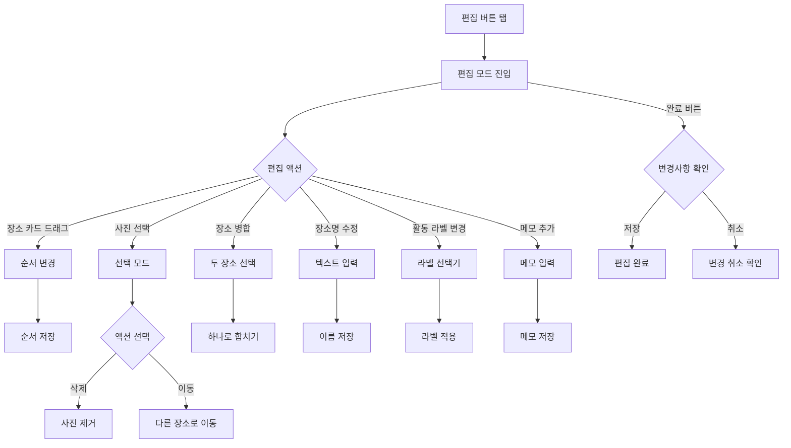
```mermaid
flowchart TD
    A[편집 버튼 탭] --> B[편집 모드 진입]

    B --> C{편집 액션}

    C -->|장소 카드 드래그| D[순서 변경]
    D --> E[순서 저장]

    C -->|사진 선택| F[선택 모드]
    F --> G{액션 선택}
    G -->|삭제| H[사진 제거]
    G -->|이동| I[다른 장소로 이동]

    C -->|장소 병합| J[두 장소 선택]
    J --> K[하나로 합치기]

    C -->|장소명 수정| L[텍스트 입력]
    L --> M[이름 저장]

    C -->|활동 라벨 변경| N[라벨 선택기]
    N --> O[라벨 적용]

    C -->|메모 추가| P[메모 입력]
    P --> Q[메모 저장]

    B -->|완료 버튼| R{변경사항 확인}
    R -->|저장| S[편집 완료]
    R -->|취소| T[변경 취소 확인]
```

**편집 모드 UI:**
```
┌─────────────────────────────────┐
│  취소      편집 모드       완료  │
├─────────────────────────────────┤
│                                 │
│  📅 Day 1 (1/15)               │
│                                 │
│ ┌─────────────────────────────┐ │
│ │ ≡  📍 제주공항         ✏️ 🗑️│ │
│ │    🕐 10:30 · ✈️ 도착       │ │
│ │    ┌───┬───┬───┐ [+추가]   │ │
│ │    │📷│📷│📷│           │ │
│ │    └───┴───┴───┘           │ │
│ └─────────────────────────────┘ │
│                                 │
│ ┌─────────────────────────────┐ │
│ │ ≡  📍 협재해수욕장     ✏️ 🗑️│ │
│ │    🕐 13:00 · 🏖️ 해변       │ │
│ │    활동: [🏖️해변▾]          │ │
│ │    메모: 탭하여 추가         │ │
│ └─────────────────────────────┘ │
│                                 │
│ [+ 새 장소 추가]                │
│                                 │
└─────────────────────────────────┘
```

---

## 8. 공유 및 내보내기

### 8.1 공유 플로우

> **v2.0 변경사항**: 프리미엄 체크 제거, 링크 공유는 서버리스로 인해 미지원

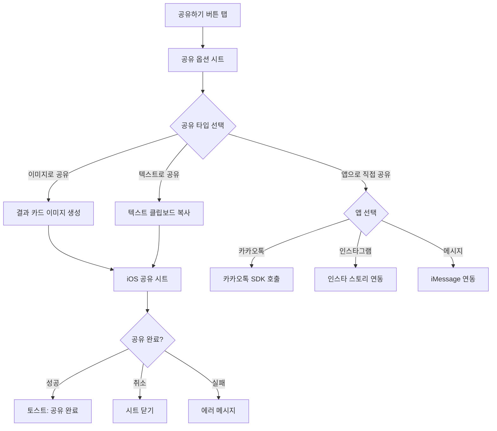
```mermaid
flowchart TD
    A[공유하기 버튼 탭] --> B[공유 옵션 시트]

    B --> C{공유 타입 선택}

    C -->|이미지로 공유| D[결과 카드 이미지 생성]
    D --> E[iOS 공유 시트]

    C -->|텍스트로 공유| F[텍스트 클립보드 복사]
    F --> E

    C -->|앱으로 직접 공유| I{앱 선택}
    I -->|카카오톡| J[카카오톡 SDK 호출]
    I -->|인스타그램| K[인스타 스토리 연동]
    I -->|메시지| L[iMessage 연동]

    E --> M{공유 완료?}
    M -->|성공| N[토스트: 공유 완료]
    M -->|취소| O[시트 닫기]
    M -->|실패| P[에러 메시지]
```

> **참고**: 서버리스 앱으로 웹 링크 공유는 미지원. 이미지/텍스트 공유만 가능.

### 8.2 공유 시트 (SCR-014)

```
┌─────────────────────────────────┐
│           공유하기              │
├─────────────────────────────────┤
│                                 │
│  공유 형식 선택                 │
│                                 │
│ ┌───────────────────────┐       │
│ │ 🖼️ 이미지 카드          │       │
│ │ SNS에 바로 올릴 수 있는  │       │
│ │ 예쁜 카드 이미지         │       │
│ └───────────────────────┘       │
│                                 │
│ ┌───────────────────────┐       │
│ │ 📝 텍스트만            │       │
│ │ 타임라인 텍스트 복사    │       │
│ └───────────────────────┘       │
│                                 │
├─────────────────────────────────┤
│  바로 공유                      │
│                                 │
│ ┌─────┬─────┬─────┬─────┐      │
│ │ 💬  │ 📸  │ 💬  │ ··· │      │
│ │카톡 │인스타│메시지│     │      │
│ └─────┴─────┴─────┴─────┘      │
│                                 │
│  [      기타 앱으로 공유     ]  │
│                                 │
└─────────────────────────────────┘
```

### 8.3 공유 텍스트 출처 표기

#### 8.3.1 출처 표기 정책

공유되는 모든 텍스트(이미지 카드, 텍스트 복사, 내보내기)에 앱 출처를 기본 포함합니다.
단, 사용자가 SNS 앱에서 자유롭게 편집/삭제할 수 있도록 **클립보드 복사 형태**로 제공합니다.

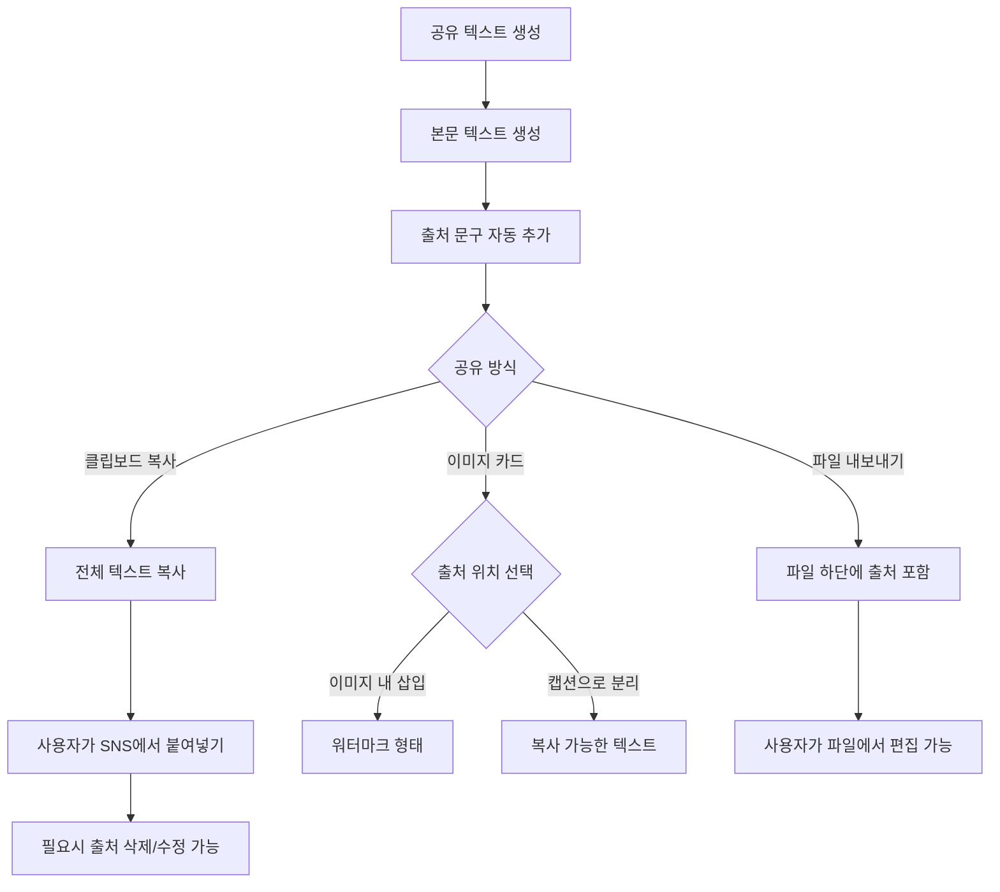
```mermaid
flowchart TD
    A[공유 텍스트 생성] --> B[본문 텍스트 생성]
    B --> C[출처 문구 자동 추가]
    C --> D{공유 방식}

    D -->|클립보드 복사| E[전체 텍스트 복사]
    E --> F[사용자가 SNS에서 붙여넣기]
    F --> G[필요시 출처 삭제/수정 가능]

    D -->|이미지 카드| H{출처 위치 선택}
    H -->|이미지 내 삽입| I[워터마크 형태]
    H -->|캡션으로 분리| J[복사 가능한 텍스트]

    D -->|파일 내보내기| K[파일 하단에 출처 포함]
    K --> L[사용자가 파일에서 편집 가능]
```

#### 8.3.2 출처 문구 형식

| 공유 유형 | 출처 문구 | 편집 가능 여부 |
|-----------|----------|---------------|
| 텍스트 공유 | `📍 Wander로 기록했어요` | ✅ SNS에서 삭제 가능 |
| 이미지 카드 (캡션) | `Made with Wander ✨` | ✅ 캡션에서 삭제 가능 |
| 이미지 카드 (워터마크) | 우하단 작은 로고 | ⚠️ 이미지 편집 필요 |
| Markdown 내보내기 | `> 📍 Wander로 기록한 여행` | ✅ 파일에서 삭제 가능 |
| 퀵모드 공유 | `via Wander` | ✅ SNS에서 삭제 가능 |

#### 8.3.3 출처 포함 텍스트 예시

**텍스트 공유 시:**
```
🏝️ 제주도 3박 4일 여행

📅 Day 1 (1/15)
📍 제주공항 → 협재해수욕장 → 애월카페거리

📅 Day 2 (1/16)
📍 한라산 등반 → 1100고지 → 서귀포

🚗 총 이동거리: 245km
📍 방문 장소: 12곳

─────────────────
📍 Wander로 기록했어요
```

**퀵모드 "지금 뭐해?" 공유 시:**
```
🎤 홍대 뮤직클럽에서 인디밴드 공연 보는 중!

📍 홍대입구역 근처 · 🕗 저녁 8시

via Wander
```

#### 8.3.4 출처 설정 옵션 (설정 화면)

```
┌─────────────────────────────────┐
│  ◀       공유 설정              │
├─────────────────────────────────┤
│                                 │
│  출처 표기                      │
│ ┌─────────────────────────────┐ │
│ │ 📍 공유 시 출처 포함    🔘  │ │
│ │                             │ │
│ │ 공유하는 텍스트 끝에 앱     │ │
│ │ 출처가 자동으로 추가됩니다.  │ │
│ │ SNS에서 자유롭게 편집/삭제  │ │
│ │ 할 수 있어요.              │ │
│ └─────────────────────────────┘ │
│                                 │
│  출처 문구 스타일               │
│ ┌─────────────────────────────┐ │
│ │ ● 📍 Wander로 기록했어요    │ │
│ │ ○ Made with Wander ✨       │ │
│ │ ○ via Wander               │ │
│ │ ○ #Wander                   │ │
│ └─────────────────────────────┘ │
│                                 │
│  💡 출처를 포함하면 더 많은     │
│     사람들이 Wander를 알게 돼요 │
│                                 │
└─────────────────────────────────┘
```

#### 8.3.5 이미지 카드 출처 옵션

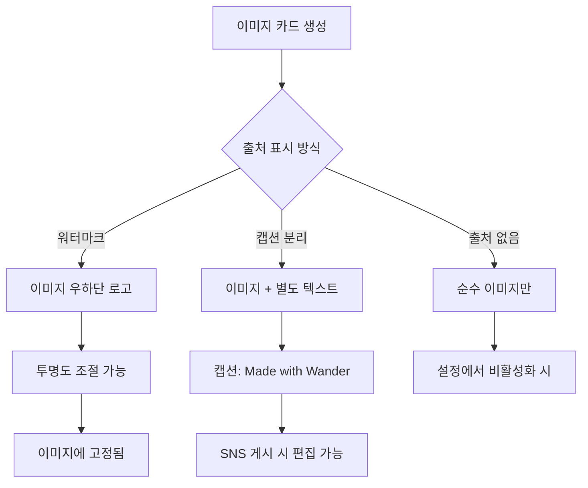
```mermaid
flowchart TD
    A[이미지 카드 생성] --> B{출처 표시 방식}

    B -->|워터마크| C[이미지 우하단 로고]
    C --> D[투명도 조절 가능]
    D --> E[이미지에 고정됨]

    B -->|캡션 분리| F[이미지 + 별도 텍스트]
    F --> G[캡션: Made with Wander]
    G --> H[SNS 게시 시 편집 가능]

    B -->|출처 없음| I[순수 이미지만]
    I --> J[설정에서 비활성화 시]
```

**이미지 카드 옵션 UI 업데이트:**
```
┌─────────────────────────────────┐
│  ◀        카드 스타일     공유  │
├─────────────────────────────────┤
│                                 │
│  ┌─────────────────────────┐   │
│  │                         │   │
│  │    [카드 미리보기]       │   │
│  │                    🏷️   │   │
│  │    🗺️ + 📊         ↑   │   │
│  │              워터마크    │   │
│  └─────────────────────────┘   │
│                                 │
├─────────────────────────────────┤
│  스타일                         │
│  [심플✓] [사진중심] [타임라인]   │
│                                 │
├─────────────────────────────────┤
│  배경색                         │
│  ⚪ ⚫ 🔵 🟢 🟡 🟠 🔴         │
│                                 │
├─────────────────────────────────┤
│  표시 정보                      │
│  ☑️ 지도  ☑️ 날짜  ☑️ 통계      │
│  ☑️ 장소명  ☐ 정확한 주소       │
│                                 │
├─────────────────────────────────┤
│  출처 표기                      │
│  ● 워터마크 (이미지 내)         │
│  ○ 캡션으로 (편집 가능)         │
│  ○ 표시 안 함                   │
│                                 │
└─────────────────────────────────┘
```

#### 8.3.6 SNS별 출처 편집 안내

| SNS | 편집 방법 | 비고 |
|-----|----------|------|
| 카카오톡 | 전송 전 텍스트 직접 편집 | 복사된 텍스트 수정 |
| 인스타그램 스토리 | 텍스트 스티커로 추가됨 → 삭제 가능 | 별도 레이어 |
| 인스타그램 피드 | 캡션에서 편집 | 게시 전 수정 |
| 트위터/X | 트윗 작성 창에서 편집 | 복사된 텍스트 수정 |
| 메시지 | 전송 전 텍스트 편집 | iMessage/SMS |

### 8.4 공유 카드 이미지 옵션

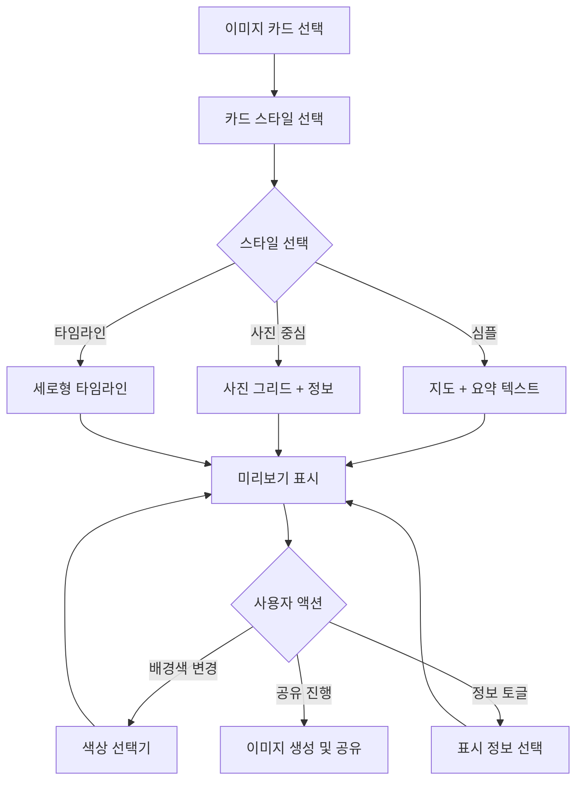
```mermaid
flowchart TD
    A[이미지 카드 선택] --> B[카드 스타일 선택]

    B --> C{스타일 선택}
    C -->|심플| D[지도 + 요약 텍스트]
    C -->|사진 중심| E[사진 그리드 + 정보]
    C -->|타임라인| F[세로형 타임라인]

    D --> G[미리보기 표시]
    E --> G
    F --> G

    G --> H{사용자 액션}
    H -->|배경색 변경| I[색상 선택기]
    H -->|정보 토글| J[표시 정보 선택]
    H -->|공유 진행| K[이미지 생성 및 공유]

    I --> G
    J --> G
```

**카드 스타일 선택 UI:**
```
┌─────────────────────────────────┐
│  ◀        카드 스타일     공유  │
├─────────────────────────────────┤
│                                 │
│  ┌─────────────────────────┐   │
│  │                         │   │
│  │    [카드 미리보기]       │   │
│  │                         │   │
│  │    🗺️ + 📊              │   │
│  │                         │   │
│  └─────────────────────────┘   │
│                                 │
├─────────────────────────────────┤
│  스타일                         │
│  [심플✓] [사진중심] [타임라인]   │
│                                 │
├─────────────────────────────────┤
│  배경색                         │
│  ⚪ ⚫ 🔵 🟢 🟡 🟠 🔴         │
│                                 │
├─────────────────────────────────┤
│  표시 정보                      │
│  ☑️ 지도  ☑️ 날짜  ☑️ 통계      │
│  ☑️ 장소명  ☐ 정확한 주소       │
│                                 │
└─────────────────────────────────┘
```

### 8.5 내보내기 플로우 (SCR-015)

> **v2.1 변경사항**: 이미지(PNG) 내보내기 추가, 워터마크 옵션
> **v2.0 변경사항**: 프리미엄 체크 제거, AI 스토리는 BYOK 연결 여부로 결정

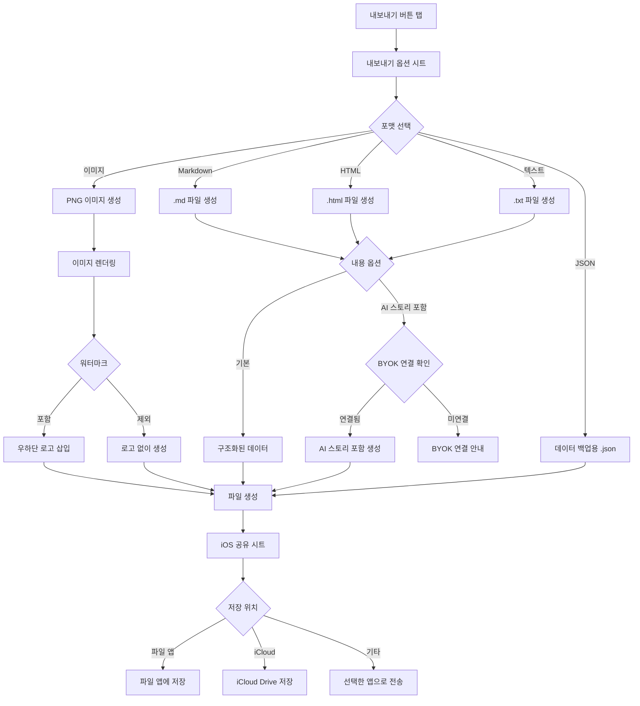
```mermaid
flowchart TD
    A[내보내기 버튼 탭] --> B[내보내기 옵션 시트]

    B --> C{포맷 선택}

    C -->|이미지| D1["PNG 이미지 생성"]
    C -->|Markdown| D[".md 파일 생성"]
    C -->|HTML| E[".html 파일 생성"]
    C -->|텍스트| F[".txt 파일 생성"]
    C -->|JSON| G["데이터 백업용 .json"]

    D1 --> D2[이미지 렌더링]
    D2 --> D3{워터마크}
    D3 -->|포함| D4[우하단 로고 삽입]
    D3 -->|제외| D5[로고 없이 생성]
    D4 --> M
    D5 --> M

    D --> H{내용 옵션}
    E --> H
    F --> H

    H -->|기본| I[구조화된 데이터]
    H -->|AI 스토리 포함| J{BYOK 연결 확인}

    J -->|연결됨| K[AI 스토리 포함 생성]
    J -->|미연결| L[BYOK 연결 안내]

    I --> M[파일 생성]
    K --> M
    G --> M

    M --> N[iOS 공유 시트]
    N --> O{저장 위치}
    O -->|파일 앱| P[파일 앱에 저장]
    O -->|iCloud| Q[iCloud Drive 저장]
    O -->|기타| R[선택한 앱으로 전송]
```

#### 8.5.1 이미지 내보내기 사양

| 항목 | 값 |
|------|-----|
| 형식 | PNG |
| 해상도 | 1080 x 1920 (세로형) |
| 워터마크 | 우하단 Wander 로고 (선택적) |
| 내용 | 지도 + 타임라인 + 통계 요약 |

> **참고**: 프리미엄/크레딧 체크 없음. AI 스토리 포함은 BYOK 연결 여부로만 결정.

### 8.6 내보내기 옵션 시트

> **v2.1 변경사항**: 이미지(PNG) 형식 추가, 워터마크 옵션
> **v2.0 변경사항**: 프리미엄 표시 제거, AI 스토리는 BYOK 연결 시 사용 가능

```
┌─────────────────────────────────┐
│          내보내기               │
├─────────────────────────────────┤
│                                 │
│  파일 형식                      │
│                                 │
│ ┌─────────────────────────────┐ │
│ │ 🖼️ 이미지 (.png)        ⭐  │ │
│ │ SNS 공유에 최적화           │ │
│ └─────────────────────────────┘ │
│                                 │
│ ┌─────────────────────────────┐ │
│ │ 📝 Markdown (.md)           │ │
│ │ 블로그 포스팅에 적합         │ │
│ └─────────────────────────────┘ │
│                                 │
│ ┌─────────────────────────────┐ │
│ │ 🌐 HTML (.html)             │ │
│ │ 웹페이지 형식                │ │
│ └─────────────────────────────┘ │
│                                 │
│ ┌─────────────────────────────┐ │
│ │ 📄 텍스트 (.txt)            │ │
│ │ 순수 텍스트                  │ │
│ └─────────────────────────────┘ │
│                                 │
├─────────────────────────────────┤
│  이미지 옵션 (이미지 선택 시)   │
│                                 │
│  ☑️ Wander 로고 워터마크       │
│                                 │
├─────────────────────────────────┤
│  포함 내용 (문서 형식 선택 시)  │
│                                 │
│  ☑️ 타임라인                    │
│  ☑️ 통계 정보                   │
│  ☐ AI 스토리 (BYOK 연결 필요)  │
│  ☑️ 사진 파일명                 │
│                                 │
├─────────────────────────────────┤
│                                 │
│  [      내보내기 시작      ]    │
│                                 │
└─────────────────────────────────┘
```

> **참고**: AI 스토리는 BYOK 연결 시 무료로 사용 가능.

### 8.7 내보내기 결과물 예시

**Markdown 출력 (무료):**
```markdown
# 제주도 3박 4일 여행

**기간:** 2026.01.15 ~ 2026.01.18
**이동거리:** 245km
**방문장소:** 12곳

---

## Day 1 (2026.01.15)

### 📍 제주공항
- 시간: 10:30
- 유형: ✈️ 공항
- 사진: IMG_001.jpg, IMG_002.jpg

### 📍 협재해수욕장
- 시간: 13:00 ~ 15:30
- 유형: 🏖️ 해변
- 사진: IMG_003.jpg ~ IMG_010.jpg

...

---

> 📍 Wander로 기록한 여행
```

**Markdown 출력 (프리미엄 - AI 스토리 포함):**
```markdown
# 바다와 커피향이 함께한 제주 여행

비행기가 제주공항에 내리자마자 느껴지는 바다 냄새.
렌터카를 빌려 곧장 협재해수욕장으로 향했다...

---

## Day 1: 에메랄드빛 첫 만남

### 📍 제주공항
> 설렘을 안고 제주의 땅을 밟았다.
> 공항을 나서자 촉촉한 바다 공기가 반겼다.

...

---

> ✨ Made with Wander
```

---

## 9. 설정 화면

### 9.1 설정 화면 구조 (SCR-007)

> **v2.2 변경사항**: 섹션 구조 개편 - 보안, 사용자 설정, 공유 섹션 분리
> **v2.0 변경사항**: 계정/프로필/프리미엄 섹션 제거 (서버리스 앱), 크레딧 제거, BYOK만 지원

```mermaid
graph TB
    subgraph "설정 화면"
        A[설정 메인]

        A --> B[AI 기능 섹션]
        A --> C[데이터 및 권한 섹션]
        A --> D[보안 섹션]
        A --> E[사용자 설정 섹션]
        A --> F[공유 섹션]
        A --> G[기타 섹션]
        A --> H[개발자 모드 섹션]

        B --> B1[AI 설정 - 프로바이더/모델 선택]

        C --> C1[데이터 관리 - 캐시, 백업]
        C --> C2[권한 설정 - 사진, 위치]

        D --> D1[보안 설정 - PIN, 생체인증]

        E --> E1[카테고리 관리 - 추가/편집/숨기기]
        E --> E2[장소 관리 - 집, 회사 등]

        F --> F1[공유 설정 - 출처 표기]

        G --> G1[앱 정보 - 버전, 라이선스]

        H --> H1[온보딩 다시 보기]
    end
```

> **참고**: 계정/프로필/로그인 관련 섹션 없음. 프리미엄/크레딧 관련 UI 없음.

### 9.2 설정 화면 레이아웃

> **v2.2 변경사항**: 섹션 구조 개편 (6개 섹션 + 개발자 모드)

```
┌─────────────────────────────────┐
│ 9:41                     📶 🔋  │
├─────────────────────────────────┤
│             설정                │
├─────────────────────────────────┤
│                                 │
│  AI 기능                        │
│ ┌─────────────────────────────┐ │
│ │ ✨ AI 설정               >  │ │
│ │    API 키 관리, 프로바이더 선택│ │
│ └─────────────────────────────┘ │
│                                 │
│  데이터 및 권한                  │
│ ┌─────────────────────────────┐ │
│ │ 💾 데이터 관리           >  │ │
│ │    저장 공간, 캐시 삭제       │ │
│ ├─────────────────────────────┤ │
│ │ 🛡️ 권한 설정            >  │ │
│ │    사진, 위치 접근 권한       │ │
│ └─────────────────────────────┘ │
│                                 │
│  보안                           │
│ ┌─────────────────────────────┐ │
│ │ 🔐 보안                  >  │ │
│ │    PIN, 생체인증 설정        │ │
│ └─────────────────────────────┘ │
│                                 │
│  사용자 설정                     │
│ ┌─────────────────────────────┐ │
│ │ 📁 카테고리 관리         >  │ │
│ │    카테고리 추가, 편집, 숨기기 │ │
│ ├─────────────────────────────┤ │
│ │ 📍 장소 관리             >  │ │
│ │    집, 회사 등 자주 가는 장소 │ │
│ └─────────────────────────────┘ │
│                                 │
│  공유                           │
│ ┌─────────────────────────────┐ │
│ │ ↗️ 공유 설정             >  │ │
│ │    기본 공유 옵션            │ │
│ └─────────────────────────────┘ │
│                                 │
│  기타                           │
│ ┌─────────────────────────────┐ │
│ │ ℹ️ 앱 정보              >  │ │
│ │    버전, 라이선스            │ │
│ └─────────────────────────────┘ │
│                                 │
│  개발자 모드                     │
│ ┌─────────────────────────────┐ │
│ │ ↺ 온보딩 다시 보기           │ │
│ └─────────────────────────────┘ │
│                                 │
├─────────────────────────────────┤
│    🏠      📚      ⚙️           │
│    홈      기록    설정          │
└─────────────────────────────────┘
```

> **참고**: 탭바는 3개 (홈, 기록, 설정). 프로필/로그인/프리미엄 없음. List 스타일은 `.insetGrouped`

### 9.3 AI 프로바이더 설정 (SCR-016)

> **v2.0 변경사항**: 크레딧 구매 제거, BYOK만 지원

```mermaid
flowchart TD
    A[AI 설정 탭] --> B[AI 프로바이더 화면]

    B --> H[프로바이더 목록 BYOK]
    H --> I{프로바이더 선택}

    I -->|OpenAI| J[OpenAI 설정]
    I -->|Anthropic| K[Anthropic 설정]
    I -->|Azure| L[Azure 설정]
    I -->|Google| M[Gemini 설정]
    I -->|AWS Bedrock| N[Bedrock 설정]
    I -->|xAI| O[Grok 설정]

    J --> P[API Key 입력]
    K --> P
    L --> Q[Endpoint + Key 입력]
    M --> P
    N --> R[AWS 자격증명 입력]
    O --> P

    P --> S[연결 테스트]
    Q --> S
    R --> S

    S --> T{테스트 결과}
    T -->|성공| U[저장 완료]
    T -->|실패| V[오류 메시지]
    V --> W[재입력 유도]
```

> **참고**: 크레딧 구매/인앱 결제 없음. BYOK가 유일한 AI 연동 방식.

### 9.4 AI 프로바이더 설정 화면

> **v2.0 변경사항**: 크레딧 구매 섹션 완전 제거, BYOK만 표시

```
┌─────────────────────────────────┐
│  ◀          AI 설정             │
├─────────────────────────────────┤
│                                 │
│ ┌─────────────────────────────┐ │
│ │ 💡 본인의 API 키로 AI 기능을 │ │
│ │    무료로 이용할 수 있어요   │ │
│ │                             │ │
│ │    비용은 각 프로바이더      │ │
│ │    정책에 따릅니다.         │ │
│ └─────────────────────────────┘ │
│                                 │
│  AI 프로바이더 선택 (BYOK)      │
│ ┌─────────────────────────────┐ │
│ │ 🟢 OpenAI              >   │ │
│ │    GPT-4o, GPT-4 Turbo     │ │
│ ├─────────────────────────────┤ │
│ │ ⚫ Anthropic           >   │ │
│ │    Claude 3.5 Sonnet, Haiku│ │
│ ├─────────────────────────────┤ │
│ │ ⚫ Azure OpenAI        >   │ │
│ │    기업용 Azure 호스팅      │ │
│ ├─────────────────────────────┤ │
│ │ ⚫ Google Gemini       >   │ │
│ │    Gemini 1.5 Pro, Flash   │ │
│ ├─────────────────────────────┤ │
│ │ ⚫ xAI Grok            >   │ │
│ │    Grok-1.5                │ │
│ ├─────────────────────────────┤ │
│ │ ⚫ AWS Bedrock         >   │ │
│ │    Claude, Titan, Llama 등 │ │
│ └─────────────────────────────┘ │
│                                 │
│  🟢 = 연결됨 · ⚫ = 미연결      │
│                                 │
│ ┌─────────────────────────────┐ │
│ │ ℹ️ API 키는 기기 내에       │ │
│ │    안전하게 저장되며        │ │
│ │    서버로 전송되지 않습니다. │ │
│ └─────────────────────────────┘ │
│                                 │
└─────────────────────────────────┘
```

> **참고**: 크레딧 구매/잔여 크레딧 표시 없음. BYOK가 유일한 AI 연동 방식.

### 9.5 API Key 입력 화면 (SCR-020, OpenAI 예시)

```
┌─────────────────────────────────┐
│  ◀        OpenAI         저장   │
├─────────────────────────────────┤
│                                 │
│  🟢 OpenAI API 설정             │
│                                 │
│  API Key를 입력하세요           │
│  (sk-로 시작하는 키)            │
│                                 │
│ ┌─────────────────────────────┐ │
│ │ sk-xxxx...xxxx       👁️    │ │
│ └─────────────────────────────┘ │
│                                 │
│  💡 API Key는 기기의 Keychain에 │
│     안전하게 저장됩니다         │
│                                 │
├─────────────────────────────────┤
│  모델 선택                      │
│ ┌─────────────────────────────┐ │
│ │ GPT-4o (추천)          ✓   │ │
│ ├─────────────────────────────┤ │
│ │ GPT-4 Turbo                │ │
│ ├─────────────────────────────┤ │
│ │ GPT-3.5 Turbo              │ │
│ └─────────────────────────────┘ │
│                                 │
├─────────────────────────────────┤
│                                 │
│  [      연결 테스트      ]      │
│                                 │
│  ✅ 연결 성공!                  │
│     사용 가능한 모델: GPT-4o    │
│                                 │
└─────────────────────────────────┘
```

### 9.6 API Key 연결 테스트 플로우

```mermaid
sequenceDiagram
    participant U as 사용자
    participant A as 앱
    participant K as Keychain
    participant API as AI Provider API

    U->>A: API Key 입력
    A->>A: 키 형식 유효성 검사

    alt 형식 오류
        A-->>U: 유효하지 않은 키 형식
    else 형식 정상
        U->>A: 연결 테스트 버튼 탭
        A->>API: 테스트 요청 (간단한 프롬프트)

        alt 연결 성공
            API-->>A: 응답 성공
            A-->>U: ✅ 연결 성공
            U->>A: 저장 버튼 탭
            A->>K: API Key 암호화 저장
            K-->>A: 저장 완료
            A-->>U: 설정 완료 안내
        else 연결 실패
            API-->>A: 오류 응답 (401, 429 등)
            A-->>U: ❌ 연결 실패 + 오류 메시지
        end
    end
```

### 9.7 API Key 오류 케이스

| 오류 코드 | 상황 | 사용자 메시지 |
|-----------|------|--------------|
| 401 | 잘못된 API Key | API Key가 올바르지 않습니다. 키를 다시 확인해주세요. |
| 403 | 권한 없음 | 이 API Key로는 해당 모델에 접근할 수 없습니다. |
| 429 | 요청 한도 초과 | API 요청 한도에 도달했습니다. 잠시 후 다시 시도해주세요. |
| 500 | 서버 오류 | AI 서비스에 일시적인 문제가 있습니다. 잠시 후 다시 시도해주세요. |
| Timeout | 응답 없음 | 연결 시간이 초과되었습니다. 네트워크 상태를 확인해주세요. |

### 9.8 데이터 관리 화면 (SCR-021)

**화면 구성:**
```
┌─────────────────────────────────┐
│  ◀      데이터 관리              │
├─────────────────────────────────┤
│                                 │
│  저장 공간 사용량                │
│                                 │
│  ████████████░░░░░░  1.2GB/5GB  │
│                                 │
│  · 여행 기록        800MB       │
│  · 캐시            234MB       │
│  · 기타            166MB       │
│                                 │
├─────────────────────────────────┤
│                                 │
│ ┌─────────────────────────────┐ │
│ │ 캐시 삭제          234MB  > │ │
│ ├─────────────────────────────┤ │
│ │ 분석 데이터 초기화        > │ │
│ ├─────────────────────────────┤ │
│ │ 모든 기록 삭제  (위험)    > │ │
│ └─────────────────────────────┘ │
│                                 │
├─────────────────────────────────┤
│                                 │
│ ┌─────────────────────────────┐ │
│ │ iCloud 백업           🔘   │ │
│ │ 마지막 백업: 2024.01.15    │ │
│ └─────────────────────────────┘ │
│                                 │
└─────────────────────────────────┘
```

**데이터 관리 옵션:**

| 항목 | 설명 | 동작 |
|------|------|------|
| 캐시 삭제 | 임시 파일, 썸네일 캐시 | 즉시 삭제, 확인 불필요 |
| 분석 데이터 초기화 | AI 분석 결과 캐시 | 확인 다이얼로그 표시 |
| 모든 기록 삭제 | 전체 여행/일상 기록 | 위험 경고 + 이중 확인 |

**삭제 확인 다이얼로그 (모든 기록 삭제):**
```
╭─────────────────────────────────╮
│                                 │
│   ⚠️ 정말 삭제하시겠어요?        │
│                                 │
│   모든 여행 기록이 영구적으로    │
│   삭제됩니다.                   │
│   이 작업은 되돌릴 수 없습니다.  │
│                                 │
│   [  취소  ]  [  삭제  ]       │
│                                 │
╰─────────────────────────────────╯
```
- "삭제" 버튼: Error 색상 (#F44336)
- 확인 시 홈 화면으로 이동

**iCloud 백업:**
- 토글 스위치: iOS 스타일, Primary 색상
- 마지막 백업 일시 표시
- 백업 포함 항목: 여행 기록, 설정, AI 연결 정보 (API Key 제외)

### 9.9 돌아보기 화면 (SCR-022)

> **v2.1 신규**: 기간별 사진 자동 수집 및 하이라이트 생성

```
┌─────────────────────────────────┐
│  ◀          돌아보기             │
├─────────────────────────────────┤
│                                 │
│  기간 선택                      │
│ ┌─────────────────────────────┐ │
│ │ ○ 이번 주     ● 지난 주      │ │
│ │ ○ 이번 달    ○ 최근 30일    │ │
│ └─────────────────────────────┘ │
│                                 │
│  📸 32장의 사진을 찾았어요       │
│                                 │
│ ┌─────┬─────┬─────┬─────┐      │
│ │ 📷  │ 📷  │ 📷  │ 📷  │      │
│ ├─────┼─────┼─────┼─────┤      │
│ │ 📷  │ 📷  │ 📷  │ 📷  │      │
│ ├─────┼─────┼─────┼─────┤      │
│ │ 📷  │ 📷  │ 📷  │ 📷  │      │
│ └─────┴─────┴─────┴─────┘      │
│                                 │
├─────────────────────────────────┤
│                                 │
│ [    하이라이트 만들기    ]     │
│                                 │
└─────────────────────────────────┘
```

**동작:**
- 기간 변경 시 자동으로 해당 기간 사진 로드
- 사진 탭 시 선택/해제 토글
- "하이라이트 만들기" → 분석 시작 → 결과 화면

### 9.10 기록 탭 화면 (SCR-006)

> **v2.2 신규**: 검색 기능, 컨텍스트 메뉴 추가

**기록 탭 레이아웃:**
```
┌─────────────────────────────────┐
│ 9:41                     📶 🔋  │
├─────────────────────────────────┤
│             기록                │
├─────────────────────────────────┤
│ ┌─────────────────────────────┐ │
│ │ 🔍 기록 검색...              │ │
│ └─────────────────────────────┘ │
├─────────────────────────────────┤
│ [전체] [여행] [일상] [주간] ... │
├─────────────────────────────────┤
│                                 │
│ ┌─────────────────────────────┐ │
│ │ [썸네일] 🏝️ 제주도 3박4일    │ │
│ │          2026.01.20~01.23   │ │
│ │          📍 12곳 · 🚗 245km │ │
│ └─────────────────────────────┘ │
│                                 │
│ ┌─────────────────────────────┐ │
│ │ [썸네일] ☕ 성수동 카페 투어   │ │
│ │          2026.01.18         │ │
│ │          📍 4곳 방문         │ │
│ └─────────────────────────────┘ │
│                                 │
│ ┌─────────────────────────────┐ │
│ │ 🔒 숨긴 기록 (3)          > │ │
│ └─────────────────────────────┘ │
│                                 │
├─────────────────────────────────┤
│    🏠      📚      ⚙️           │
│    홈      기록    설정          │
└─────────────────────────────────┘
```

**검색 기능:**
- 검색어 입력 시 제목에서 실시간 필터링
- 빈 결과 시: "검색 결과가 없습니다" 표시
- 검색어 지우기 버튼 (X)

**카테고리 필터 칩:**
| 필터 | 설명 |
|------|------|
| 전체 | 모든 기록 표시 |
| 여행 | 여행 카테고리 기록 |
| 일상 | 일상 카테고리 기록 |
| 주간 | 주간 하이라이트 기록 |
| 출장 | 출장 카테고리 기록 |
| 사용자 정의 | 사용자가 추가한 카테고리 |

**기록 컨텍스트 메뉴 (길게 누르기):**
```
┌─────────────────────────────────┐
│  🏝️ 제주도 3박4일               │
├─────────────────────────────────┤
│  ✏️ 제목 수정                   │
│  🏷️ 카테고리 변경               │
│  👁️ 숨기기                      │
│  🗑️ 삭제                        │
└─────────────────────────────────┘
```

**컨텍스트 메뉴 동작:**
| 메뉴 | 동작 |
|------|------|
| 제목 수정 | 텍스트 입력 Alert 표시 |
| 카테고리 변경 | 카테고리 선택 시트 표시 |
| 숨기기 | 인증 후 기록 숨김 처리 |
| 삭제 | 삭제 확인 Alert 표시 (위험 동작) |

### 9.11 숨긴 기록 화면 (SCR-023)

> **v2.1 신규**: 숨긴 기록 접근 (인증 필요)

**기록 탭 내 진입점:**
```
┌─────────────────────────────────┐
│          기록                    │
├─────────────────────────────────┤
│  [전체] [여행] [일상] [주간] ... │
│                                 │
│  ... 일반 기록 목록 ...          │
│                                 │
├─────────────────────────────────┤
│ ┌─────────────────────────────┐ │
│ │ 🔒 숨긴 기록 (3)         >  │ │
│ └─────────────────────────────┘ │
│                                 │
├─────────────────────────────────┤
│    🏠      📚      ⚙️           │
│    홈      기록    설정          │
└─────────────────────────────────┘
```

**숨긴 기록 목록 (인증 후):**
```
┌─────────────────────────────────┐
│  ◀       숨긴 기록               │
├─────────────────────────────────┤
│                                 │
│  🔓 인증됨 · 5분 후 자동 잠금    │
│                                 │
│ ┌─────────────────────────────┐ │
│ │ 🏝️ 비밀 여행               │ │
│ │ 2026.01.10 ~ 01.12         │ │
│ │ 📍 5곳 방문                  │ │
│ │                    [숨김해제]│ │
│ └─────────────────────────────┘ │
│                                 │
│ ┌─────────────────────────────┐ │
│ │ 🎁 깜짝 계획                │ │
│ │ 2026.01.05                  │ │
│ │ 📍 3곳 방문                  │ │
│ │                    [숨김해제]│ │
│ └─────────────────────────────┘ │
│                                 │
└─────────────────────────────────┘
```

**기록 숨기기 플로우:**
```mermaid
flowchart TD
    A[기록 상세 화면] --> B[더보기 메뉴]
    B --> C[숨기기 선택]
    C --> D{인증 설정됨?}

    D -->|예| E[인증 요청]
    D -->|아니오| F[인증 설정 안내]

    E --> G{인증 성공?}
    G -->|성공| H[기록 숨김 처리]
    G -->|실패| I[재시도 안내]

    F --> J[설정 화면으로 이동]
    H --> K[토스트: 기록이 숨겨졌습니다]
```

### 9.12 인증 화면 (SCR-024)

> **v2.1 신규**: Face ID/Touch ID 또는 PIN 입력

**생체 인증 화면:**
```
┌─────────────────────────────────┐
│                                 │
│                                 │
│                                 │
│         ┌─────────┐             │
│         │  😐     │             │
│         │ Face ID │             │
│         └─────────┘             │
│                                 │
│    숨긴 기록에 접근하려면        │
│    인증이 필요합니다            │
│                                 │
│                                 │
│    [    PIN으로 인증    ]       │
│                                 │
│    [      취소      ]           │
│                                 │
└─────────────────────────────────┘
```

**PIN 입력 화면:**
```
┌─────────────────────────────────┐
│                                 │
│    PIN 입력                     │
│                                 │
│    ● ● ○ ○                     │
│                                 │
│  ┌─────┬─────┬─────┐           │
│  │  1  │  2  │  3  │           │
│  ├─────┼─────┼─────┤           │
│  │  4  │  5  │  6  │           │
│  ├─────┼─────┼─────┤           │
│  │  7  │  8  │  9  │           │
│  ├─────┼─────┼─────┤           │
│  │     │  0  │  ⌫  │           │
│  └─────┴─────┴─────┘           │
│                                 │
│    [Face ID로 인증]             │
│                                 │
└─────────────────────────────────┘
```

**인증 플로우:**
```mermaid
flowchart TD
    A[숨긴 기록 접근 시도] --> B{생체인증 가능?}

    B -->|가능| C[Face ID/Touch ID 요청]
    B -->|불가능| D[PIN 입력 화면]

    C --> E{인증 결과}
    E -->|성공| F[숨긴 기록 접근 허용]
    E -->|실패| G{재시도?}

    G -->|예| C
    G -->|PIN으로| D

    D --> H{PIN 확인}
    H -->|일치| F
    H -->|불일치| I[오류 표시]
    I --> J{시도 횟수}
    J -->|3회 미만| D
    J -->|3회 이상| K[잠금 안내]

    F --> L[5분간 인증 유지]
```

### 9.13 카테고리 관리 화면 (SCR-025)

> **v2.1 신규**: 기본 카테고리 숨기기 + 사용자 정의 카테고리 추가

```
┌─────────────────────────────────┐
│  ◀      카테고리 관리            │
├─────────────────────────────────┤
│                                 │
│  기본 카테고리                   │
│ ┌─────────────────────────────┐ │
│ │ 🗺️ 여행              [표시] │ │
│ ├─────────────────────────────┤ │
│ │ ☀️ 일상              [표시] │ │
│ ├─────────────────────────────┤ │
│ │ 📅 주간              [숨김] │ │
│ ├─────────────────────────────┤ │
│ │ 💼 출장              [표시] │ │
│ └─────────────────────────────┘ │
│                                 │
│  내 카테고리                     │
│ ┌─────────────────────────────┐ │
│ │ 🎂 가족 모임           [✏️] │ │
│ ├─────────────────────────────┤ │
│ │ 🏃 운동               [✏️] │ │
│ └─────────────────────────────┘ │
│                                 │
│  [  ➕ 새 카테고리 추가  ]      │
│                                 │
└─────────────────────────────────┘
```

**카테고리 추가/편집 시트:**
```
┌─────────────────────────────────┐
│        새 카테고리 추가          │
├─────────────────────────────────┤
│                                 │
│  이름                           │
│ ┌─────────────────────────────┐ │
│ │ 데이트                       │ │
│ └─────────────────────────────┘ │
│                                 │
│  아이콘                         │
│ ┌─────┬─────┬─────┬─────┬────┐ │
│ │ 🎂 │ 🏃 │ 💑 │ 🎮 │ ...│ │
│ └─────┴─────┴─────┴─────┴────┘ │
│                                 │
│  색상                           │
│ ┌─────┬─────┬─────┬─────┬────┐ │
│ │ 🔴 │ 🟠 │ 🟡 │ 🟢 │ ...│ │
│ └─────┴─────┴─────┴─────┴────┘ │
│                                 │
├─────────────────────────────────┤
│  [취소]          [저장]         │
└─────────────────────────────────┘
```

**규칙:**
- 기본 카테고리: 숨기기만 가능 (삭제/수정 불가)
- 사용자 카테고리: 추가/수정/삭제 가능
- 사용자 카테고리 최대 10개

### 9.14 사용자 장소 설정 화면 (SCR-026)

> **v2.1 신규**: 집, 회사/학교, 사용자 정의 장소 설정

```
┌─────────────────────────────────┐
│  ◀       내 장소                 │
├─────────────────────────────────┤
│                                 │
│  💡 자주 가는 장소를 등록하면    │
│     분석 시 자동으로 인식해요    │
│                                 │
│  기본 장소                       │
│ ┌─────────────────────────────┐ │
│ │ 🏠 집                        │ │
│ │ 서울시 강남구 테헤란로 123    │ │
│ │                        [✏️] │ │
│ ├─────────────────────────────┤ │
│ │ 🏢 회사/학교                 │ │
│ │ 등록되지 않음                │ │
│ │                        [➕] │ │
│ └─────────────────────────────┘ │
│                                 │
│  내 장소                         │
│ ┌─────────────────────────────┐ │
│ │ 🏋️ 헬스장                    │ │
│ │ 서울시 서초구 반포대로 45     │ │
│ │                        [✏️] │ │
│ ├─────────────────────────────┤ │
│ │ ☕ 단골 카페                  │ │
│ │ 서울시 마포구 연남동 123-4   │ │
│ │                        [✏️] │ │
│ └─────────────────────────────┘ │
│                                 │
│  [  ➕ 새 장소 추가  ]          │
│       (최대 5개)                │
│                                 │
└─────────────────────────────────┘
```

**장소 추가/편집 화면:**
```
┌─────────────────────────────────┐
│  ◀       장소 등록               │
├─────────────────────────────────┤
│                                 │
│  이름                           │
│ ┌─────────────────────────────┐ │
│ │ 헬스장                       │ │
│ └─────────────────────────────┘ │
│                                 │
│  아이콘                         │
│ ┌─────┬─────┬─────┬─────┬────┐ │
│ │ 🏋️ │ 🏠 │ 🏢 │ ☕ │ ...│ │
│ └─────┴─────┴─────┴─────┴────┘ │
│                                 │
│  위치                           │
│ ┌─────────────────────────────┐ │
│ │ 🔍 주소 검색                 │ │
│ └─────────────────────────────┘ │
│                                 │
│ ┌─────────────────────────────┐ │
│ │                             │ │
│ │       [ 🗺️ 지도 ]           │ │
│ │         📍                  │ │
│ │                             │ │
│ └─────────────────────────────┘ │
│                                 │
│ [  📍 현재 위치 사용  ]         │
│                                 │
├─────────────────────────────────┤
│  [삭제]          [저장]         │
└─────────────────────────────────┘
```

**분석 시 활용:**
- 등록된 장소 반경 100m 이내 → 해당 장소명으로 자동 라벨링
- 예: "집" 근처 사진 → "귀가", "출발"
- 예: "회사" 근처 사진 → "출근", "퇴근"

---

## 10. 예외 케이스 및 에러 처리

### 10.1 예외 케이스 분류

```mermaid
graph TB
    subgraph "예외 케이스 분류"
        A[예외 케이스]

        A --> B[권한 관련]
        A --> C[데이터 관련]
        A --> D[네트워크 관련]
        A --> E[처리 오류]
        A --> F[사용자 입력 오류]

        B --> B1[사진 권한 거부]
        B --> B2[사진 권한 제한]
        B --> B3[위치 권한 거부]

        C --> C1[GPS 없는 사진]
        C --> C2[시간 정보 없음]
        C --> C3[손상된 메타데이터]
        C --> C4[저장 공간 부족]

        D --> D1[Geocoding 실패]
        D --> D2[AI API 오류]
        D --> D3[공유 실패]

        E --> E1[분석 실패]
        E --> E2[이미지 생성 실패]
        E --> E3[저장 실패]

        F --> F1[잘못된 API Key]
        F --> F2[선택 사진 없음]
        F --> F3[중복 기록]
    end
```

### 10.2 권한 관련 예외 처리

#### 10.2.1 사진 권한 완전 거부

```mermaid
flowchart TD
    A[사진 접근 시도] --> B{권한 상태 확인}

    B -->|denied| C[권한 거부 화면 표시]
    C --> D[설정으로 이동 버튼]
    D --> E{사용자 선택}

    E -->|설정으로 이동| F[iOS 설정 앱 열기]
    F --> G[앱 포커스 복귀 시 권한 재확인]
    G --> H{권한 변경됨?}
    H -->|Yes| I[정상 플로우 계속]
    H -->|No| C

    E -->|취소| J[이전 화면으로]
```

**권한 거부 화면 UI:**
```
┌─────────────────────────────────┐
│                                 │
│                                 │
│         📷 ❌                    │
│                                 │
│   사진 접근 권한이 필요해요      │
│                                 │
│   Wander는 사진의 메타데이터를  │
│   분석하여 여행 기록을          │
│   만들어 드립니다.              │
│                                 │
│   설정에서 사진 접근을          │
│   허용해 주세요.                │
│                                 │
│                                 │
│   [    설정으로 이동    ]       │
│   [       취소        ]        │
│                                 │
└─────────────────────────────────┘
```

#### 10.2.2 사진 권한 제한 (일부만 허용)

```mermaid
flowchart TD
    A[사진 선택 화면 진입] --> B{권한 상태 확인}

    B -->|limited| C[제한 모드 배너 표시]
    C --> D[허용된 사진만 표시]

    D --> E{사용자 액션}
    E -->|더 많은 사진 추가 버튼| F[PHPickerViewController 표시]
    F --> G[추가 사진 선택]
    G --> H[선택 사진 목록에 추가]
    H --> D

    E -->|전체 접근 허용| I[설정으로 이동 안내]
```

**제한 모드 배너:**
```
┌─────────────────────────────────┐
│ ⚠️ 일부 사진만 접근 가능합니다   │
│ [더 많은 사진 추가] [전체 허용]  │
└─────────────────────────────────┘
```

#### 10.2.3 위치 권한 거부

```mermaid
flowchart TD
    A[분석 시작] --> B{위치 권한 상태}

    B -->|granted| C[Geocoding 수행]
    B -->|denied| D[좌표만 사용하여 분석]

    D --> E[분석 완료]
    E --> F[결과 화면 + 위치 제한 안내]

    F --> G[위치 권한 허용 유도 배너]
    G --> H{사용자 선택}
    H -->|허용하기| I[설정으로 이동]
    H -->|무시| J[현재 상태 유지]
```

**위치 권한 없음 안내:**
```
┌─────────────────────────────────┐
│ ℹ️ GPS 좌표만 표시됩니다         │
│ 위치 권한을 허용하면 주소와      │
│ 장소명을 자동으로 표시합니다.    │
│ [    위치 권한 허용    ]        │
└─────────────────────────────────┘
```

### 10.3 데이터 관련 예외 처리

#### 10.3.1 GPS 없는 사진 처리

```mermaid
flowchart TD
    A[사진 선택 완료] --> B[메타데이터 검사]

    B --> C{GPS 포함 사진 수}

    C -->|전체 포함| D[정상 분석 진행]
    C -->|일부 포함| E[부분 GPS 안내]
    C -->|전체 없음| F[GPS 없음 안내]

    E --> G[GPS 없는 사진 표시]
    G --> H{사용자 선택}
    H -->|그대로 진행| I[GPS 있는 사진만 지도 표시]
    H -->|GPS 없는 사진 제외| J[해당 사진 제거 후 진행]
    H -->|취소| K[사진 선택으로 복귀]

    F --> L{사용자 선택}
    L -->|시간순 정렬만| M[지도 없이 타임라인만 생성]
    L -->|다른 사진 선택| K
    L -->|취소| K
```

**GPS 없음 안내 다이얼로그:**
```
┌─────────────────────────────────┐
│                                 │
│   📍 위치 정보가 없어요         │
│                                 │
│   선택한 50장 중 32장에         │
│   GPS 정보가 없습니다.          │
│                                 │
│   ┌─────────────────────────┐  │
│   │ GPS 없음: 32장           │  │
│   │ ┌───┬───┬───┬───┐       │  │
│   │ │📷│📷│📷│...│       │  │
│   │ └───┴───┴───┴───┘       │  │
│   └─────────────────────────┘  │
│                                 │
│   [  GPS 있는 사진만 분석  ]    │
│   [   시간순 정렬만 진행   ]    │
│   [        취소          ]     │
│                                 │
└─────────────────────────────────┘
```

#### 10.3.2 시간 정보 없는 사진

```mermaid
flowchart TD
    A[메타데이터 추출] --> B{촬영 시간 확인}

    B -->|시간 있음| C[정상 처리]
    B -->|시간 없음| D[파일 생성 시간 사용]

    D --> E[대체 시간 사용 알림]
    E --> F[⚠️ 마크와 함께 표시]
```

#### 10.3.3 저장 공간 부족

```mermaid
flowchart TD
    A[저장 시도] --> B{저장 공간 확인}

    B -->|충분| C[저장 진행]
    B -->|부족| D[저장 실패]

    D --> E[공간 부족 안내]
    E --> F{사용자 선택}
    F -->|설정으로 이동| G[iOS 저장공간 설정]
    F -->|이전 기록 삭제| H[기록 관리 화면]
    F -->|취소| I[저장 취소]
```

**저장 공간 부족 안내:**
```
┌─────────────────────────────────┐
│                                 │
│   💾 저장 공간이 부족해요        │
│                                 │
│   기록을 저장하려면 약 50MB의   │
│   여유 공간이 필요합니다.       │
│                                 │
│   현재 사용 가능: 12MB          │
│                                 │
│   [   저장공간 관리   ]         │
│   [ 이전 기록 삭제하기 ]        │
│   [       취소       ]         │
│                                 │
└─────────────────────────────────┘
```

### 10.4 네트워크 관련 예외 처리

#### 10.4.1 Geocoding 실패

```mermaid
flowchart TD
    A[Geocoding 요청] --> B{응답 확인}

    B -->|성공| C[주소 정보 저장]
    B -->|실패 - 네트워크| D[재시도 로직]
    B -->|실패 - 서버 오류| E[좌표만 표시]
    B -->|실패 - 알 수 없는 위치| F[좌표만 표시]

    D --> G{재시도 횟수}
    G -->|3회 미만| A
    G -->|3회 이상| E

    E --> H[⚠️ 주소 변환 실패 표시]
    F --> H
```

#### 10.4.2 AI API 오류

```mermaid
flowchart TD
    A[AI 스토리 생성 요청] --> B{API 응답}

    B -->|성공| C[스토리 표시]
    B -->|401 Unauthorized| D[API Key 오류 안내]
    B -->|429 Rate Limit| E[요청 한도 안내]
    B -->|500 Server Error| F[서버 오류 안내]
    B -->|Timeout| G[타임아웃 안내]
    B -->|Network Error| H[네트워크 오류 안내]

    D --> I[API Key 재설정 유도]
    E --> J[잠시 후 재시도 안내]
    F --> J
    G --> K[재시도 버튼]
    H --> K

    K --> L{재시도?}
    L -->|Yes| A
    L -->|No| M[무료 기능으로 계속]
```

**AI API 오류 다이얼로그:**
```
┌─────────────────────────────────┐
│                                 │
│   🤖 AI 스토리 생성 실패        │
│                                 │
│   API 요청 한도에 도달했습니다.  │
│   잠시 후 다시 시도해주세요.     │
│                                 │
│   남은 크레딧: 45               │
│                                 │
│   [    나중에 다시 시도   ]     │
│   [ 무료 기능으로 계속하기 ]    │
│                                 │
└─────────────────────────────────┘
```

### 10.5 사용자 입력 오류

#### 10.5.1 잘못된 API Key 형식

```mermaid
flowchart TD
    A[API Key 입력] --> B{형식 검증}

    B -->|OpenAI: sk-로 시작| C[형식 정상]
    B -->|Anthropic: sk-ant-로 시작| C
    B -->|형식 오류| D[즉시 오류 표시]

    D --> E[올바른 형식 안내]
    E --> A

    C --> F[연결 테스트]
```

**형식 오류 인라인 표시:**
```
┌─────────────────────────────────┐
│ ┌─────────────────────────────┐ │
│ │ invalid-key-format          │ │
│ └─────────────────────────────┘ │
│ ⚠️ OpenAI API Key는 'sk-'로    │
│    시작해야 합니다              │
└─────────────────────────────────┘
```

#### 10.5.2 중복 기록 감지

```mermaid
flowchart TD
    A[저장 시도] --> B{중복 확인}

    B -->|새 기록| C[정상 저장]
    B -->|유사 기록 존재| D[중복 안내]

    D --> E{사용자 선택}
    E -->|새로 저장| C
    E -->|기존 기록 업데이트| F[기존 기록에 병합]
    E -->|취소| G[저장 취소]
```

**중복 기록 안내:**
```
┌─────────────────────────────────┐
│                                 │
│   📋 비슷한 기록이 있어요       │
│                                 │
│   "제주도 3박4일" (1/15 ~ 1/18) │
│   과 겹치는 사진이 35장 있습니다 │
│                                 │
│   [   새로운 기록으로 저장  ]   │
│   [ 기존 기록에 사진 추가하기]   │
│   [         취소          ]    │
│                                 │
└─────────────────────────────────┘
```

### 10.6 에러 화면 템플릿 (SCR-019)

**일반 에러:**
```
┌─────────────────────────────────┐
│                                 │
│                                 │
│         [에러 아이콘]           │
│            ⚠️                   │
│                                 │
│   문제가 발생했어요              │
│                                 │
│   {에러 상세 메시지}            │
│                                 │
│                                 │
│   [      다시 시도      ]       │
│   [       홈으로       ]        │
│                                 │
│   문제가 계속되면               │
│   [문의하기]를 통해 알려주세요   │
│                                 │
└─────────────────────────────────┘
```

**복구 불가능한 에러:**
```
┌─────────────────────────────────┐
│                                 │
│                                 │
│         [심각 에러 아이콘]       │
│            ❌                   │
│                                 │
│   앱에 문제가 발생했어요         │
│                                 │
│   죄송합니다. 예기치 않은       │
│   오류가 발생했습니다.          │
│                                 │
│   [  오류 보고서 전송  ]        │
│   [    앱 재시작     ]         │
│                                 │
└─────────────────────────────────┘
```

---

## 11. 상태 관리 및 데이터 플로우

### 11.1 앱 상태 다이어그램

```mermaid
stateDiagram-v2
    [*] --> Launching
    Launching --> Onboarding: 첫 실행
    Launching --> Home: 재실행

    Onboarding --> PermissionRequest
    PermissionRequest --> Home: 권한 처리 완료

    Home --> PhotoSelection: 기록 만들기
    Home --> QuickMode: 지금 뭐해?
    Home --> WeeklyHighlight: 이번 주
    Home --> RecordList: 기록 탭
    Home --> Settings: 설정 탭

    PhotoSelection --> Analyzing: 사진 선택 완료
    QuickMode --> Analyzing: 사진 선택 완료
    WeeklyHighlight --> Analyzing: 확인

    Analyzing --> Result: 분석 완료
    Analyzing --> Error: 분석 실패

    Result --> Sharing: 공유하기
    Result --> Export: 내보내기
    Result --> Edit: 수정하기
    Result --> Home: 저장 완료

    Sharing --> Result: 완료/취소
    Export --> Result: 완료/취소
    Edit --> Result: 저장

    Error --> Home: 홈으로
    Error --> PhotoSelection: 다시 시도

    RecordList --> RecordDetail: 기록 선택
    RecordDetail --> Edit: 수정
    RecordDetail --> Sharing: 공유

    Settings --> APISettings: AI 설정
    APISettings --> Settings: 저장/취소
```

### 11.2 데이터 모델

```mermaid
erDiagram
    User ||--o{ Record : creates
    Record ||--|{ Day : contains
    Day ||--|{ Place : contains
    Place ||--|{ Photo : contains
    User ||--o| APIConfig : has

    User {
        string id PK
        bool isOnboardingCompleted
        string photoPermission
        string locationPermission
        date createdAt
    }

    Record {
        string id PK
        string userId FK
        string title
        date startDate
        date endDate
        string type "travel|daily|weekly"
        float totalDistance
        int placeCount
        int photoCount
        string aiStory "nullable"
        date createdAt
        date updatedAt
    }

    Day {
        string id PK
        string recordId FK
        date date
        int dayNumber
        string summary
    }

    Place {
        string id PK
        string dayId FK
        string name
        string address
        float latitude
        float longitude
        string placeType
        string activityLabel
        datetime startTime
        datetime endTime
        string memo
        int order
    }

    Photo {
        string id PK
        string placeId FK
        string assetId "iOS PHAsset ID"
        datetime capturedAt
        float latitude
        float longitude
        bool hasGPS
        string thumbnailPath
    }

    APIConfig {
        string id PK
        string userId FK
        string provider "openai|anthropic|azure|google|xai|bedrock"
        string apiKey "encrypted"
        string endpoint "nullable"
        string model
        int credits
        date lastUsed
    }
```

### 11.3 분석 프로세스 상세

```mermaid
sequenceDiagram
    participant U as 사용자
    participant PS as 사진선택
    participant A as 분석엔진
    participant PK as PhotoKit
    participant CL as CoreLocation
    participant DB as 로컬DB

    U->>PS: 사진 선택 완료
    PS->>A: 선택된 Asset IDs 전달

    loop 각 사진에 대해
        A->>PK: 메타데이터 요청
        PK-->>A: EXIF 데이터

        alt GPS 있음
            A->>CL: Reverse Geocoding 요청
            CL-->>A: 주소 정보
        else GPS 없음
            A->>A: GPS 없음 플래그
        end
    end

    A->>A: 시간순 정렬
    A->>A: 장소별 클러스터링
    A->>A: 일자별 그룹핑
    A->>A: 활동 추론 (Rule-based)
    A->>A: 통계 계산

    A->>DB: 임시 결과 저장
    A-->>U: 결과 화면 표시

    opt AI 스토리 요청 시
        U->>A: AI 스토리 생성 요청
        A->>DB: API Config 조회
        A->>API: 스토리 생성 요청
        API-->>A: 생성된 스토리
        A-->>U: 스토리 표시
    end

    U->>A: 저장 요청
    A->>DB: 정식 저장
    DB-->>A: 저장 완료
    A-->>U: 저장 완료 알림
```

### 11.4 공유 프로세스 상세

```mermaid
sequenceDiagram
    participant U as 사용자
    participant R as 결과화면
    participant IG as 이미지생성기
    participant SS as 공유시트
    participant SNS as SNS앱

    U->>R: 공유하기 버튼
    R->>R: 공유 옵션 시트 표시

    U->>R: 이미지 카드 선택
    R->>R: 스타일 선택 화면

    U->>R: 스타일 선택 완료
    R->>IG: 카드 이미지 생성 요청

    IG->>IG: 지도 스냅샷 생성
    IG->>IG: 사진 그리드 생성
    IG->>IG: 텍스트 오버레이
    IG->>IG: 최종 이미지 합성
    IG-->>R: 생성된 이미지

    R->>SS: iOS 공유 시트 호출
    SS-->>U: 공유 옵션 표시

    alt 카카오톡 선택
        U->>SS: 카카오톡 선택
        SS->>SNS: 카카오톡 SDK 호출
        SNS-->>U: 카카오톡 열림
    else 인스타그램 선택
        U->>SS: 인스타그램 선택
        SS->>SNS: 인스타그램 스토리 API
        SNS-->>U: 인스타 스토리 편집
    else 저장 선택
        U->>SS: 이미지 저장
        SS->>PK: 카메라롤 저장
        PK-->>U: 저장 완료 알림
    end
```

---

## 부록 A: 화면 전환 매트릭스

| From \ To | 홈 | 기록목록 | 설정 | 사진선택 | 분석중 | 결과 | 공유시트 |
|-----------|-----|---------|------|---------|-------|------|---------|
| 스플래시 | ✓ | | | | | | |
| 온보딩 | ✓ | | | | | | |
| 홈 | - | ✓ | ✓ | ✓ | | | |
| 기록목록 | ✓ | - | ✓ | | | ✓ | |
| 설정 | ✓ | ✓ | - | | | | |
| 사진선택 | ✓ | | | - | ✓ | | |
| 분석중 | ✓ | | | | - | ✓ | |
| 결과 | ✓ | ✓ | | | | - | ✓ |
| 공유시트 | | | | | | ✓ | - |

---

## 부록 B: 에러 코드 정의

| 코드 | 카테고리 | 설명 | 사용자 메시지 |
|------|----------|------|--------------|
| E001 | 권한 | 사진 접근 권한 없음 | 사진 접근 권한이 필요합니다 |
| E002 | 권한 | 위치 권한 없음 | 위치 권한이 없어 GPS 분석이 제한됩니다 |
| E003 | 데이터 | GPS 정보 없음 | 선택한 사진에 위치 정보가 없습니다 |
| E004 | 데이터 | 메타데이터 손상 | 일부 사진의 정보를 읽을 수 없습니다 |
| E005 | 저장 | 저장 공간 부족 | 저장 공간이 부족합니다 |
| E006 | 저장 | 저장 실패 | 저장 중 문제가 발생했습니다 |
| E007 | 네트워크 | Geocoding 실패 | 주소 정보를 가져올 수 없습니다 |
| E008 | AI | API Key 오류 | API Key가 올바르지 않습니다 |
| E009 | AI | 요청 한도 초과 | API 요청 한도에 도달했습니다 |
| E010 | AI | 서버 오류 | AI 서비스에 일시적 문제가 있습니다 |
| E011 | AI | 타임아웃 | 응답 시간이 초과되었습니다 |
| E012 | 공유 | 공유 실패 | 공유 중 문제가 발생했습니다 |
| E013 | 일반 | 알 수 없는 오류 | 문제가 발생했습니다 |

---

## 부록 C: 결과 편집 및 재분석

### C.1 결과 화면 편집 기능

결과 화면(ResultView)에서 분석 결과를 수정할 수 있는 편집 기능을 제공합니다.

#### C.1.1 편집 가능 항목

| 항목 | 편집 방법 | 설명 |
|------|----------|------|
| 여행 제목 | 텍스트 입력 | 자동 생성된 제목 수정 |
| 장소 이름 | 텍스트 입력 | 역지오코딩 결과 수정 |
| 활동 라벨 | Picker 선택 | 추론된 활동 유형 변경 |
| 장소 순서 | 드래그 앤 드롭 | 타임라인 순서 재배열 |
| 사진 할당 | 선택 후 이동 | 다른 장소로 사진 이동 |
| 장소 삭제 | 스와이프/버튼 | 불필요한 장소 제거 |
| 장소 병합 | 두 장소 선택 | 인접 장소 하나로 합치기 |
| 메모 추가 | 텍스트 입력 | 장소별 메모 기록 |

#### C.1.2 편집 모드 플로우

```mermaid
flowchart TD
    A[결과 화면] --> B{편집 버튼 탭}
    B --> C[편집 모드 진입]

    C --> D{편집 작업}
    D -->|제목 수정| E[제목 텍스트필드 활성화]
    D -->|장소 편집| F[장소 카드 편집 UI]
    D -->|사진 관리| G[사진 선택 모드]

    E --> H[변경사항 임시 저장]
    F --> H
    G --> H

    H --> I{완료 버튼}
    I -->|저장| J[변경사항 적용]
    I -->|취소| K[변경사항 폐기]

    J --> L[결과 화면으로 복귀]
    K --> L
```

#### C.1.3 편집 모드 UI

```
┌─────────────────────────────────┐
│  취소       편집 모드       완료 │
├─────────────────────────────────┤
│                                 │
│  📝 여행 제목                   │
│  ┌─────────────────────────────┐│
│  │ 제주도 3일 여행           ✏️││
│  └─────────────────────────────┘│
│                                 │
│  📅 Day 1 (1/15)               │
│                                 │
│  ┌─────────────────────────────┐│
│  │ ≡ 📍 제주공항          ✏️ 🗑️││
│  │   🕐 10:30 · ✈️ 도착        ││
│  │   활동: [✈️ 도착 ▾]         ││
│  │   ┌───┬───┬───┐            ││
│  │   │📷│📷│📷│  [+ 추가]    ││
│  │   └───┴───┴───┘            ││
│  │   메모: 탭하여 추가...      ││
│  └─────────────────────────────┘│
│                                 │
│  [+ 새 장소 추가]               │
│                                 │
└─────────────────────────────────┘
```

### C.2 재분석 기능

사진을 추가하거나 분석 옵션을 변경하여 다시 분석할 수 있습니다.

#### C.2.1 재분석 트리거

| 트리거 | 위치 | 설명 |
|--------|------|------|
| 사진 추가 | 결과 화면 | 기존 분석에 사진 추가 후 재분석 |
| 분석 설정 변경 | 설정 > 분석 설정 | 클러스터링 설정 변경 후 재분석 |
| 스마트 분석 활성화 | 결과 화면 | 기본 분석 → 스마트 분석 업그레이드 |

#### C.2.2 재분석 플로우

```mermaid
flowchart TD
    A[결과 화면] --> B{재분석 트리거}

    B -->|사진 추가| C[사진 선택기 열기]
    C --> D[추가 사진 선택]
    D --> E[기존 사진 + 추가 사진]

    B -->|스마트 분석| F[스마트 분석 옵션]
    F --> G{기기 지원 확인}
    G -->|iOS 17+| H[스마트 분석 활성화]
    G -->|iOS 16| I[지원 불가 안내]

    E --> J[재분석 확인 다이얼로그]
    H --> J

    J --> K{사용자 확인}
    K -->|확인| L[분석 화면으로 이동]
    K -->|취소| M[결과 화면 유지]

    L --> N[분석 진행]
    N --> O[새 결과 화면]
```

#### C.2.3 재분석 확인 다이얼로그

```
┌─────────────────────────────────┐
│                                 │
│           재분석 확인            │
│                                 │
│  기존 분석 결과가 새 결과로      │
│  대체됩니다. 계속하시겠습니까?   │
│                                 │
│  • 기존 사진: 25장              │
│  • 추가 사진: 10장              │
│  • 총 분석 대상: 35장           │
│                                 │
│  ┌─────────┐  ┌─────────────┐  │
│  │  취소   │  │  재분석하기  │  │
│  └─────────┘  └─────────────┘  │
│                                 │
└─────────────────────────────────┘
```

#### C.2.4 스마트 분석 업그레이드 UI

```
┌─────────────────────────────────┐
│                                 │
│      🤖 스마트 분석 사용 가능    │
│                                 │
│  Vision 프레임워크와 POI 검색으로│
│  더 정확한 분석이 가능합니다.    │
│                                 │
│  ✓ 장면 인식 (음식, 풍경 등)    │
│  ✓ 주변 POI 검색               │
│  ✓ 자동 제목 생성 개선         │
│                                 │
│  ┌─────────────────────────────┐│
│  │   🚀 스마트 분석으로 업그레이드││
│  └─────────────────────────────┘│
│                                 │
│  기본 분석 결과 유지하기         │
│                                 │
└─────────────────────────────────┘
```

### C.3 저장된 기록 편집

기록 목록에서 저장된 여행 기록을 편집할 수 있습니다.

#### C.3.1 편집 진입점

```mermaid
flowchart TD
    A[기록 목록] --> B[기록 카드 탭]
    B --> C[기록 상세 화면]

    C --> D{액션 선택}
    D -->|편집 버튼| E[편집 모드]
    D -->|더보기 메뉴| F[컨텍스트 메뉴]

    F --> G{메뉴 선택}
    G -->|수정하기| E
    G -->|재분석| H[재분석 플로우]
    G -->|카테고리 변경| I[카테고리 선택]
    G -->|삭제| J[삭제 확인]
```

#### C.3.2 기록 상세 화면 더보기 메뉴

```
┌─────────────────────────────────┐
│  ✏️ 수정하기                    │
├─────────────────────────────────┤
│  🔄 사진 추가 후 재분석          │
├─────────────────────────────────┤
│  📁 카테고리 변경               │
├─────────────────────────────────┤
│  👁️ 숨기기                      │
├─────────────────────────────────┤
│  🗑️ 삭제                        │
└─────────────────────────────────┘
```

---

## 부록 D: 접근성 고려사항

### D.1 VoiceOver 지원

| 요소 | VoiceOver 레이블 |
|------|-----------------|
| 여행 기록 만들기 카드 | "여행 기록 만들기. 버튼. 여행 사진을 선택하면 자동으로 동선을 분석합니다" |
| 사진 썸네일 | "{촬영일시}, {장소명 또는 좌표}. 이미지. 선택하려면 두 번 탭하세요" |
| 지도 | "여행 동선 지도. {N}개 장소 표시됨. 확대하려면 두 번 탭하세요" |
| 타임라인 장소 카드 | "{장소명}, {시간}, {활동유형}. {N}장의 사진" |

### D.2 Dynamic Type 지원

- 모든 텍스트는 Dynamic Type 지원
- 최대 xxxLarge까지 대응
- 레이아웃 붕괴 방지를 위한 최소/최대 크기 설정

### D.3 색상 대비

- 모든 텍스트는 WCAG 2.1 AA 기준 충족 (4.5:1 이상)
- 중요 버튼은 3:1 이상 대비
- 다크모드 완전 지원

---

## 부록 E: 다국어 지원

### E.1 지원 언어

| 언어 코드 | 언어명 | 상태 |
|----------|--------|------|
| ko | 한국어 | 기본 언어 (소스) |
| en | 영어 | 완전 지원 |

### E.2 언어 설정 UI (SCR-027)

설정 > 언어에서 앱 언어를 변경할 수 있습니다.

```
┌─────────────────────────────────┐
│  ◀ 언어 설정                     │
├─────────────────────────────────┤
│                                 │
│  언어 선택                       │
│                                 │
│  ┌─────────────────────────────┐│
│  │ 🌐 시스템 설정        ✓     ││
│  │    기기 언어 설정을 따릅니다 ││
│  └─────────────────────────────┘│
│                                 │
│  ┌─────────────────────────────┐│
│  │ 🇰🇷 한국어                   ││
│  └─────────────────────────────┘│
│                                 │
│  ┌─────────────────────────────┐│
│  │ 🇺🇸 English                 ││
│  └─────────────────────────────┘│
│                                 │
│  ─────────────────────────────  │
│  앱 언어는 언제든지 변경할 수    │
│  있습니다.                       │
│                                 │
└─────────────────────────────────┘
```

### E.3 로컬라이즈 키 네이밍 컨벤션

```
{화면}.{영역}.{항목}
```

**주요 프리픽스:**
- `tab.*` - 탭바 항목
- `home.*` - 홈 화면
- `photoSelection.*` - 사진 선택
- `analysis.*` - 분석 화면
- `result.*` - 결과 화면
- `settings.*` - 설정 화면
- `records.*` - 기록 화면
- `common.*` - 공통 버튼/레이블
- `error.*` - 에러 메시지
- `activity.*` - 활동 유형
- `permission.*` - 권한 관련

### E.4 로컬라이즈 적용 화면

| 화면 | 로컬라이즈 적용 | 키 예시 |
|------|---------------|--------|
| 탭바 | ✅ 완료 | `tab.home`, `tab.records`, `tab.settings` |
| 홈 | ✅ 완료 | `home.greeting.line1`, `home.quickMode`, `home.recentRecords` |
| 사진 선택 | ✅ 완료 | `photoSelection.title`, `photoSelection.dragHint` |
| 분석 화면 | ✅ 완료 | `analysis.analyzing`, `analysis.photoCount` |
| 결과 화면 | ✅ 완료 | `result.travelRoute`, `result.saveRecord` |
| 기록 목록 | ✅ 완료 | `records.title`, `records.search`, `records.filter.all` |
| 설정 화면 | ✅ 완료 | `settings.title`, `settings.language` |

### E.5 LanguageManager 구조

```swift
@MainActor
@Observable
class LanguageManager {
    static let shared = LanguageManager()

    enum Language: String, CaseIterable {
        case system = "system"  // 시스템 설정 따르기
        case korean = "ko"
        case english = "en"
    }

    var currentLanguage: Language
    var effectiveLanguageCode: String  // 실제 적용되는 언어 코드

    func localizedString(_ key: String) -> String
}

// 사용 예시
extension String {
    @MainActor
    var localized: String {
        LanguageManager.shared.localizedString(self)
    }
}
```

### E.6 언어 변경 플로우

```mermaid
sequenceDiagram
    actor User
    participant Settings as 설정 화면
    participant LangSettings as 언어 설정
    participant Manager as LanguageManager
    participant UI as UI 갱신

    User->>Settings: 언어 설정 탭
    Settings->>LangSettings: 이동
    User->>LangSettings: 언어 선택 (예: English)
    LangSettings->>Manager: currentLanguage = .english
    Manager->>Manager: UserDefaults 저장
    Manager->>Manager: Bundle 업데이트
    Manager->>UI: @Observable 변경 감지
    UI->>User: 즉시 UI 갱신
```

### E.7 주의사항

1. **포맷 문자열**: `%lld`, `%@` 등 플레이스홀더 위치가 언어마다 다를 수 있음
2. **텍스트 길이**: 영어가 한국어보다 길어질 수 있으므로 레이아웃 유연성 확보
3. **날짜/숫자 포맷**: `Locale`에 따라 자동 처리
4. **이미지 내 텍스트**: 로컬라이즈 불가, 아이콘 사용 권장

---

*문서 버전: v2.3*
*최종 수정: 2026년 2월 4일*
*변경사항 (v2.3): 다국어 지원 문서 추가 (지원 언어, 언어 설정 UI, 로컬라이즈 키 컨벤션)*
*이전 변경사항 (v2.2): 결과 편집 기능, 재분석 기능, 스마트 분석 업그레이드, 저장된 기록 편집 플로우 추가*
*이전 변경사항 (v2.1): 홈 FAB 도입, 돌아보기 기간선택, 이미지 내보내기, 숨긴 기록, 카테고리 관리, 사용자 장소 설정*
*다음 단계: 추가 언어 지원 (일본어, 중국어 등)*
