# Wander Intelligence 분석 알고리즘

> Wander 앱의 핵심 차별화 요소인 스마트 분석 시스템의 상세 기술 문서

---

## 목차

1. [개요](#1-개요)
2. [시스템 아키텍처](#2-시스템-아키텍처)
3. [분석 파이프라인](#3-분석-파이프라인)
4. [핵심 서비스 상세](#4-핵심-서비스-상세)
   - [4.1 VisionAnalysisService](#41-visionanalysisservice)
   - [4.2 TravelDNAService](#42-traveldnaservice)
   - [4.3 MomentScoreService](#43-momentscoreservice)
   - [4.4 StoryWeavingService](#44-storyweavingservice)
   - [4.5 InsightEngine](#45-insightengine)
   - [4.6 FastVLMService](#46-fastvlmservice-ios-182)
5. [데이터 흐름](#5-데이터-흐름)
6. [점수 계산 공식](#6-점수-계산-공식)
7. [iOS 버전별 기능](#7-ios-버전별-기능)

---

## 1. 개요

### 1.1 Wander Intelligence란?

Wander Intelligence는 사진의 메타데이터와 이미지 분석을 결합하여 단순한 위치 기록을 넘어 **의미 있는 여행 경험**으로 변환하는 On-Device AI 시스템입니다.

### 1.2 핵심 목표

| 목표 | 설명 |
|------|------|
| **개인화** | 사용자의 여행 스타일을 분석하여 맞춤형 인사이트 제공 |
| **차별화** | 경쟁 앱과 구별되는 고유한 분석 결과 생성 |
| **가치 창출** | 단순 기록을 넘어 여행의 의미와 스토리 발견 |
| **프라이버시** | 100% On-Device 처리로 개인정보 보호 |

### 1.3 핵심 구성요소

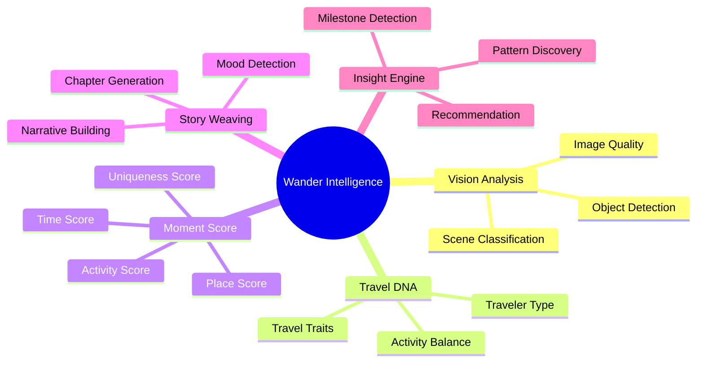

---

## 2. 시스템 아키텍처

### 2.1 전체 아키텍처

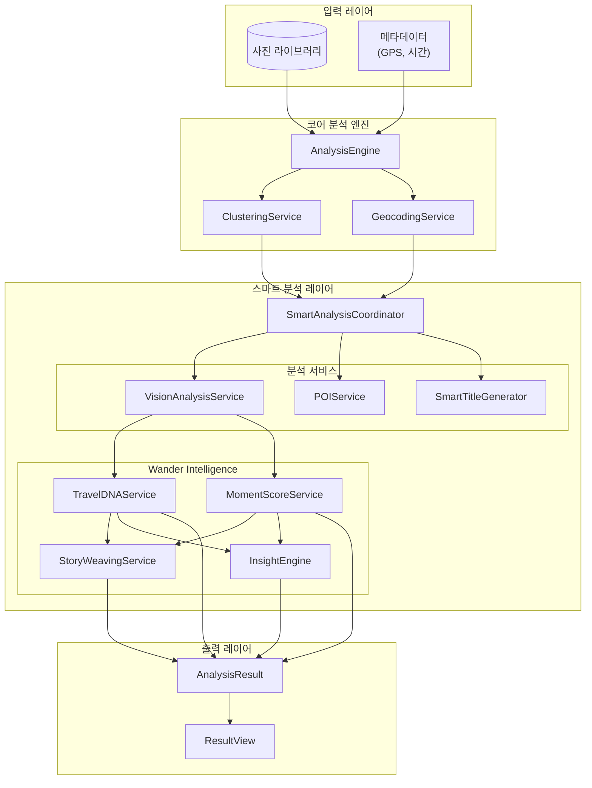

### 2.2 서비스 의존성

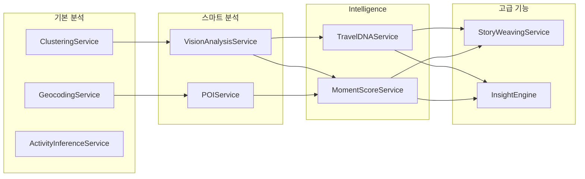

---

## 3. 분석 파이프라인

### 3.1 전체 분석 흐름

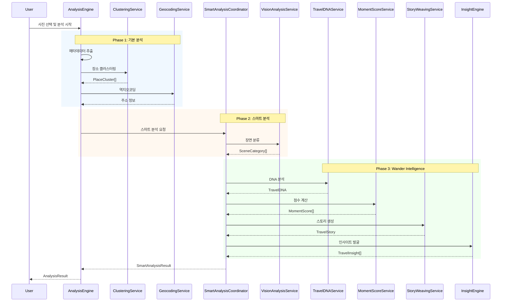

### 3.2 분석 단계별 진행률

| 단계 | 가중치 | 누적 | 설명 |
|------|--------|------|------|
| 메타데이터 추출 | 5% | 5% | GPS, 시간 정보 추출 |
| 클러스터링 | 10% | 15% | 시공간 기반 장소 그룹화 |
| 역지오코딩 | 25% | 40% | 좌표 → 주소 변환 |
| Vision 분석 | 20% | 60% | 장면 분류 |
| POI 검색 | 15% | 75% | 주변 정보 검색 |
| Intelligence | 20% | 95% | DNA, Score, Story, Insight |
| 마무리 | 5% | 100% | 결과 병합 |

---

## 4. 핵심 서비스 상세

### 4.1 VisionAnalysisService

#### 개요
Apple Vision Framework를 활용한 이미지 분류 서비스

#### 장면 카테고리

```mermaid
graph TD
    subgraph Natural["자연"]
        beach[해변]
        mountain[산]
        nature[자연]
        park[공원]
    end

    subgraph Urban["도시"]
        city[도시]
        shopping[쇼핑]
        landmark[랜드마크]
    end

    subgraph Culture["문화"]
        museum[박물관]
        temple[사찰]
        culture[문화시설]
    end

    subgraph Dining["식음료"]
        cafe[카페]
        restaurant[레스토랑]
        food[음식]
    end

    subgraph Travel["여행"]
        hotel[숙소]
        airport[공항]
        transportation[교통]
    end

    subgraph People["인물"]
        people[사람들]
        portrait[인물사진]
    end
```

#### 분류 로직

```swift
// 대표 사진 샘플링 (최대 3장)
let samples = sampleAssets(from: assets, count: 3)

// 각 사진 분류
for asset in samples {
    let classifications = await classifyScene(image: image)
    // confidence 기반 가중 투표
}

// 최종 카테고리 결정
return dominantCategory
```

---

### 4.2 TravelDNAService

#### 개요
여행 패턴 분석을 통한 사용자 여행 성향 프로파일링

#### 여행자 유형 (9종)

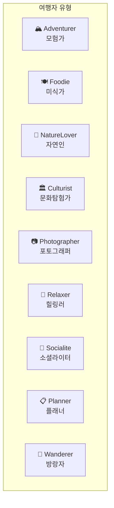

#### DNA 코드 생성

```
DNA 코드 형식: [Primary]-[Secondary]-[TimePreference]

예시:
- ADV-NAT-MOR : 아침형 자연 탐험 모험가
- FOD-CUL-EVE : 저녁형 문화 애호 미식가
- PHO-REL-BAL : 균형형 힐링 포토그래퍼
```

#### 분석 알고리즘

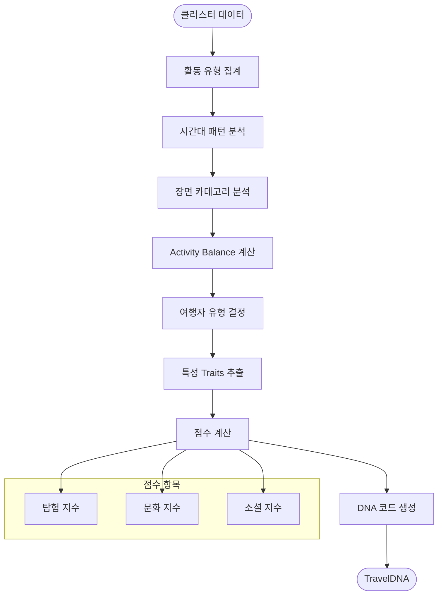

#### Activity Balance 계산

```
Outdoor vs Indoor:
- 해변, 산, 자연, 공원 → Outdoor +1
- 박물관, 카페, 쇼핑 → Indoor +1

Active vs Relaxing:
- 산, 관광, 쇼핑 → Active +1
- 카페, 숙소, 공원 → Relaxing +1

결과: 각 항목 0-100 백분율
```

---

### 4.3 MomentScoreService

#### 개요
각 장소/순간의 특별함을 0-100점으로 정량화

#### 점수 구성요소

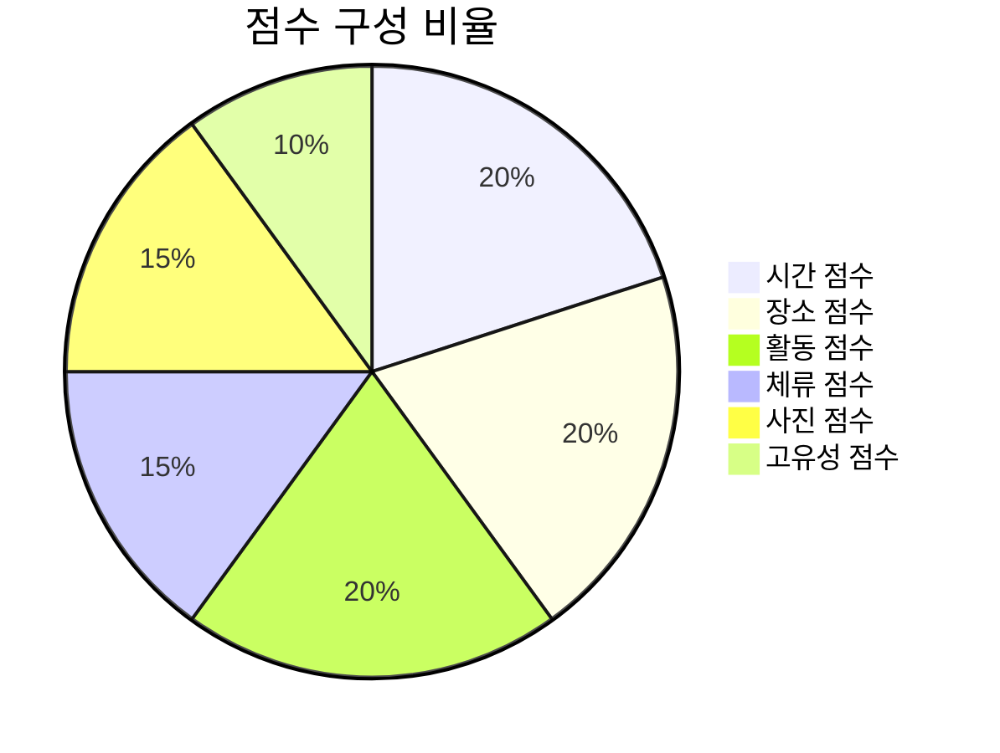

#### 등급 체계

| 등급 | 점수 범위 | 이모지 | 설명 |
|------|----------|--------|------|
| Legendary | 90-100 | 👑 | 전설의 순간 |
| Epic | 80-89 | ⭐ | 특별한 순간 |
| Memorable | 70-79 | 💫 | 기억될 순간 |
| Pleasant | 60-69 | 😊 | 즐거운 순간 |
| Ordinary | 50-59 | 📍 | 평범한 순간 |
| Casual | 0-49 | 🚶 | 일상의 순간 |

#### 특별 배지 (12종)

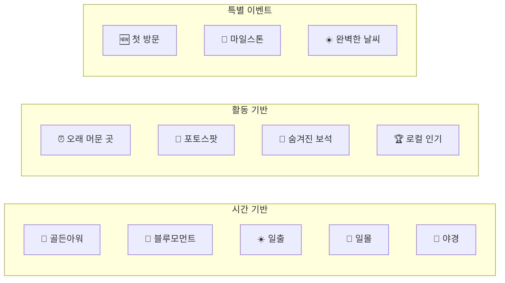

#### 점수 계산 상세

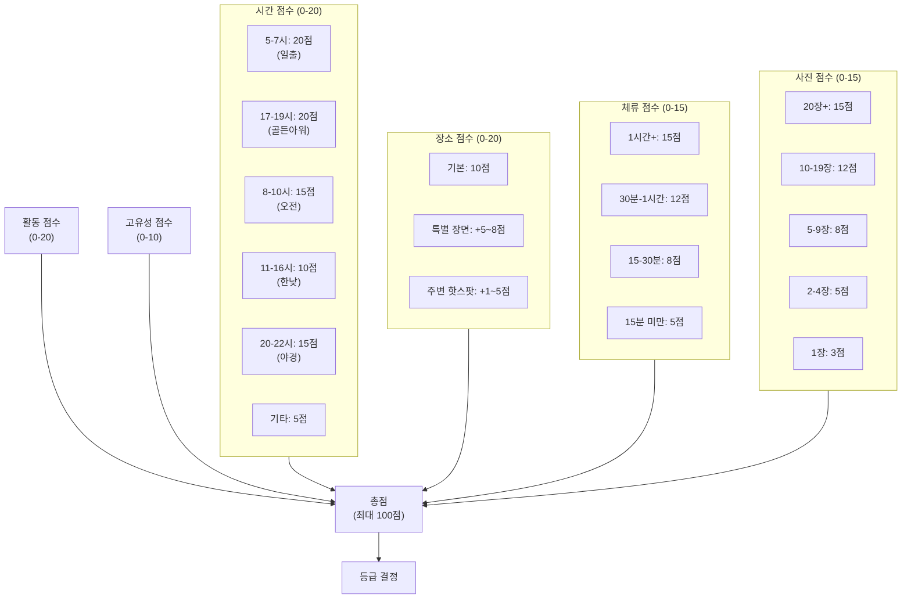

---

### 4.4 StoryWeavingService

#### 개요
분석 결과를 바탕으로 자연어 여행 스토리 자동 생성

#### 스토리 구조

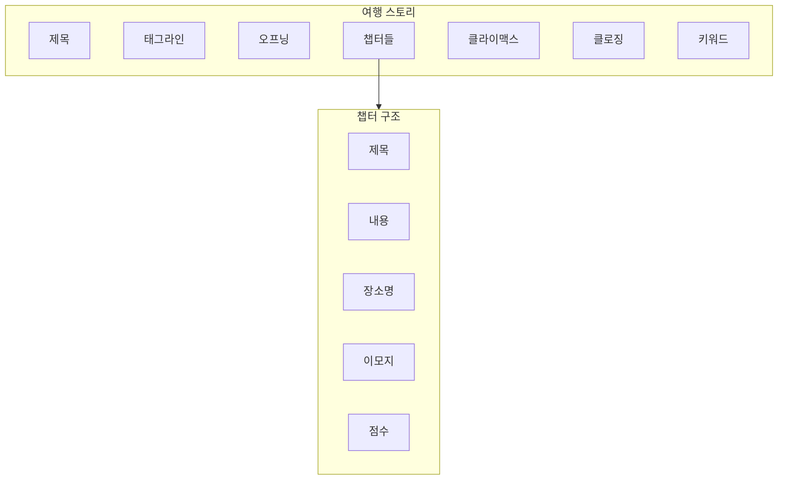

#### 스토리 무드 (7종)

| 무드 | 이모지 | 설명 | 트리거 조건 |
|------|--------|------|-------------|
| Adventurous | 🏔️ | 모험적인 | 산, 자연 활동 위주 |
| Romantic | 💕 | 로맨틱한 | 카페, 일몰, 해변 |
| Peaceful | 🌿 | 평화로운 | 공원, 사찰, 자연 |
| Exciting | ⚡ | 신나는 | 관광, 쇼핑, 도시 |
| Reflective | 🌙 | 성찰적인 | 박물관, 문화시설 |
| Heartwarming | 💝 | 따뜻한 | 맛집, 카페, 사람들 |
| Inspiring | ✨ | 영감 주는 | 랜드마크, 특별 점수 |

#### 스토리 생성 플로우

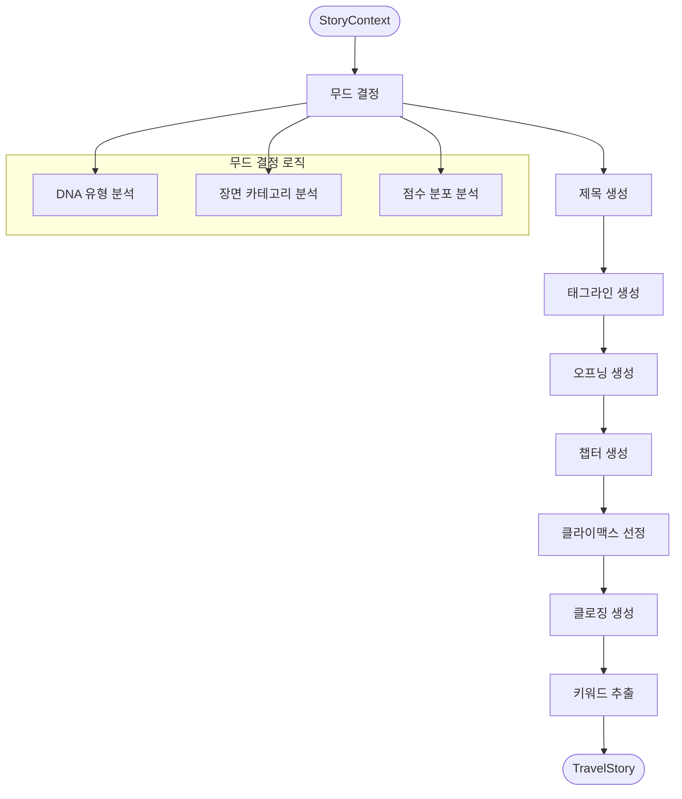

---

### 4.5 InsightEngine

#### 개요
데이터에서 사용자가 인식하지 못한 패턴과 의미 발굴

#### 인사이트 카테고리

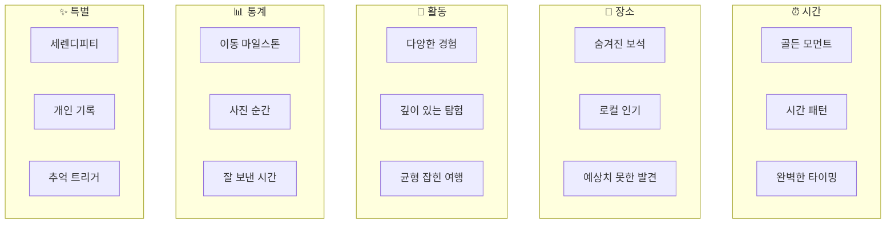

#### 중요도 레벨

| 레벨 | 값 | 설명 | UI 표시 |
|------|-----|------|---------|
| Minor | 1 | 작은 발견 | 기본 |
| Notable | 2 | 주목할 만한 | 기본 |
| Significant | 3 | 중요한 발견 | 강조 |
| Highlight | 4 | 하이라이트 | ⭐ 표시 |
| Exceptional | 5 | 특별한 순간 | ✨ 표시 |

#### 인사이트 발굴 알고리즘

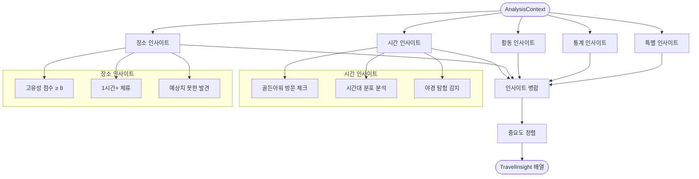

---

### 4.6 FastVLMService (iOS 18.2+)

#### 개요
Apple의 Foundation Models API를 활용한 고급 이미지 분석 (iOS 18.2+)

#### 기능

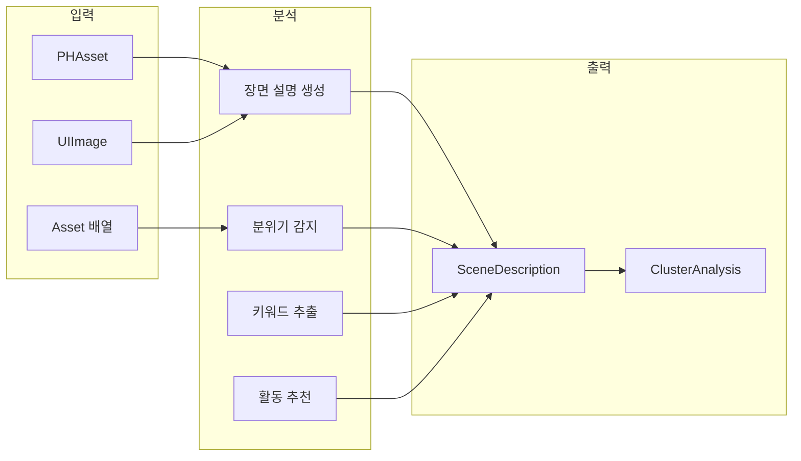

#### TravelMood (8종)

| 무드 | 이모지 | 한국어 | 연관 장면 |
|------|--------|--------|-----------|
| Peaceful | 🌿 | 평화로운 | 자연, 공원, 카페 |
| Adventurous | 🏔️ | 모험적인 | 산 |
| Romantic | 💕 | 로맨틱한 | - |
| Energetic | ⚡ | 활기찬 | 도시, 쇼핑 |
| Relaxing | 🌊 | 여유로운 | 해변, 자연, 공원 |
| Cultural | 🏛️ | 문화적인 | 박물관, 사찰 |
| Nostalgic | 📷 | 추억이 깃든 | 랜드마크 |
| Joyful | 🎉 | 즐거운 | 레스토랑, 음식 |

---

## 5. 데이터 흐름

### 5.1 입력 데이터

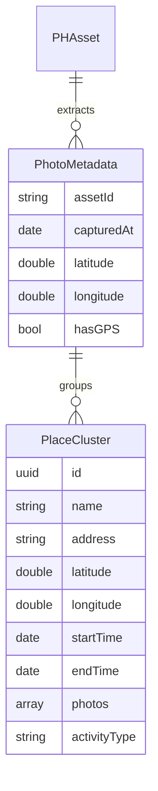

### 5.2 분석 결과 데이터

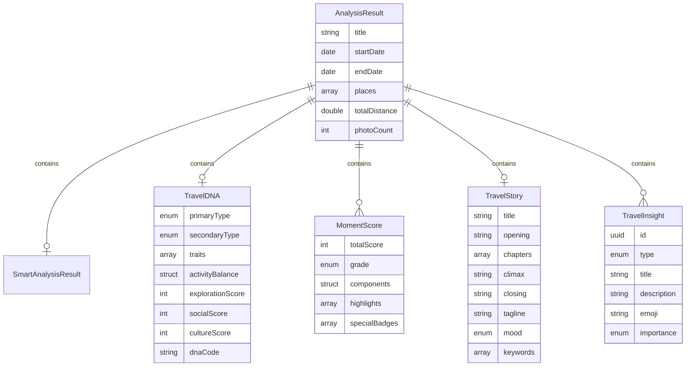

---

## 6. 점수 계산 공식

### 6.1 MomentScore 계산

```
TotalScore = min(TimeScore + PlaceScore + ActivityScore + DurationScore + PhotoScore + UniquenessScore, 100)

여기서:
- TimeScore (0-20): 방문 시간대 기반
- PlaceScore (0-20): 장면 카테고리 + 주변 핫스팟
- ActivityScore (0-20): 활동 유형 + 장면 일치 보너스
- DurationScore (0-15): 체류 시간
- PhotoScore (0-15): 촬영 사진 수
- UniquenessScore (0-10): 이 여행 내 고유성
```

### 6.2 TripOverallScore 계산

```
AverageScore = sum(MomentScores) / count(MomentScores)
PeakScore = max(MomentScores)
TotalBadges = count(unique(allBadges))
TripGrade = gradeFrom(AverageScore)
```

### 6.3 TravelDNA 점수

```
ExplorationScore = (uniqueActivityTypes * 10) + (placeCount * 5) + (distanceBonus)
CultureScore = (museumCount + templeCount) * 20 + (landmarkCount * 10)
SocialScore = (restaurantCount + cafeCount) * 10 + (peoplePhotoRatio * 30)

각 점수는 0-100 범위로 정규화
```

---

## 7. iOS 버전별 기능

### 7.1 기능 매트릭스

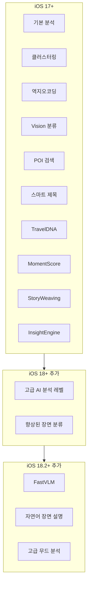

### 7.2 분석 레벨

| 레벨 | iOS 버전 | 기능 |
|------|----------|------|
| Basic | 17+ | 기본 분석 |
| Smart | 17+ | + Vision, POI, 스마트 제목 |
| Advanced | 18+ | + AI 분석, Wander Intelligence |

---

## 부록: 파일 구조

```
Services/SmartAnalysis/
├── SmartAnalysisCoordinator.swift  # 전체 조율
├── VisionAnalysisService.swift     # Vision 분류
├── POIService.swift                # POI 검색
├── SmartTitleGenerator.swift       # 제목 생성
├── TravelDNAService.swift          # DNA 분석
├── MomentScoreService.swift        # 점수 계산
├── StoryWeavingService.swift       # 스토리 생성
├── InsightEngine.swift             # 인사이트 발굴
└── FastVLMService.swift            # VLM 분석 (iOS 18.2+)
```

---

*문서 버전: 1.0*
*최종 업데이트: 2026-02-04*
